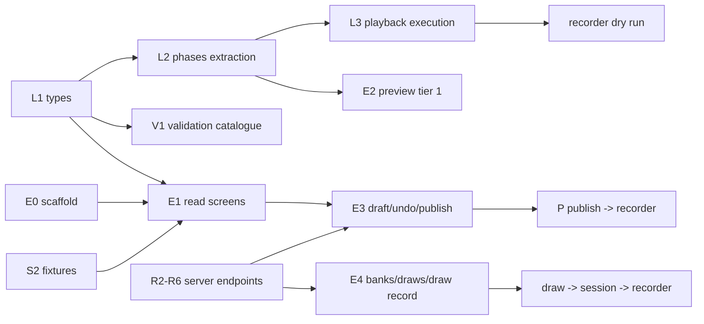

# Implementation plan — script editor (`spr-script-editor`)

Companion to [README.md](README.md) §6: it keeps the milestones and turns them into tasks,
file-level targets, ordering and gates. Grounded against commit `0c1de418` in worktree
`determined-antonelli-b67204`; the design docs are untracked there.

**Gate** = the observable proof that closes a milestone. A milestone is not closed on
code-complete alone. Tasks named `L…` touch the library/recorder, `E…` the editor, `V…`
validation, `S…` fixtures, `R…` the server in `server/` (track R, §4). There are no time
estimates here; only order and dependencies. Bracketed labels (`A1`, `B4`, `C2`, `D3`) index the
plan review that drove an amendment; §9 maps each one to where it lands.

## 1. Ground truth (verified in the repository)

| Fact | Verified in | Consequence for the plan |
|---|---|---|
| Angular 20.3.x, CLI 20.3.36, `@angular/build` builders; Material 20.2, CDK 20.2.14, forms 20.3, TS 5.9.3 | `package.json` | CDK is already a dependency: drag-drop and virtual scroll need no new package. |
| Two projects on this branch: `WebSpeechRecorderNg` (application), `speechrecorderng` (library); **`master` has renamed the application to `Cavox`** (`angular.json` projects `Cavox`, `speechrecorderng`; `package.json` name `cavox`) | `angular.json` in this worktree and on `origin/master` | M2's project block is a third project; re-base first (R0). |
| `master` does have CI, but only security scans (`codeql.yml`, `osv-scanner.yml`) — no build/test workflow; `bin/theme_audit.mjs` drives an already-running Chrome over CDP (port 9333, `--url`, `--viewports`, `--prepare`) | `origin/master:.github/workflows`, `bin/theme_audit.mjs` | "Add editor routes to the CI list" means the audit command list; adding a test workflow is server work (R10). |
| Demo app imports the library by **relative source path**; root `tsconfig.json` maps `speechrecorderng` → `dist/speechrecorderng` | `src/app/app.module.ts`, `tsconfig.json:...` | `from 'speechrecorderng'` imports in the editor are ambiguous until D-A (§2) is decided. |
| Library is one eager `NgModule` declaring every recorder component and registering `SPR_ROUTES` | `speechrecorderng.module.ts` | D1 confirmed; the editor must not import it and must not rely on its routes. |
| Timing facts: defaults `1000`/`500` ms; `prerecdelay` falls back to `prerecording` (`sessionmanager.ts:1120-1122`), `postrecdelay` to `postrecording` (`:1127`); max timer `pre+recduration+post` (`:1133`); prompt applied at start for `PRERECORDING`/`PRERECORDINGONLY`, at pre-delay end for `RECORDING`, cleared at pre-delay end for `PRERECORDINGONLY` (`:1113-1163`) | `sessionmanager.ts` | L2 can only be correct if these exact behaviours are pinned as characterisation tests first. |
| `RANDOMIZED` is ignored; shuffle runs in the component for `order==='RANDOM'`, writing `_shuffledGroups`/`_shuffledPromptItems`; `applyItem` reads them | `speechrecorderng.component.ts:333-345`, `sessionmanager.ts` `applyItem` | The editor must never persist `_shuffled*`; drafts strip them (D-F). |
| Library types lag the JSON: `Section` has no `name`, `Script` has no `name`/`type`/`minRecorderVersion`, yet fixtures carry `name`, `type`, `scriptId`; `1.json` still uses legacy `promptUnits` | `script.ts:63-81`, `src/test/script/*.json` | Additive type extensions (D-I); the loader must tolerate keys the types do not describe and keep them untouched. |
| `Group._shuffledPromptItems` / `Section._shuffledGroups` are **required, non-optional** fields | `script.ts:67-76` | The editor's loader fills them; the serialiser strips them (never make the recorder null-check). |
| Fixtures: `1.json` 1.8 kB (legacy), `1245.json` 26.6 kB, `3456.json` 6.5 kB, `3171…json` 16.7 kB | `src/test/script/` | Enough for M2; M1/M4 need new fixtures (playback, draw, 500-item perf). |
| Library tests: `@angular/build:karma`, `src/test.ts`, `tsconfig.spec.json`, `karma.conf.js` (Chrome, `singleRun:false`) | `angular.json`, `projects/speechrecorderng/*` | Copy the pattern for the editor; headless runs pass `--watch=false --browsers=ChromeHeadless`. |
| Design-doc defects: README §4.1 test `tsConfig` is malformed (`"projects/spr-script-editor:tsconfig.spec.json"`); data-model §2.1 has no `Playback.durationMs` although the timeline/W05 need it; README §8.2 script-name question is open while fixtures already carry `name` | this directory | Fix while touching those files (M0/M1). |
| Design tension: README §3 forbids `AudioContext` in the editor; rest-api §5 allows client-side decode of clip duration | README §3, rest-api §5 | Use `HTMLMediaElement` metadata (no Web Audio), server `durationMs` authoritative (D-G). |
| The recorder loads a session's script as `GET script/{sess.script}` — the published, unresolved script | `speechrecorderng.component.ts:164`, rest-api §1 | A1: a published drawn group reaches the recorder empty; a delivery mechanism must be frozen (D-K). |
| Every library component is a `standalone: false` NgModule declaration (`SpeechrecorderngModule` declares and exports them, and registers `SPR_ROUTES`) | `audio_display.ts:53`, `speechrecorderng.module.ts` declarations | A2: the editor cannot use `AudioPlayer`/`AudioDisplay` without importing the module; audition player decided in D-L. |
| Dev config is `apiEndPoint:'test'`, `apiType:'files'`; `src/test` is mapped to `/test` | `src/environments/environment.ts`, `angular.json:35` | A3: the editor needs its own asset mapping plus every list-endpoint fixture; S2 lists them. |
| `promptUnits` occurs in `1.json`/`317118e4…json` but in no library `.ts`; those sections carry no `groups` | `src/test/script/*.json`, grep of `projects/speechrecorderng/src/lib` | A4: the editor must detect the legacy shape and never add `groups: []` implicitly (D-M). |
| `public-api.ts` exports the model types but not `PromptitemUtil`/`MediaitemUtil`/`PromptDocUtil`, `Order`, `VirtualViewBox` | `public-api.ts` | L1 must export them or the editor duplicates item labels and drifts. |
| rest-api has no media list or delete endpoint, only `POST /media` and the in-use refusal rule | rest-api §5, §7 | B1: add `GET`/`DELETE media` before W11 and the delete path are implementable. |
| `VERSION='3.11.26'`; three numeric segments today | `spr.module.version.ts` | The L4 comparator must define missing-segment and pre-release behaviour, not only `3.10` vs `3.9`. |
| **The server is in the repo**, on `master` (`b0d04f60`): a Node-builtins receiver — the draft of the production server — in `server/{server,api,store,body,multipart,wav}.mjs` (~2 000 lines), `npm run serve:api`, file store under `--data` (gitignored `server/data`) seeded from `src/test`. This branch (`dc04a94c`) predates it. | `git ls-tree origin/master`, `package.json`, `server/*.mjs` | Re-base before M2; extend `server/` instead of writing a stub (D-B rewritten, R0); changes transfer to production (D-Q). |
| Receiver surface today: `GET project/{p}`, `GET project/{p}/{resource}`, `GET script/{id}` (read-only, any method), `GET/PATCH/PUT session/{id}`, project-scoped session PATCH, recfile list/audio, `GET/POST/PATCH recordingfile/{id}`, raw and chunked upload with an `Idempotency-Key` journal. No create/list/write for scripts, no banks, media, draws, ETag or validation. | `server/api.mjs` header and route switch | Track R is additive: every editor endpoint in [rest-api.md](rest-api.md) is new server work. |
| Receiver error body is `{"error": message}`; `sendJson(res, status, body, headers)` accepts extra headers; CORS/credentials are CLI flags; there is no auth; `.json`/`.wav` URL suffixes are stripped for `apiType: 'files'` clients. | `server/api.mjs` `respondToError`/`sendJson`, `server/server.mjs` | Extend to `{error, message, details}` additively; ETag needs only the headers parameter (R1). |
| `wav.mjs` probes and concatenates WAVE; `multipart.mjs` parses uploads; `store.mjs` writes through temp+rename and keeps ids/journal under `<data>/uploads`; `projectResourcePath` refuses traversal. | `server/wav.mjs`, `multipart.mjs`, `store.mjs` | Media `durationMs`, multipart and atomic writes reuse existing code (R1/R6); the ETag is safe only because writes are atomic. |
| **Upstream already ships an audio-prompt playback model**: an audio `mediaitems[0]` is played as the prompt (`Mediaitem.autoplay`, `Mediaitem.replay`), with `audio/prompt_audio.ts`, a held traffic light, a replay control and the `R` key (commits `99f4ff42`, `cb1d360f`). No `PromptItem.playback`, `PlaybackWhen`, `repeats`, `gap`, `headphones` or `maxReplays` exists in the tree. | `script.ts`, `sessionmanager.ts:1293/1435`, `prompting.ts:326`, `lib/audio/prompt_audio.ts` | Reconciled by **D-V = C** (§10.3): `playback` becomes an optional modifier over the shipped audio mediaitem. |
| **Upstream already ships load-time prefill**: `PromptItemPrefill` (`source`, `select:'random'`, `itemcodeFormat`, templated `mediaitems`), `ScriptPrefillService`, `prefill.ts`, `Session.prefills`; sources are fetched through the new `ScriptService.scriptResourceObservable` (`ba81bcf8`). | `prefill.ts`, `prefill.service.ts`, `session.ts`, `script.service.ts` | Reconciled by **D-W = A** (§10.4): the item bank becomes a prefill source type, resolved server-side where session state is needed. |
| i18n moved into the library: `@jsverse/transloco`, `SPR_STRINGS`/`SprTranslator`, `bin/build_i18n.mjs`, `src/assets/i18n/{en,sv}.json`. `master` also renamed the app to `Cavox` and added `src/assets/configurations.json` plus a configuration picker in `src/app/session/sessions.ts`; the recorder records against the receiver by default (`fecbd8ac`). | `package.json`, `lib/i18n/translate.ts`, `src/app/session/sessions.ts` | The editor reuses the library catalogs and the picker naming; the "script bank" here is scripts/configurations, not the item bank — do not conflate the terms. |
| Fixtures changed on master: `1245.json` rewritten (net −58), new `dysartri-*`/`sti-*` scripts using prefill and prompt audio, `1.json` still legacy `promptUnits` | `git diff 0c1de418 origin/master -- src/test/script` | M2's fixture set is re-checked; the legacy-shape test (A4/N06) still applies. |

## 2. Decisions this plan takes (review points, not silently assumed)

| # | Decision | Why / alternative |
|---|---|---|
| D-A | The editor imports the library **from source**: editor `tsconfig.app.json` overrides `baseUrl` to `../..` and `paths: {"speechrecorderng": ["projects/speechrecorderng/src/public-api.ts"]}`. | The dist mapping forces `ng build speechrecorderng` before every `ng serve` and kills HMR in library code. The demo app already consumes source. Alternative (npm semantics) costs only the developer loop; production build is identical. |
| D-B | **Extend the in-repo receiver** (`server/*.mjs`) rather than write a separate stub: rest-api §2–§7 land as new modules there (`validate.mjs`, `bank.mjs`, `draw.mjs`, `media.mjs`), behind the existing handler and store. Development runs it with `--data /tmp/… --seed src/test`, so runtime state never enters the repo. | The server exists, is the recorder's contract reference, and already owns the upload half. A parallel stub would duplicate the store, upload and WAV code and drift (Q1 is answered: the server is local). Alternative: a stub in `bin/` only if the receiver turns out to be evaluation-only and the production service is elsewhere. |
| D-C | Undo = whole-draft snapshots (`structuredClone`), coalesced per focused field, history capped (~50). The pending edit is also captured as a small **edit intent** (JSON-Patch-style ops per save window); on 412 the intent is re-applied once over the server copy with index guards, then a visible conflict state. | A snapshot stack alone cannot re-apply a structural edit (move/delete/add) — only text. Snapshots serve undo, the intent serves rest-api §2.3's reapply; the intent must cover structure, not only typing. |
| D-D | Validation is pure functions with an injected context (bank `matchCount`, media index, deployment `VERSION`, feature→version map); publishing re-checks server-side. | Editor is catalogue owner (validation.md); the server is the only trusted gate. |
| D-E | JSON path → line mapping via an in-repo tokenizer (`core/validation/json-lines.ts`), no code-editor dependency. | ui-spec §5 says a textarea is enough; a dependency for gutter dots is not. |
| D-F | The draft serialiser strips keys starting `_` and never rewrites unknown keys. | D7 and the byte-comparable promise; `_shuffled*` are runtime artifacts. |
| D-G | Clip duration: server `durationMs` preferred; else measure on upload with an `HTMLMediaElement` (`loadedmetadata`), never `AudioContext`. | Keeps README §3's "no recording code in the editor" true; W05/timeline degrade to "unknown" when neither is available. |
| D-H | Editor state uses Angular signals + `OnPush`; forms stay typed reactive (README §4.3). | Signals fit draft state and selection; no zone-less migration required. |
| D-I | `Script.name?`, `Script.type?`, `Script.minRecorderVersion?`, `Section.name?`, `PromptItem.playback?`, `Group.draw?`, `Playback.durationMs?` become optional typed fields; `Playback`/`Draw`/bank/draw types land with them. | Fixtures already carry them; the editor cannot be typed otherwise. Additive, recorder unaffected. |
| D-J | The draw-rule "example draw" is computed client-side and labelled an example; the server stays the only resolver. The label states that it ignores `fixedBy` and `skipRecordedBySpeaker`, and it samples fairly instead of taking page one. | Two implementations of the draw exist; the example must never be presented as the session's draw (D4). |
| D-K | The server resolves a session's draws into a **materialised script** whose id goes into `Session.script`; `GET script/{id}` then serves it unchanged and the recorder needs no call-site change. Alternative: a session-scoped script endpoint plus one recorder call site. | The recorder today reads `script/{sess.script}` (`speechrecorderng.component.ts:164`) and a published drawn group has `promptItems: []` — A1. Materialisation preserves D2 without a recorder change; it requires the library list and draw queries to exclude internal scripts. |
| D-L | The editor's audition player is **editor-local** (`HTMLMediaElement`), not the library's Web Audio `AudioPlayer`/`AudioDisplay`. README §5 and ui-spec §3.3 are amended to say so. | The library components are `standalone: false` NgModule declarations (A2); importing the module would register `SPR_ROUTES` and bundle the recorder, and `AudioPlayer` uses Web Audio, which README §3 forbids in the editor. |
| D-M | Legacy `promptUnits` scripts are detected (N06) and migrated to `groups` only on request, with a confirmation; the loader never fabricates `groups: []` over one. Until migrated the script opens read-only. | A4: a save that adds `groups: []` silently changes what the recorder runs while the original data survives as an ignored key. |
| D-N | Drafts get server-side revision history (keep the last N saves) plus a local backup of unacked changes in `localStorage`, restored on load. | Published versions are recoverable; drafts are otherwise overwrite-only, so a bad merge/PUT or a crash loses everything since the last publish (D2/D3). |
| D-O | The persisted draw filter gets frozen semantics and a `q` field: tags are AND, `hasAudio:false` means "items without a model recording", category is exact, word bounds are inclusive and case-insensitive, and a `filterVersion` lets those semantics change without silently reinterpreting old rules. The bank page's browse filter is visually distinct from the rule filter. | The filter is persisted and D2 promises reproducibility, yet rest-api/ui-spec and `DrawFilter` disagree about free text and say nothing about the rest (B4). |
| D-P | A preview session (`type: "TEST"`) is what disables uploads: the recorder honours it. If it cannot, tier-2 requires its own recorder deployment with `enableUploadRecordings:false`. | rest-api §6 assumes such a deployment exists but the plan never schedules it; recordings from a preview must be impossible, not merely discarded (B5). |
| D-Q | The receiver is the **draft of the production server**: changes to `server/` are transferred to production, so its API shape, store layout and behaviour are production contracts. The editor's base URL points at it in development and at production elsewhere; no editor code knows which. | Owner decision (2026-10-02). A draft copied forward must not break the recorder-facing paths, and layout changes ship with migrations (§10.1). |
| D-R | The error body becomes `{error, message, details}` everywhere, additively: `error` keeps its current string value, so the recorder client is untouched. | rest-api documents the envelope; the receiver answers `{error}` only, and the recorder reads it. |
| D-S | A draft's ETag is a strong validator over the **stored bytes** (sha256), and every draft write goes through temp+rename. No canonicalisation, so unknown keys and order survive (D-F). | `If-Match` forbids weak validators, and a torn file must not get an ETag. `store.mjs` already writes atomically. |
| D-T | Server-side validation lives in `server/validate.mjs` and is kept in step with the editor's TS catalogue by **shared conformance fixtures** (`doc/script-editor/checks/*.json`: draft + expected ids), run by `node --test` and by the editor's V1 specs. | Two runtimes (Node and the browser) cannot share the TS directly; fixtures are the cheap honest contract, and publishing must not trust the client. |
| D-U | Draw resolution, the PRNG and materialised session scripts are server-owned. The editor's example draw is independent, labelled, and never presented as the session's draw (D-J). | D2 requires byte-identical reproducibility across re-draws; one implementation owns the algorithm, the editor only previews. |
| D-V | **Playback model — decided: C (owner, 2026-10-02, §10.3).** The audio mediaitem stays the sound source and the default placement; `PromptItem.playback` is an optional modifier that sets `when`, `repeats`, `gap`, `headphones` and `replayable`/`maxReplays`, overriding the shipped `Mediaitem.autoplay`/`replay` when present. | Keeps `master`'s tested audio-prompt code and needs no script migration, while preserving the design's placements and repeat controls. |
| D-W | **Randomised items — decided: A (owner, 2026-10-02, §10.4).** The item bank becomes a **prefill source type**: plain lists keep the shipped load-time, client-side path; bank sources are resolved server-side at session creation where session state is needed, and the resolution is recorded in one session trace. | One UI concept and one reproducibility story instead of two mechanisms; M0 freezes the exact unified schema. |

## 3. Dependency graph and parallel tracks



* **Track L (library/recorder)**: L1 → L2 → L3/L4. `sessionmanager.ts` has exactly one writer at a
  time; the L2 refactor must land before L3 edits the same flow.
* **Track E (editor)**: E0 starts immediately (needs nothing new from L). E1 waits only for L1.
  E3/E4 additionally wait for the server endpoints (R2–R8).
* **Track V (validation)**: starts after L1; independent of the editor shell.
* **Track S (fixtures)**: starts immediately; nothing depends on new library code.
* **Track R (server)**: R1 → R2 → R3/R4/R6 → R5/R7/R8, with R10 alongside; the editor's write path
  cannot close without R2–R4.

E0 and V1 can run in parallel with L1; they share only type definitions, which are additive.

Additions to the tracks: **L5** (resolved-script delivery, D-K) starts once L1 lands and gates the
M1 dry run and M4; **E0** also owns the `src/test` asset mapping (A3); **R4/R10** own the shared
check fixtures and the server conformance tests (M0/M3); **S2** owns the full FILES fixture
inventory (§4 M2).

## 4. Milestones, tasks, gates

### M0 — API agreement (documents, no application code)

- [] Close open Q1: the receiver is in-repo and is the draft of the production server, so changes
      are transferred (D-Q); record the transfer and migration process, and who owns the
      production-side auth/backup (R12, §10.1).
- [] Freeze **how the recorder obtains a resolved script** (A1, D-K): a materialised script id on
      `Session.script`, or a session-scoped endpoint plus one recorder call site. The receiver and
      the M4 gate must exercise this exact path, not a shortcut.
- [] Freeze the draft protocol: **strong** ETag (rest-api's `"w/4-17"` example is weak and
      weak validators are not valid for `If-Match`; use `"4-17"` or specify comparison), 428/412,
      `details.current` **including the current ETag**, `details.checks`, idempotent PUT, whether
      `_restore` consumes `If-Match`, and an `ETag` on the create response (or `If-None-Match: *`
      for the first write).
- [] Freeze what "new script" seeds (a script with no section is unpublishable under E10), and the
      id semantics of import JSON and duplicate.
- [] Freeze publish gate payload, the check ids the server enforces, how E04's `matchCount` is
      computed atomically at publish time, and the rendering of server-returned `details.checks`;
      freeze the feature→recorder-version map ownership (`L1` adds
      `lib/speechrecorder/script/feature-versions.ts`; the server needs the same table — decide
      whether it is exported, duplicated or config).
- [] Freeze bank endpoints and the shipped-bank delivery answer (Q3), **bank/media write
      concurrency** (ETag or an explicit last-write-wins statement) and upload filename collisions.
- [] Add the **media endpoints rest-api is missing** (B1): `GET project/{p}/media` with `usedBy`,
      `DELETE project/{p}/media/{src}`, the draft-vs-published reference rule, and the orphan
      policy for uploads the undo stack cannot remove.
- [] Freeze the unified randomised-items schema (D-W, §10.4): the source reference (list vs bank),
      the client/server resolution split, the single session trace (extended `Session.prefills`,
      `ResolvedDraw` dropped), `_redraw` and its status rule, itemcode padding and count cap,
      seeds per `fixedBy`, the refill rule, and the PRNG spec the receiver implements.
- [] Freeze the `Playback` modifier (D-V, §10.3): fields and defaults, the override of
      `Mediaitem.autoplay`/`replay`, the check for both being set, and the non-recording `when`
      restriction.
- [] Freeze the bank-source filter semantics (D-O, §10.4), including a `filterVersion`.
- [] Freeze `/media` upload (`X-Filename`, `durationMs` advisory), media-in-use refusal, and the
      source of truth for W10's "deployment runs {actual}" (B7).
- [] Freeze the auth surface: cookie vs bearer, XSRF strategy, and the 401 → login → return-URL
      contract the shell implements (B8).
- [] Fix the doc defects: the §1 list (README §4.1 test path and its missing `src/test` asset
      mapping, data-model `durationMs`, script `name`), the README §4.4 audit URL
      (`/edit/script/1245` vs ui-spec §1), README §4.3 `express/json-server` vs D-B's Node
      builtins, README §5's `BankService`/`DrawService` placement (kept editor-local; the recorder
      never uses them), and ui-spec §8's M5-vs-per-milestone a11y wording. **The doc-level items in
      this bullet are applied in this worktree**; the API items above are not.
- [] Pseudonymity decision (Q4) — it changes the draws view only.
- Gate: endpoint list and JSON shapes frozen in this directory, exercised by the check fixtures
  and the server's conformance tests (R4/R10) and imported by the editor specs; the open questions
  above either answered or explicitly deferred with a default marked in this file.

### M1 — Recorder honours playback (library + recorder, no editor)

| Task | Files | Content |
|---|---|---|
| L1 types | `lib/speechrecorder/script/script.ts`, `public-api.ts` | `Playback` as the optional modifier of §10.3 (the prompt's audio mediaitem stays the source; `Mediaitem.autoplay/replay` unchanged); the bank source descriptor and the extended prefill trace of §10.4; extend `PromptItem`, `Group`, `Script`, `Section` (D-I); export everything, **including the pure utilities the editor reuses** (`PromptitemUtil`, `MediaitemUtil`, `PromptDocUtil`, `Order`, `VirtualViewBox`). No recorder behaviour change. |
| L2 extraction | new `lib/speechrecorder/script/phases.ts`; `sessionmanager.ts` | Characterisation tests first (`phases.spec.ts` or spec beside manager): every default and fallback from §1, the max-timer arithmetic with and without playback (C1), non-recording items (`NON_RECORDING_WAIT`, the `duration` path), and AUTORECORDING auto-advance. Then `promptVisibleAt(promptphase, phase, itemType)`, `effectiveTiming(item)` — returning pre/rec/post **and the playback span with its sequencing** — and the phase-transition table the preview needs (D8). The manager calls them; no behaviour change. |
| L3 playback | `sessionmanager.ts`, `prompting.ts`, `audio/prompt_audio.ts` | The `playback` modifier of §10.3: all `when` values with their **end-of-item behaviour pinned** (`BEFORE` plays to the end, then the pre-delay, then recording, and the max timer includes the playback span (C1); `PRERECORDING` starts with the delay and never extends the timer — W05 warns; `DURING` starts at `RECORDING` and its overrun past the stop is defined; `ONDEMAND` adds a play control; the default `WITH_PROMPT` is today's autoplay), `repeats`/`gap`, and `playback` overriding `Mediaitem.autoplay/replay`. Preload the next clip; route playback so capture cannot double-count it; surface fetch/decode failure in the UI and the session log (never silent); block with a clear message when the service worker has not cached the file offline (C2/C3). Next/Prev/Stop/Pause stop playback and cancel its timers (C4). `playback.alt` joins the item label/description (C5). |
| L3 replay | `sessionmanager.ts`, `item.ts`, session upload | `replayable`/`maxReplays` build on the shipped replay control and `R` key (`cb1d360f`): `playback.replayable` overrides `Mediaitem.replay`, and the cap plus a **persisted replay count** (session PATCH or a log entry) get a test (C4). |
| L3 headphones | prompting UI + `sessionmanager.start()` | If any item in the section has `playback.headphones`, require a confirmation before the section starts. |
| L4 version gate | `feature-versions.ts`, `speechrecorderng.component.ts` (script load) | Recorder refuses a script whose `minRecorderVersion` is above `VERSION` with a clear message. **Write a numeric segment comparator** with tests for `"3.10" > "3.9"`, missing segments and pre-release suffixes. The server applies the same gate at session creation, because a stale cached recorder bundle cannot check anything (C8). |
| L5 resolved script | `speechrecorderng.component.ts` (load path), session API per D-K | Land the mechanism frozen in M0: the recorder reads the materialised id from `Session.script` unchanged, or calls the new session-scoped endpoint. Prove it with a drawn fixture end to end; the receiver serves the same shape (R7). |
| Fixture | `src/test/script/playback.json` | Hand-written script exercising all four `when` values, one non-recording item with playback, and a drawn group. |
| Gate | Manual dry run in the recorder with `playback.json`: clip plays at the right moment for each `when`; replay counted **and persisted**; headphone gate appears; navigation during playback is safe; a drawn fixture runs its items through the L5 path. `npm run test_module -- --watch=false --browsers=ChromeHeadless` green, including the extraction tests **and the fake-clock `when` tests** (C7). |

### M2 — Editor skeleton, read-only

| Task | Files | Content |
|---|---|---|
| E0 project block | `angular.json`, `projects/spr-script-editor/**` | Project block per README §4.1 with the test `tsConfig` path fixed **and an asset entry serving `src/test` at `/test`** (A3); `tsconfig.json`/`tsconfig.app.json`/`tsconfig.spec.json` (D-A); `index.html`; `main.ts` (`bootstrapApplication`, providers from README §4.3 plus the editor's `bank-api`/`draw-api`/`media` services); `main.scss` mirroring `src/main.scss` (palette → `mat.theme` → token + role pins, light and dark); budgets deliberately larger than the recorder's (measure at M2 and set explicit numbers); **no service worker**. The editor imports neither `SpeechrecorderngModule` nor any component it declares (A2). |
| E0 routes/shell | `app/app.routes.ts`, `app/shell/`, `app/editor.config.ts` | Routes of ui-spec §1 with selection in `?sel=`; shell: breadcrumb, save state, warning count link, Preview, Publish, undo/redo. `?sel=` indices are sanitised and fall back to the nearest node after reorder/delete/undo (D9). |
| E1 services | `app/core/script-api.service.ts`, `bank-api.service.ts`, `draw-api.service.ts`, `media.service.ts`, `load.ts` | Read endpoints now, write endpoints in M3. URL building mirrors `ProjectService` (`apiEndPoint` + `project/{p}/…`, `withCredentials`, FILES-mode `.json?requestUUID=`). `load.ts` fills `_shuffled*` **with `groups` verbatim** (never shuffled) and keeps unknown keys; when `groups` is absent it never fabricates an empty array over a legacy `promptUnits` section (A4/D-M). S2 lists every FILES path this needs. |
| E1 library list | `app/library/` | Table, filter row, legend cards, empty/loading/error states (ui-spec §2, §9). |
| E1 editor screens | `app/editor/outline|items-table|inspector` | Outline (flattened tree rows, markers, filter, keyboard, CDK drag-drop, virtual scroll above ~300 rows); centre (script flow cards, section tables, drawn-group card + example draw); inspector (four variants; timeline bar from `effectiveTiming`; playback block with an **editor-local `HTMLMediaElement` audition player** (D-L), not the library's Web Audio components). |
| E2 preview tier 1 | `app/preview/` | Stage mock, step simulation, order list with drawn items folded in, "Nothing is recorded or uploaded" banner. Uses `promptVisibleAt`/`effectiveTiming` **and L2's phase-transition table** — no local copy of the state machine (D8). |
| V1 catalogue | `app/core/validation/**` | E01–E10, W01–W11, N01–N06 as pure functions with context (D-D); `json-lines.ts` (D-E) with specs for escapes, tabs/CRLF, duplicate keys and unicode; fixes and `normalise.ts` (idempotence spec); one spec per id plus the clean case. Fix table: N01, N02, N06 (legacy `promptUnits` → groups, with confirmation), W08, E02 (next free code), E04 (clamp), E05 (free prefix), E08 (keep one side, explicitly chosen). Added checks: `repeats ≥ 1`, `gap ≥ 0`, `maxReplays ≥ 0`, virtual-view-box numbers; `DURING`/`PRERECORDING` on a non-recording item; W03 also scans `draw.playback`; W05 on a drawn group is suspended unless the bank reports clip durations; W11 uses the media index and is suspended, like E04, when it cannot be fetched (D6). |
| S2 fixtures | `src/test/script/`, `projects/spr-script-editor/src/assets/fixtures` | Fixture inventory for FILES mode, one file per path the UI reads: `test/project/<p>.json`, `test/project/<p>/script.json` (library list), `test/script/1245.json` (existing), `playback.json` (copied from M1), a drawn-group script, a **legacy `promptUnits` script** (prove load→save is byte-identical until migrated), bank/draw/media fixtures for §6/§7 and W11, and a generated ~500-item script for perf. |
| Gate | `1245.json` navigable and inspectable in the editor against `ApiType.FILES` **served from `/test` with the list fixtures present**; a legacy script opens read-only and round-trips byte-identically; validation catalogue runs over both; theme audit passes on two editor routes (edit + one interaction state via a new `bin/audit/*.js`); the 500-item script stays responsive in outline and tables; VoiceOver (Safari) pass #1 on the outline and inspector (ui-spec §8). |

### M3 — Write path

| Task | Files | Content |
|---|---|---|
| E3 draft service | `app/core/script-draft.service.ts` | Snapshot undo/redo (D-C) **plus a per-save-window edit intent (JSON-Patch-style ops) used for the 412 reapply**, so structural edits (move/delete/add) survive; history depth capped (~50). 2 s debounce + blur flush, single-flight save, ETag from the last response, 412 → reapply the intent once with index guards → conflict state keeping both texts. `FILES` mode = writes disabled, draft shown as locally modified; `beforeunload` guard while dirty; local backup of unacked changes restored on load (D-N). Invalid JSON text is never PUT: the service serialises the last valid model, the shell shows "unsaved changes", and reload keeps the text from the backup (D2). |
| E3 source view | `app/source/` | Textarea + Format + gutter dots via `json-lines`; parse-and-apply only when parse and invariants hold; structure frozen otherwise; the invalid text lives only in the local backup; import (file), export `script-{id}.json`; publish from the header. |
| E3 checks panel | `app/validation` UI | Severity groups, `line · subject`, consequence sentence, deep link into the editor, one-click fixes; errors block Publish, warnings are listed to the publisher; **server-returned `details.checks` render here too** (B3), so a publish-time race appears as findings, not a bare 409. |
| E3 publish/versions | `script-api.service.ts`, shell | Publish with gate; version list + restore (`draft/_restore`) **with a designed surface — ui-spec has no version-history screen (D5): add a panel to the script inspector and amend ui-spec §3.3**; PATCH name/archive; create/duplicate from the library; `minRecorderVersion` derived from the feature map and shown as N04. |
| E3 media | `script-api.service.ts`, `media.service.ts`, playback block | `POST project/{p}/media`, capture `durationMs` (D-G), attach to `playback.src`; `GET` the media list for the picker and W11; `DELETE` surfaces `MEDIA_IN_USE`; orphan uploads are called out because undo cannot remove them (B1). |
| R2–R4 server write surface | `server/{api,store,etag,validate}.mjs` (track R) | R1–R4 land here; the M3 gate runs against the receiver, not FILES. Conformance fixtures under `doc/script-editor/checks/` are shared with V1. |
| Gate | Create → edit in two browsers without silent loss (412 path exercised with a **structural** edit) → publish blocked by an error, allowed with warnings → the recorder loads the published version. Unit specs: draft undo/redo/conflict, edit-intent reapply, invalid-JSON save rules, normaliser idempotence, fixes, **editor→library round-trip byte-stability over every fixture**, server conformance, all run against the receiver. |

### M4 — Banks and draws

| Task | Files | Content |
|---|---|---|
| E4 bank browser | `app/bank/` | **Per D-W (§10.4).** Grouped picker (project/builtin), origin chip, read-only state + "Copy to this project", filter builder with live `matchCount`, item table with audition and pagination, project-bank item editing, CSV import result UI. The browse filter and the persisted bank-source filter are visibly distinct; only the latter is written to the draft (D-O). |
| E4 rule builder | `app/bank/` (rule panel) | **Per D-W.** The bank-source fields: `count` vs `matchCount` (E04, suspended when the count is unknown per ui-spec §9), `fixedBy`, `skipRecordedBySpeaker`, `itemcodePrefix` preview (padding and cap per M0), `playBankAudio` + settings + `itemDefaults`, example draw (D-J) **labelled as ignoring `fixedBy`/`skipRecordedBySpeaker` and sampled fairly, not from page one** (D4). |
| E4 randomised items panel | `app/editor/`, `app/bank/` | **Per D-W.** One panel with a source picker — word list, sentence list, item bank — showing whether the source is drawn when the script loads or when the session starts; the list sources are the shipped `PromptItemPrefill`, the bank source carries the fields above. |
| E4 draws view | `app/draws/` | **Per D-W.** Reads the **unified session trace** (extended `Session.prefills`: list draws and bank draws): table + detail, CSV export (`Accept: text/csv`), re-draw enabled only for `CREATED` with the disabled reason shown. Preview (`type:"TEST"`) sessions are excluded or badged per M0 (D-P). |
| E4 tier-2 preview | editor config + recorder | `POST …/preview-session`, open `/wsr/ng/spr/session/{id}` in a new tab; editor config needs the recorder base URL. The recorder honours `session.type === 'TEST'` by disabling uploads in that tab, or the deployment running the preview has `enableUploadRecordings:false` (D-P) — state which one the plan relies on. |
| Gate | A drawn group produces a session in the recorder whose items are traceable to bank items **through the mechanism frozen in M0/D-K, not a shortcut**; re-opening that session shows identical items (D2); a preview session cannot upload anything (R8); CSV matches the detail view. |

### M5 — Hardening

- Keyboard map and tree semantics from ui-spec §8 done in M2's outline; VoiceOver (Safari) and
  NVDA (Firefox) passes run **per milestone from M2** (ui-spec §8), M5 verifies the whole map.
- Empty/loading/error states of ui-spec §9 revisited as a checklist across all screens.
- Perf: 500-item script, outline, tables, validation on debounce rather than per keystroke.
- Editor routes + interaction state in the theme-audit command list; document the list (there is
  no CI config in-repo — put commands in `README` §7 or `bin/`).
- i18n of editor chrome only if the project needs it; keep strings centralised from M2 so a
  retrofit is mechanical.
- Preview (`type:"TEST"`) sessions: exclusion from draws/reports and cleanup verified (D-P).
- Update README/data-model/rest-api/validation where M0–M4 changed them — including the
  audition-player decision (D-L), the legacy-shape rule (D-M) and the media endpoints (B1); record
  the receiver's transfer process, migration notes and how to run it (track R).

### Track R — server implementation (`server/`)

The receiver is Node-builtins only and stays that way; none of this runs in the browser. Files:
`server/api.mjs` (routes), `server/store.mjs` (persistence), `server/server.mjs` (startup/seeding),
and new modules `server/{etag,validate,bank,draw,media}.mjs`.

| Task | Files | Content | Milestone |
|---|---|---|---|
| R0 re-base and contract | — | **Done in this worktree**: the branch is re-based onto `master` (`ba81bcf8`, backup ref `backup/pre-rebase-r0`), so `server/`, the `Cavox` rename, Transloco, prefill and the audio-prompt code are in-tree. The §1 facts verified at `0c1de418` are now re-checked against the new tree; the playback and randomised-item models collide (D-V/D-W, §10.3/§10.4). | M0 |
| R1 HTTP primitives | `server/etag.mjs` (new), `server/api.mjs` (`sendJson`, `respondToError`), `server/body.mjs` (`RequestError`) | **Done.** Strong sha256 validators and `If-Match` verdicts (`missing`/`stale`/`ok`, `*` supported), 428/412 with `details.current` **and `currentEtag`**, and the additive `{error, message, code?, details?}` envelope — `error` keeps the human message the recorder reads, `code` is the editor's selector. Tests: `server/etag.test.mjs`. | M2 |
| R2 draft store and endpoints | `server/store.mjs`, `server/api.mjs` | **Done.** Per-script directory of §10.1 with a legacy read of `script/<id>.json`; byte-preserving `writeDraft` (temp+rename) that snapshots a revision and bumps `draftVersion`; `GET/PUT project/{p}/script/{id}/draft` (ETag, 428, 412 with `details.current`, `If-None-Match: *` for a first write); `GET project/{p}/script` list, `POST` (seeded minimal script + ETag + `Location`), `PATCH` name/archive. `GET script/{id}` now prefers `published.json` and still reads legacy flat files. Tests: `server/draft.test.mjs`. Remaining for R3: publish/versions/restore and `from`-duplication. | M2/M3 |
| R3 publish and versions | `server/store.mjs`, `server/api.mjs`, new `server/feature-versions.mjs` | Publish writes `versions/<n>.json`, then atomically renames `published.json`, then updates `meta.json` (idempotent on retry); list/read versions, `_restore` (with `If-Match`), `minRecorderVersion` from a feature map that mirrors the library's. `GET script/{id}` keeps returning the published version. | M3 |
| R4 validation and publish gate | new `server/validate.mjs`; the catalogue in the library (`lib/speechrecorder/script/checks.ts`, dependency-free) with a generated `server/checks.generated.mjs` (esbuild, committed, regeneration test in R10); `doc/script-editor/checks/*.json` | E01–E11 and the data-model §4 invariants over a draft, returning `details.checks`; publish refuses with 409. One implementation, one corpus (§10.2). | M3/M4 |
| R5 banks | new `server/bank.mjs`, `server/api.mjs` | Project banks plus a seeded builtin set; list/query with the frozen filter semantics (`matchCount`, `withoutAudio`, `limit`/`offset`), item CRUD, CSV `_import`, `copyFrom`, `BANK_READ_ONLY`. The same module answers E04. | M4 |
| R6 media | new `server/media.mjs`, `server/api.mjs` | `POST` (raw `X-Filename`, or multipart through `multipart.mjs`; `durationMs` from `probeWav` for WAVE), `GET` list with `usedBy`, `DELETE` with `MEDIA_IN_USE`; files under `<data>/project/<p>/media/`. | M3 |
| R7 randomised sources and sessions | new `server/draw.mjs`, `server/store.mjs` (`createSession`), `server/api.mjs` | Resolve each **bank source** at creation: filter, skip/refill, deterministic PRNG, itemcode padding; materialise an internal script and point `Session.script` at it (D-K/D-U); record the draw in the **unified session trace** (extended `Session.prefills`, `ResolvedDraw` dropped, §10.4); `GET …/draws` at session and script scope, CSV, `_redraw` for `CREATED` only. | M4 |
| R8 preview sessions | `server/api.mjs`, `server/store.mjs` | `POST …/preview-session` → a `type:"TEST"` session plus resolved script and `expires`; the server **refuses uploads and recordingfile writes for TEST sessions**; TEST sessions stay out of draw and usage listings. | M4 |
| R9 fixtures and dev loop | `src/test/**`, `README` §Testing | New fixtures (playback, drawn group, legacy `promptUnits`, ~500 items, a bank tree, media clips) usable as `--seed`; document `npm run serve:api -- --data /tmp/… --seed src/test`; `server/data` stays gitignored runtime state. | M2/M4 |
| R10 tests and CI | `server/*.test.mjs`, `.github/workflows/` | `node --test server/`: store atomicity/ids, ETag/428/412, the check fixtures, bank filter, draw determinism and skip/refill, media in-use, multipart, WAV duration, TEST upload refusal. Add a workflow running them plus the karma jobs (only CodeQL/OSV exist today). | M5 |
| R11 fixture parity | `server/api.mjs`, `src/test/**` | FILES mode and the receiver answer the same shapes for the editor's read paths, so the M2 FILES gate and the M3 server-backed gate test one contract. | M2 |

| R12 transfer discipline | `server/store.mjs`, `server/server.mjs`, `server/README` | A layout version in `meta.json`, a `--migrate` path that reads legacy flat trees, a `--gc` subcommand for draft revisions, expired previews and orphan media, and a short runbook for backup, restore and transfer to production. | M0/M5 |

Gate: `node --test server/` green; the M3/M4 gates run **against the receiver**, not FILES; a drawn
session's items are traceable to bank items through the materialised script; a TEST session cannot
upload; a store-layout change is proven by a migration test on a legacy tree.

## 5. Verification commands

```bash
npm run test_module -- --watch=false --browsers=ChromeHeadless   # library, incl. phases specs
ng test spr-script-editor --watch=false --browsers=ChromeHeadless
ng build spr-script-editor --configuration development           # typecheck + template strictness
ng serve spr-script-editor --host=127.0.0.1 --configuration development
node --test server/                                              # server unit tests (R10)
npm run serve:api -- --port 4301 --data /tmp/spr-server --seed src/test   # the receiver (track R)
node bin/theme_audit.mjs --url http://127.0.0.1:4300/project/test/script/1245/edit \
  --viewports 1366x768,1920x1080 --prepare bin/audit/open-draw-inspector.js
```

Manual, per milestone: dry-run a recorded session in the recorder after every model change —
the editor's output is only useful if another application interprets it (README §7).

## 6. PR slicing (suggested order)

1. `feat(lib): script model additions (playback, draw, banks, script metadata, exported utils)` — L1.
2. `test(lib): characterisation tests for timing, prompt visibility and playback sequencing` — L2 part 1.
3. `refactor(lib): extract promptVisibleAt/effectiveTiming/phase transitions` — L2 part 2, no behaviour change.
4. `feat(lib|recorder): resolved-script delivery to the recorder` — L5 per D-K (server side, plus the call site if the endpoint option wins).
5. `feat(recorder): play media to the speaker, replay persistence` — L3, plus fixture.
6. `feat(lib): minRecorderVersion gate, feature map, session-start check` — L4.
7. `chore(editor): project block, `/test` assets, bootstrap, theme, routes` — E0.
8. `feat(editor): read services + media service and model loader (legacy shapes)` — E1 core.
9. `feat(editor): script library list` — E1.
10. `feat(editor): outline, centre, inspector incl. editor-local audition` — E1 (can split outline / inspector).
11. `feat(editor): validation catalogue incl. N06 and the added checks` — V1 (can land with 8).
12. `feat(editor): tier-1 preview on the shared phase table` — E2.
13. `feat(server): draft store, ETag/If-Match, publish, versions, validation fixtures` — R1–R4/R9/R10 (before 14 and 16).
14. `feat(editor): draft service, edit intents, local backup, save state` — E3 part 1.
15. `feat(editor): source view, checks panel (incl. server findings), fixes` — E3 part 2.
16. `feat(editor): publish, versions + history surface, media list/upload/delete` — E3 part 3.
17. `feat(editor): banks, draw rule, draw record, tier-2 preview` — E4.
18. `chore(editor): a11y passes, perf, audit list, docs` — M5.
19. `feat(server): banks, media endpoints, draw resolution, materialised sessions, preview` — R5–R8 (with 16).
20. `chore(ci): run the server tests and the karma jobs` — R10 (with 18).

L1 must land first (2–8 depend on it for types). 7–12 can run in parallel with 2–6 once 1 lands.
`sessionmanager.ts` is edited by 3 and 5 only, sequentially; 4 touches the component's load path.
R1–R4 must land before 14–16; R5–R8 before 17. PRs 1, 4 and 5 wait on **D-V**; 16–17 wait on **D-W**
(§10.3/§10.4).

## 7. Risks

| Risk | Mitigation |
|---|---|
| Receiver changes are copied to a production server. | D-Q: the API and store are production contracts; layout changes ship with a migration and a version marker (§10.1); the recorder-facing `GET script/{id}` path never breaks. |
| Production adds auth, retention and backup around a receiver that has none. | M0 requirement list (§8); the production deployment owns auth/CSRF/backup, `--gc` covers retention and pruning (R12). |
| Extraction changes recorder behaviour. | Characterisation tests first (L2), refactor second; the recorder's current code is the oracle. |
| ETag conflict handling loses an edit. | Edit intents (D-C) reapply once with index guards, including structural edits, then a visible conflict state that keeps both texts accessible; test with two clients against the receiver. |
| Virtual scroll + CDK drag-drop interaction. | Fixed row height; keyboard reorder (`Alt+↑/↓`) is the guaranteed path; if drag proves unstable above N rows, disable drag there and say why in the outline help. |
| Legacy scripts (`1.json`, `317118e4…json`: `promptUnits`, no `groups`) load into a typed model. | Detect the shape (N06), migrate only on request with confirmation, open read-only until then; never fabricate `groups: []` (A4/D-M); a spec proves load→save is byte-identical unless migrated. |
| `minRecorderVersion` comparisons wrong (`"3.10"` vs `"3.9"`, missing segments, pre-release). | Segment comparator with tests (L4); W10/N04 use the same function; the server gates at session creation too (C8). |
| Bundle growth from importing library code (the NgModule pulls every recorder component). | The editor imports no NgModule (A2/D-L) and measures its bundle at M2 with editor-specific budgets. If a library utility drags the audio subtree, fall back to an editor-local copy behind a spec. |
| Accessibility debt discovered late. | Outline tree semantics and keyboard map are M2 acceptance, not M5 cleanup; VoiceOver/NVDA passes run per milestone from M2 (ui-spec §8; D7). |
| i18n retrofit. | Centralise chrome strings from M2. |
| File duration unknown → W05/timeline degrade. | Server `durationMs`, else `HTMLMediaElement` (D-G); when unknown, W05 is suspended with "unknown", never silently passed. |
| **A1** Drawn sessions reach the recorder unresolved. | D-K delivery mechanism, L5, and the M4 gate exercised through the recorder's real load path — never a shortcut. |
| **A2** Audition player cannot be the library's (non-standalone, Web Audio). | D-L: editor-local `HTMLMediaElement` player; README §5/ui-spec §3.3 amended. |
| **A3** FILES-mode fixtures/assets absent → M2 gate cannot pass. | E0 asset mapping for `src/test`; S2 inventory of every read path; the M2 gate requires the list fixtures. |
| **C1** Playback breaks the max-timer arithmetic. | L2 characterisation tests include the max timer with and without playback; `effectiveTiming` returns sequencing, not just spans. |
| **C2** Autoplay/preload/offline failures. | Gesture-driven `HTMLMediaElement` playback, preload the next clip, visible failure in UI + session log, offline block when the file is not cached. |
| **C3** Playback routes through capture and double-counts. | Route playback outside the capture path; test `DURING` records exactly the acoustic result. |
| **C4** Replay counts never persisted (no upload path). | L3 replay row: session PATCH or log entry, with a test. |
| **C8** A stale cached recorder bundle skips playback and ignores `minRecorderVersion`. | The server applies the version gate at session creation; deployments keep the bundle current. |
| **D1** 412 reapply cannot cover a structural edit. | Edit intents (D-C) with index guards and a structural-edit test. |
| **D3** A bad draft merge/PUT loses everything since the last publish. | Draft revision history + local backup (D-N). |
| **B1** Media list/delete endpoints missing. | M0 freeze + R6 + E3 media task and fixtures. |
| **B3** Publish-time server findings never shown. | E3 checks panel renders `details.checks`. |
| **B4** Persisted filter semantics drift. | D-O freeze + `filterVersion`. |
| **D4** Example draw read as the real draw. | Labelled as ignoring `fixedBy`/`skipRecordedBySpeaker`; fair sample. |
| Re-base drift: `master` renamed the app to `Cavox` and added a session picker while this branch sat on `0c1de418`. | R0 re-bases first; §1 names and README §4.1/§4.5 follow the new project name; the design docs are re-checked against master before M2. |
| A draft write is interrupted and the ETag describes a torn file. | Writes go through temp+rename (already the store's pattern); the ETag is the hash of the stored bytes only (D-S, R1/R2). |
| The server's checks drift from the editor's catalogue. | Shared conformance fixtures run by `node --test` and by the V1 specs (D-T, R4); the server owns the publish gate. |
| `usedBy` for media costs a scan of drafts and versions. | Acceptable at the current scale; if it bites, cache an index beside the media list (R6). |
| Runtime data (`server/data`) committed by accident. | Gitignored; development uses `--data /tmp/…`; R9 documents the loop. |
| A TEST session accepts an upload. | The server refuses uploads and recordingfile writes for `type:"TEST"` (R8), independent of the recorder's UI. |
| The draw PRNG changes and breaks D2 reproducibility. | One implementation (D-U), frozen in M0 with fixtures that re-run a draw twice and compare item ids. |

## 8. Open questions and the gate that must close them

| Question (README §8) | Gate | Plan default until answered |
|---|---|---|
| 1. Server ownership (upstream vs local) | M0 | **Answered**: the receiver is in this repo (`server/`, `npm run serve:api`) and is the draft of the production server; changes transfer (D-Q). |
| 2. Script `name` ownership (entity vs index) | M0/M3 | `Script.name?` on the entity (D-I); fixtures already carry it. |
| 3. Shipped-bank delivery | M0/M4 | Server resolves `audioSrc` for `BUILTIN`; client uses what it is given (rest-api §3.4). |
| 4. Speaker pseudonymity in the draw record | M4 | Show what the API returns; keep speaker rendering isolated so a pseudonym mapping is a one-file change. |
| 5. Multi-project banks | M0/M4 | Project-local per D3; no cross-project bank ids until answered. |
| New: strong ETag semantics | M0 | Plan assumes a strong validator (D-C). |
| New: feature→version map ownership | M0/M1 | Library exports it (`feature-versions.ts`); the server re-checks errors, warnings stay client-side. |
| New: recorder base URL for tier-2 | M4 | Editor config value; no hard-coded deployment path. |
| New: resolved-script delivery (A1) | M0 | Materialised script id on `Session.script` (D-K); alternative is a session-scoped endpoint plus a recorder call site. |
| New: audition player (A2) | M0 | Editor-local `HTMLMediaElement` player (D-L); README §5/ui-spec amended. |
| New: legacy shape policy (A4) | M0 | Detect + migrate on request (D-M); read-only until migrated. |
| New: media endpoints (B1) | M0 | `GET` list with `usedBy`, `DELETE`, orphan policy; rest-api §5/§7 extended. |
| New: draw-filter semantics incl. `q` (B4) | M0 | `q` added to `DrawFilter`, tags AND, inclusive bounds, `filterVersion`. |
| New: auth surface (B8) | M0 | Cookie vs bearer, XSRF, 401 → login → return-URL contract documented. |
| New: W10's "deployment runs {actual}" (B7) | M0 | Co-deployment assumption, else an endpoint reporting the recorder version. |
| New: bank/media write concurrency (B8) | M0 | Last-write-wins stated explicitly, or ETag per bank/resource. |
| New: draft history retention (D3) | M0/M3 | Draft revisions in `<data>/script/<id>/revisions/`, keep 50 / 30 days, plus a local backup (D-N, §10.1). |
| New: preview session handling (D-P) | M4 | Recorder honours `type:"TEST"`, or a dedicated preview deployment. |
| New: production transfer requirements (auth, CSRF, retention, backup, migrations) | M0 | §10.1: the store layout is a contract with migrations; auth/CSRF/backup belong to the production deployment; `--gc` covers retention (R12). |
| New: draft store layout and revision retention | M0 | Per-script directory `script/<id>/{meta,published,draft,versions,revisions}` with a legacy read (§10.1, R2). |
| New: error-envelope extension | M0 | Additive `{error, message, details}`; `error` stays a string for the recorder (D-R, R1). |
| New: server-side check scope | M0 | E01–E11 plus the data-model §4 invariants; warnings stay client-side (D-T, R4). |

## 9. Review findings index

Labels used throughout: `A…` blocker, `B…` M0 contract hole, `C…` recorder runtime risk, `D…`
editor/validation weak point. Each line names where the amendment lands.

| # | Finding | Addressed by |
|---|---|---|
| A1 | The recorder reads `script/{sess.script}`, so a published drawn group arrives empty; "no recorder change" (D2) is false as specified. | D-K, L5, M4 gate |
| A2 | The library's `AudioPlayer`/`AudioDisplay` are non-standalone NgModule components using Web Audio; the editor cannot import them without the module. | D-L, E0, E1 inspector |
| A3 | FILES mode needs the `src/test` asset mapping and list-endpoint fixtures; the M2 gate cannot pass without them. | E0, S2, M2 gate |
| A4 | Legacy `promptUnits` sections have no library support; a save that adds `groups: []` silently changes what the recorder runs. | D-M, N06, V1, M2 gate |
| B1 | rest-api has no media list/delete endpoint. | M0, E3 media, R6 |
| B2 | Draft create/seed/id semantics undefined. | M0 |
| B3 | Publish-gate ownership and the rendering of server-returned checks. | M0, E3 checks panel |
| B4 | Persisted draw-filter semantics (incl. free text) undefined. | D-O, M0 |
| B5 | Draw materialisation details and preview-session exclusion. | M0, D-P, E4 |
| B6 | ETag details: idempotency, `_restore`, 412 payload, create response. | M0 |
| B7 | W10 compares against an unspecified recorder version. | M0 |
| B8 | Auth/XSRF contract, bank/media write concurrency. | M0 |
| C1 | Playback changes the max-timer arithmetic and sequencing. | L2, L3 |
| C2 | Autoplay, preload, decode failure and offline playback. | L3 |
| C3 | Playback must not double-count through the capture path. | L3 |
| C4 | Replay counts have no persistence path; navigation/pause must stop playback. | L3, L3 replay |
| C5 | `playback.alt` must reach item labels. | L1, L3 |
| C6 | Playback on non-recording items has no defined `when` semantics. | L2, V1 |
| C7 | Proof of the four `when`s must be automated. | M1 gate |
| C8 | A stale cached recorder bundle cannot enforce `minRecorderVersion`. | L4, M0 |
| D1 | Snapshot undo cannot reapply a structural edit after 412. | D-C, E3 draft |
| D2 | Invalid-JSON text must never be PUT and must survive reload. | E3 draft/source |
| D3 | Drafts are overwrite-only; a bad merge loses work since the last publish. | D-N, E3 |
| D4 | The example draw must not be read as the real draw. | D-J, E4 |
| D5 | Version history has no UI surface in ui-spec. | E3 publish/versions |
| D6 | Missing checks and uniform suspension for E04/W05/W11. | V1 |
| D7 | A11y passes are per milestone (ui-spec §8), not M5-only. | M2, M5 |
| D8 | Tier-1 preview needs the phase-transition rules, not a copy. | L2, E2 |
| D9 | `?sel=` indices are unstable under reorder/delete/undo. | E0 routes |
| D10 | `BankService`/`DrawService` placement differs from README §5. | M0 doc fixes, E1 |

Track R (server) is new in this revision: the receiver was found on `master` after the review, so
R0–R11 carry no A–D label. They answer open question 1 and the endpoint catalogue in
[rest-api.md](rest-api.md), and they are the reason D-B changed from "write a stub" to "extend the
receiver".

## 10. Decision context: draft storage and check ownership

Two M0 decisions need the owner's call; this section is the reasoning behind the defaults in §2 and
§8. Both are load-bearing for the production server, not only for the receiver (D-Q).

### 10.1 Draft storage and revision retention

Constraints, in priority order:

1. `GET script/{id}` keeps returning the published script from the path the recorder reads today.
   Publishing must never leave that path pointing at a half-written version.
2. Drafts are written every ~2 s of editing; the store must survive a crash without a torn file
   (temp+rename) and produce a stable strong ETag per accepted write.
3. Published versions are provenance — sessions reference `scriptVersion` — so a version is never
   pruned. Draft revisions are recovery material and are pruned.
4. The layout must be copyable for backup and transfer (rsync/tar) and inspectable: that is the
   receiver's purpose and production inherits it.

**Layout (recommended default).** One directory per script; the recorder's path is a fixed file
inside it, and a legacy read keeps old trees working:

```
<data>/script/<id>/meta.json           name, archived, publishedVersion, draftVersion, counts
<data>/script/<id>/published.json      the recorder's script (GET script/{id})
<data>/script/<id>/versions/<n>.json   immutable published versions
<data>/script/<id>/draft.json          current draft (ETag = sha256 of these bytes)
<data>/script/<id>/revisions/<n>.json  coalesced draft snapshots, pruned
<data>/script/<id>.json                legacy: read as published v1, never written again after migration
```

Alternatives: (a) flat namespaces (`<data>/draft/<id>.json`, `<data>/script-versions/…`) — fewer
nested dirs, but a script's data is scattered and selective export is harder; (b) the live published
file stays `script/<id>.json` with history beside it — least code, but publishing overwrites the
one path that must never break and a crash mid-write is fatal; (c) a database — better concurrency,
worse inspectability and a heavier transfer story.

**Versions.** Immutable, numbered from 1, kept forever. `publish` writes the version file first,
then atomically renames `published.json`, then updates `meta.json`; a crash between steps is
repaired by re-running publish with the same draft (idempotent).

**Draft revisions.** Snapshots of accepted writes, coalesced by save window (the editor already
debounces), deduplicated by content hash, keep the last **50** and at most **30 days**. Recovery
material only — the UI does not list them; they answer a bad merge or a crash (D-N).

**ETag.** Strong, `sha256` of the current draft bytes, computed from the bytes read (no cached
validator to drift). An identical body returns the same ETag; `If-Match` compares bytes. The
`draftVersion` counter is for display and the version-number UI, not the validator.

**Concurrency.** One writer per script is the invariant. A single process with temp+rename and
`If-Match` is safe; multiple replicas need a shared filesystem with atomic rename (best-effort) or
a database, and then `draftVersion` becomes the DB sequence — the API does not change. `--gc`
prunes draft revisions, expired preview sessions and orphaned media; it never touches published
versions or recordings.

**Transfer.** The layout is a contract: any change ships with a migration (read-old/write-new on
start, or `--migrate`) and a layout version in `meta.json` (R12). Never change the recorder-facing
path in a way an older process could misread.

### 10.2 Check ownership: server-authoritative validation

What must be shared is smaller than "the catalogue": `details.checks` carries `{id, path,
severity}` and the editor renders its own message text by id (rest-api §2.4, validation.md). The
server must reproduce **which** checks fire and **where**, not their prose. E01–E11 and the
[data-model.md](data-model.md) §4 invariants block a publish; W01–W12 and N01–N06 stay client-side
except where the owner wants a warning visible to the publisher too.

Split by data needed: script-local (E01–E03, E05–E11), bank-dependent (E04); W11 is client-side and
suspended when the media index is unavailable.

| Option | How | Cost | Risk |
|---|---|---|---|
| A. Duplicate + fixtures | Server implements in `server/validate.mjs`; a corpus of (draft, expected ids/paths) runs in both suites | lowest build cost | drift between releases unless the corpus covers the boundaries |
| B. Shared plain-ESM module | `shared/script-checks.mjs` (dependency-free, JSDoc types) imported by the server and by the editor (`allowJs`) | one runtime implementation | the editor build must accept JS; types need a shim |
| C. Library owns the TS | Checks live beside `feature-versions.ts`; the server imports a generated ESM artifact built by esbuild at build time | one typed source, no duplication | a build step and an artifact to keep fresh; keep it dependency-free so Angular is not dragged in |
| D. Server loads the editor artifact | Server imports the editor's built validation bundle | one implementation | couples the server deployment to an editor build and a stable artifact path |

**Recommendation: C with A's corpus.** One typed source (the catalogue already lives in
validation.md and the editor), a generated `server/checks.generated.mjs` the server imports without
touching TypeScript, and the fixture corpus as the cross-runtime test that fails when one side
changes alone. The generation step is the only new build piece and it shows up in the diff.

**Corpus scope (minimum):** per E id, one positive and one negative draft; E05 boundaries (reserved
ranges across sections, two draws sharing a prefix); E11 boundaries (cap 999, zero/negative);
E04 against a bank fixture; every `path` asserted byte-for-byte, because the editor deep-links by
it.

**Production concerns beyond drift:** the server validates hostile input, so it caps the body
(`--max-body` already), bounds array walks, and never mutates the draft it validates. A publish
rejected server-side returns the same ids the editor shows, so a client that skipped a check cannot
publish around it.

### 10.3 Playback: the design and the shipped code disagree

Shipped on `master` (before this branch was re-based): an **audio mediaitem is the prompt**.
`Mediaitem.autoplay` plays it when the prompt is presented and the traffic light waits for it;
`Mediaitem.replay` lets the operator repeat it from the transport control or the `R` key;
`PromptitemUtil.autoplayAudioitem`/`replayAudioitem` and `audio/prompt_audio.ts` implement it.
Nothing in the tree knows `PromptItem.playback`, `when`, `repeats`, `gap`, `maxReplays` or
`headphones`.

Designed in this directory: what the speaker hears is a separate `playback` block, so an item can
show text and play a cue, or show nothing and play; placement is `BEFORE`/`PRERECORDING`/`DURING`/
`ONDEMAND`, with repeats, gaps, headphones and a replay cap; drawn items can play their bank
audio.

| Option | Shape | Cost / loss |
|---|---|---|
| A. Adopt the shipped model | audio mediaitem + `autoplay`/`replay`; drop `playback` | smallest code and one model, but loses independent display/sound, the four placements, repeats/gap/headphones and `maxReplays` |
| B. Keep the designed block | `playback` becomes the only model; `autoplay`/`replay` are migrated on load | richest model, but two representations must coexist while scripts in `src/test` and `Demo1` still carry the old flags |
| C. Extend the shipped model (recommended) | the audio mediaitem stays the sound source and the default placement; an optional `playback` object *moves* it (`when`), adds `repeats`/`gap`/`headphones`, and `replayable`/`maxReplays` replace `replay` | one source of truth per file, no data migration, keeps every designed capability; `prompt_audio.ts` grows placement and repeat logic |

C is additive to what is already tested (the `prompt_audio` and `mediaitem` specs), keeps
`GET script/{id}` compatible, and makes the editor's playback block an extension of the field
researchers already have.

**Chosen (owner, 2026-10-02): C.** The concrete model:

```ts
export interface Playback {
  /** Where the prompt's audio plays. Default 'WITH_PROMPT' — the shipped autoplay behaviour. */
  when?: 'WITH_PROMPT' | 'BEFORE' | 'PRERECORDING' | 'DURING' | 'ONDEMAND';
  repeats?: number;      // default 1
  gap?: number;          // ms between repeats, default 500
  headphones?: boolean;  // default false
  replayable?: boolean;  // overrides Mediaitem.replay when present
  maxReplays?: number;   // unset = uncapped
  durationMs?: number;   // advisory, server-measured
}
// The sound source is the prompt's first audio mediaitem (PromptitemUtil.autoplayAudioitem).
// Mediaitem.autoplay/replay keep their shipped meaning when `playback` is absent.
```

Rules to freeze in M0: `playback` present ⇒ the item's `Mediaitem.autoplay`/`replay` are ignored
(and flagged by a check when both are set, so the intent is explicit); `when` on a non-recording
item is `WITH_PROMPT`/`BEFORE`/`ONDEMAND` only; `repeats`/`gap` apply inside whichever phase `when`
selects; `maxReplays` is enforced where the shipped `replay` control already lives. The traffic
light keeps waiting for the prompt audio exactly as `prompt_audio.ts` does today.

### 10.4 Randomised items: prefill and draw are two mechanisms

Shipped: `PromptItemPrefill` on the placeholder item — `source` (fetched with
`scriptResourceObservable` from `script/{source}`), `select:'random'`, `itemcodeFormat` with `{n}`,
templated `mediaitems` with `{entry}` — resolved **client-side when the script loads**, with the
drawn lists persisted in `Session.prefills` so a reload reproduces the items. The `sti-*` and
`dysartri-*` scripts in `src/test` use it.

Designed: a group-level `draw` over an **item bank** with metadata and model recordings: filters
(category, words, tags, `q`, `hasAudio`), `count`, `fixedBy` (`SESSION`/`SPEAKER`/`SCRIPT`),
`itemcodePrefix`, `skipRecordedBySpeaker`, `playBankAudio`, resolved **server-side at session
creation**, materialised into the session's script (D-K) and recorded in `ResolvedDraw`.

They answer one product question with different shapes, resolution times and traces. Options:

- **A (recommended). Generalise prefill into the bank.** Keep prefill's client-side path for plain
  lists; make an item bank a prefill source type carrying metadata and audio, and resolve the parts
  that need server state (`skipRecordedBySpeaker`, `fixedBy:'SCRIPT'`, materialisation) at session
  creation. One persisted trace per session (`prefills` and/or `draw`), one UI concept.
- **B. Keep both.** Fastest, but researchers meet two randomised-item features with different
  reproducibility rules and two record views.
- **C. Replace prefill with draw.** Cleanest model, but it migrates scripts already in `src/test`
  and discards shipped, tested code.

A is the smallest step that avoids two mechanisms; if the item bank is not wanted at all, the
existing prefill already covers word/sentence lists and the design's bank becomes optional.

**Chosen (owner, 2026-10-02): A.** The concrete shape, to be frozen in M0:

- The **source** of a randomised prefill is a discriminated reference: a script-resource list
  (shipped `source` + `select:'random'`) or a **bank source** (`bank`, `bankSource`, `filter`,
  `count`, `order`, `fixedBy`, `skipRecordedBySpeaker`, `itemcodePrefix`, `playBankAudio`,
  `itemDefaults`).
- **Resolution split**: plain lists stay client-side at load, exactly as `ScriptPrefillService`
  does today. Bank sources, and any source needing speaker or recording state, resolve **server-side
  at session creation** (which also gives D-K its materialised script).
- **One trace**: the session records every drawn source — the shipped `Session.prefills` for
  lists, extended to carry the bank draws (list ids, bank item ids, counts, the refill flag). The
  separate `ResolvedDraw` type is dropped; the draw record view reads the unified trace.
- **Editor**: one "randomised items" panel with a source picker (word list, sentence list, item
  bank); the wording distinguishes "drawn when the script loads" from "drawn when the session
  starts" only where the researcher must know.
- The shipped `sti-*`/`dysartri-*` scripts keep working unchanged.
