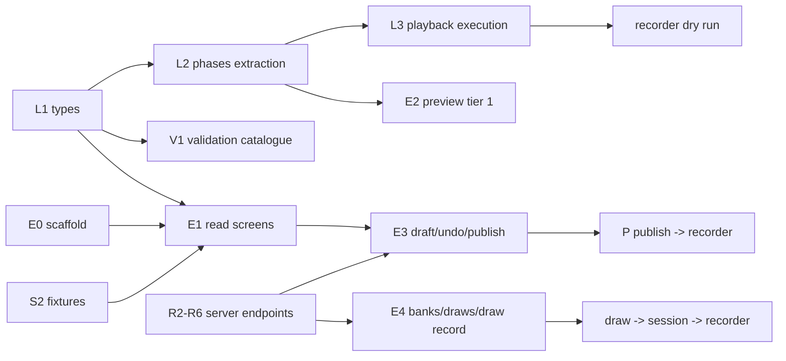

# Implementation plan — script editor (`spr-script-editor`)

Companion to [README.md](README.md) §6: it keeps the milestones and turns them into tasks,
file-level targets, ordering and gates. Grounded against commit `0c1de418` in worktree
`determined-antonelli-b67204`; the design docs are untracked there.

**Gate** = the observable proof that closes a milestone. A milestone is not closed on
code-complete alone. Tasks named `L…` touch the library/recorder, `E…` the editor, `V…`
validation, `S…` fixtures, `R…` the server in `server/` (track R, §4). There are no time
estimates here; only order and dependencies. Bracketed labels (`A1`, `B4`, `C2`, `D3`) index the
plan review that drove an amendment; §9 maps each one to where it lands.

## 1. Ground truth (verified in the repository)

| Fact | Verified in | Consequence for the plan |
|---|---|---|
| Angular 20.3.x, CLI 20.3.36, `@angular/build` builders; Material 20.2, CDK 20.2.14, forms 20.3, TS 5.9.3 | `package.json` | CDK is already a dependency: drag-drop and virtual scroll need no new package. |
| Two projects on this branch: `WebSpeechRecorderNg` (application), `speechrecorderng` (library); **`master` has renamed the application to `Cavox`** (`angular.json` projects `Cavox`, `speechrecorderng`; `package.json` name `cavox`) | `angular.json` in this worktree and on `origin/master` | M2's project block is a third project; re-base first (R0). |
| `master` holds only security scans (`codeql.yml`, `osv-scanner.yml`); this branch adds `.github/workflows/tests.yml` (receiver `node --test`, library karma) — the editor jobs join at M2. `bin/theme_audit.mjs` drives an already-running Chrome over CDP (port 9333, `--url`, `--viewports`, `--prepare`) | `origin/master:.github/workflows`, `.github/workflows/tests.yml`, `bin/theme_audit.mjs` | "Add editor routes to the CI list" means the audit command list; R10 keeps the tests workflow current. |
| Demo app imports the library by **relative source path**; root `tsconfig.json` maps `speechrecorderng` → `dist/speechrecorderng` | `src/app/app.module.ts`, `tsconfig.json:...` | `from 'speechrecorderng'` imports in the editor are ambiguous until D-A (§2) is decided. |
| Library is one eager `NgModule` declaring every recorder component and registering `SPR_ROUTES` | `speechrecorderng.module.ts` | D1 confirmed; the editor must not import it and must not rely on its routes. |
| Timing facts: defaults `1000`/`500` ms; `prerecdelay` falls back to `prerecording` (`sessionmanager.ts:1120-1122`), `postrecdelay` to `postrecording` (`:1127`); max timer `pre+recduration+post` (`:1133`); prompt applied at start for `PRERECORDING`/`PRERECORDINGONLY`, at pre-delay end for `RECORDING`, cleared at pre-delay end for `PRERECORDINGONLY` (`:1113-1163`) | `sessionmanager.ts` | L2 can only be correct if these exact behaviours are pinned as characterisation tests first. |
| `RANDOMIZED` is ignored; shuffle runs in the component for `order==='RANDOM'`, writing `_shuffledGroups`/`_shuffledPromptItems`; `applyItem` reads them | `speechrecorderng.component.ts:333-345`, `sessionmanager.ts` `applyItem` | The editor must never persist `_shuffled*`; drafts strip them (D-F). |
| Library types lag the JSON: `Section` has no `name`, `Script` has no `name`/`type`/`minRecorderVersion`, yet fixtures carry `name`, `type`, `scriptId`; `1.json` still uses legacy `promptUnits` | `script.ts:63-81`, `src/test/script/*.json` | Additive type extensions (D-I); the loader must tolerate keys the types do not describe and keep them untouched. |
| `Group._shuffledPromptItems` / `Section._shuffledGroups` are **required, non-optional** fields | `script.ts:67-76` | The editor's loader fills them; the serialiser strips them (never make the recorder null-check). |
| Fixtures: `1.json` 1.8 kB (legacy), `1245.json` 26.6 kB, `3456.json` 6.5 kB, `3171…json` 16.7 kB | `src/test/script/` | Enough for M2; M1/M4 need new fixtures (playback, draw, 500-item perf). |
| Library tests: `@angular/build:karma`, `src/test.ts`, `tsconfig.spec.json`, `karma.conf.js` (Chrome, `singleRun:false`) | `angular.json`, `projects/speechrecorderng/*` | Copy the pattern for the editor; headless runs pass `--watch=false --browsers=ChromeHeadless`. |
| Design-doc defects: README §4.1 test `tsConfig` is malformed (`"projects/spr-script-editor:tsconfig.spec.json"`); data-model §2.1 has no `Playback.durationMs` although the timeline/W05 need it; README §8.2 script-name question is open while fixtures already carry `name` | this directory | Fix while touching those files (M0/M1). |
| Design tension: README §3 forbids `AudioContext` in the editor; rest-api §5 allows client-side decode of clip duration | README §3, rest-api §5 | Use `HTMLMediaElement` metadata (no Web Audio), server `durationMs` authoritative (D-G). |
| The recorder loads a session's script as `GET script/{sess.script}` — the published, unresolved script | `speechrecorderng.component.ts:164`, rest-api §1 | A1: a published drawn group reaches the recorder empty; a delivery mechanism must be frozen (D-K). |
| Every library component is a `standalone: false` NgModule declaration (`SpeechrecorderngModule` declares and exports them, and registers `SPR_ROUTES`) | `audio_display.ts:53`, `speechrecorderng.module.ts` declarations | A2: the editor cannot use `AudioPlayer`/`AudioDisplay` without importing the module; audition player decided in D-L. |
| Dev config is `apiEndPoint:'test'`, `apiType:'files'`; `src/test` is mapped to `/test` | `src/environments/environment.ts`, `angular.json:35` | A3: the editor needs its own asset mapping plus every list-endpoint fixture; S2 lists them. |
| `promptUnits` occurs in `1.json`/`317118e4…json` but in no library `.ts`; those sections carry no `groups` | `src/test/script/*.json`, grep of `projects/speechrecorderng/src/lib` | A4: the editor must detect the legacy shape and never add `groups: []` implicitly (D-M). |
| `public-api.ts` exports the model types but not `PromptitemUtil`/`MediaitemUtil`/`PromptDocUtil`, `Order`, `VirtualViewBox` | `public-api.ts` | L1 must export them or the editor duplicates item labels and drifts. |
| rest-api has no media list or delete endpoint, only `POST /media` and the in-use refusal rule | rest-api §5, §7 | B1: add `GET`/`DELETE media` before W11 and the delete path are implementable. |
| `VERSION='3.11.26'`; three numeric segments today | `spr.module.version.ts` | The L4 comparator must define missing-segment and pre-release behaviour, not only `3.10` vs `3.9`. |
| **The server is in the repo**, on `master` (`b0d04f60`): a Node-builtins receiver — the draft of the production server — in `server/{server,api,store,body,multipart,wav}.mjs` (~2 000 lines), `npm run serve:api`, file store under `--data` (gitignored `server/data`) seeded from `src/test`. This branch (`dc04a94c`) predates it. | `git ls-tree origin/master`, `package.json`, `server/*.mjs` | Re-base before M2; extend `server/` instead of writing a stub (D-B rewritten, R0); changes transfer to production (D-Q). |
| Receiver surface today: `GET project/{p}`, `GET project/{p}/{resource}`, `GET script/{id}` (read-only, any method), `GET/PATCH/PUT session/{id}`, project-scoped session PATCH, recfile list/audio, `GET/POST/PATCH recordingfile/{id}`, raw and chunked upload with an `Idempotency-Key` journal. No create/list/write for scripts, no banks, media, draws, ETag or validation. | `server/api.mjs` header and route switch | Track R is additive: every editor endpoint in [rest-api.md](rest-api.md) is new server work. |
| Receiver error body is `{"error": message}`; `sendJson(res, status, body, headers)` accepts extra headers; CORS/credentials are CLI flags; there is no auth; `.json`/`.wav` URL suffixes are stripped for `apiType: 'files'` clients. | `server/api.mjs` `respondToError`/`sendJson`, `server/server.mjs` | Extend to `{error, message, details}` additively; ETag needs only the headers parameter (R1). |
| `wav.mjs` probes and concatenates WAVE; `multipart.mjs` parses uploads; `store.mjs` writes through temp+rename and keeps ids/journal under `<data>/uploads`; `projectResourcePath` refuses traversal. | `server/wav.mjs`, `multipart.mjs`, `store.mjs` | Media `durationMs`, multipart and atomic writes reuse existing code (R1/R6); the ETag is safe only because writes are atomic. |
| **Upstream already ships an audio-prompt playback model**: an audio `mediaitems[0]` is played as the prompt (`Mediaitem.autoplay`, `Mediaitem.replay`), with `audio/prompt_audio.ts`, a held traffic light, a replay control and the `R` key (commits `99f4ff42`, `cb1d360f`). No `PromptItem.playback`, `PlaybackWhen`, `repeats`, `gap`, `headphones` or `maxReplays` exists in the tree. | `script.ts`, `sessionmanager.ts:1293/1435`, `prompting.ts:326`, `lib/audio/prompt_audio.ts` | Reconciled by **D-V = C** (§10.3): `playback` becomes an optional modifier over the shipped audio mediaitem. |
| **Upstream already ships load-time prefill**: `PromptItemPrefill` (`source`, `select:'random'`, `itemcodeFormat`, templated `mediaitems`), `ScriptPrefillService`, `prefill.ts`, `Session.prefills`; sources are fetched through the new `ScriptService.scriptResourceObservable` (`ba81bcf8`). | `prefill.ts`, `prefill.service.ts`, `session.ts`, `script.service.ts` | Reconciled by **D-W = A** (§10.4): the item bank becomes a prefill source type, resolved server-side where session state is needed. |
| i18n moved into the library: `@jsverse/transloco`, `SPR_STRINGS`/`SprTranslator`, `bin/build_i18n.mjs`, `src/assets/i18n/{en,sv}.json`. `master` also renamed the app to `Cavox` and added `src/assets/configurations.json` plus a configuration picker in `src/app/session/sessions.ts`; the recorder records against the receiver by default (`fecbd8ac`). | `package.json`, `lib/i18n/translate.ts`, `src/app/session/sessions.ts` | The editor reuses the library catalogs and the picker naming; the "script bank" here is scripts/configurations, not the item bank — do not conflate the terms. |
| Fixtures changed on master: `1245.json` rewritten (net −58), new `dysartri-*`/`sti-*` scripts using prefill and prompt audio, `1.json` still legacy `promptUnits` | `git diff 0c1de418 origin/master -- src/test/script` | M2's fixture set is re-checked; the legacy-shape test (A4/N06) still applies. |
| `1245.json` deliberately fails two checks: section 0 ("Empty section test") has no group (E10) and several groups carry items without an itemcode (E01) | `src/test/script/1245.json`, seeded-receiver smoke (duplicate → publish → `409 PUBLISH_REJECTED`) | The M2 fixture is for navigating and inspecting, not publishing; the editor must show those findings. M3 publishes a created script. |

## 2. Decisions this plan takes (review points, not silently assumed)

| # | Decision | Why / alternative |
|---|---|---|
| D-A | The editor imports the library **from source**: editor `tsconfig.app.json` overrides `baseUrl` to `../..` and `paths: {"speechrecorderng": ["projects/speechrecorderng/src/public-api.ts"]}`. | The dist mapping forces `ng build speechrecorderng` before every `ng serve` and kills HMR in library code. The demo app already consumes source. Alternative (npm semantics) costs only the developer loop; production build is identical. |
| D-B | **Extend the in-repo receiver** (`server/*.mjs`) rather than write a separate stub: rest-api §2–§7 land as new modules there (`validate.mjs`, `bank.mjs`, `draw.mjs`, `media.mjs`), behind the existing handler and store. Development runs it with `--data /tmp/… --seed src/test`, so runtime state never enters the repo. | The server exists, is the recorder's contract reference, and already owns the upload half. A parallel stub would duplicate the store, upload and WAV code and drift (Q1 is answered: the server is local). Alternative: a stub in `bin/` only if the receiver turns out to be evaluation-only and the production service is elsewhere. |
| D-C | Undo = whole-draft snapshots (`structuredClone`), coalesced per focused field, history capped (~50). The pending edit is also captured as a small **edit intent** (JSON-Patch-style ops per save window); on 412 the intent is re-applied once over the server copy with index guards, then a visible conflict state. | A snapshot stack alone cannot re-apply a structural edit (move/delete/add) — only text. Snapshots serve undo, the intent serves rest-api §2.3's reapply; the intent must cover structure, not only typing. |
| D-D | Validation is pure functions with an injected context (bank `matchCount`, media index, deployment `VERSION`, feature→version map); publishing re-checks server-side. | Editor is catalogue owner (validation.md); the server is the only trusted gate. |
| D-E | JSON path → line mapping via an in-repo tokenizer (`core/validation/json-lines.ts`), no code-editor dependency. | ui-spec §5 says a textarea is enough; a dependency for gutter dots is not. |
| D-F | The draft serialiser strips keys starting `_` and never rewrites unknown keys. | D7 and the byte-comparable promise; `_shuffled*` are runtime artifacts. |
| D-G | Clip duration: server `durationMs` preferred; else measure on upload with an `HTMLMediaElement` (`loadedmetadata`), never `AudioContext`. | Keeps README §3's "no recording code in the editor" true; W05/timeline degrade to "unknown" when neither is available. |
| D-H | Editor state uses Angular signals + `OnPush`; forms stay typed reactive (README §4.3). | Signals fit draft state and selection; no zone-less migration required. |
| D-I | `Script.name?`, `Script.type?`, `Script.minRecorderVersion?`, `Section.name?`, `PromptItem.playback?`, `Group.draw?`, `Playback.durationMs?` become optional typed fields; `Playback`/`Draw`/bank/draw types land with them. | Fixtures already carry them; the editor cannot be typed otherwise. Additive, recorder unaffected. |
| D-J | The draw-rule "example draw" is computed client-side and labelled an example; the server stays the only resolver. The label states that it ignores `fixedBy` and `skipRecordedBySpeaker`, and it samples fairly instead of taking page one. | Two implementations of the draw exist; the example must never be presented as the session's draw (D4). |
| D-K | The server resolves a session's draws into a **materialised script** whose id goes into `Session.script`; `GET script/{id}` then serves it unchanged and the recorder needs no call-site change. Alternative: a session-scoped script endpoint plus one recorder call site. | The recorder today reads `script/{sess.script}` (`speechrecorderng.component.ts:164`) and a published drawn group has `promptItems: []` — A1. Materialisation preserves D2 without a recorder change; it requires the library list and draw queries to exclude internal scripts. |
| D-L | The editor's audition player is **editor-local** (`HTMLMediaElement`), not the library's Web Audio `AudioPlayer`/`AudioDisplay`. README §5 and ui-spec §3.3 are amended to say so. | The library components are `standalone: false` NgModule declarations (A2); importing the module would register `SPR_ROUTES` and bundle the recorder, and `AudioPlayer` uses Web Audio, which README §3 forbids in the editor. |
| D-M | Legacy `promptUnits` scripts are detected (N06) and migrated to `groups` only on request, with a confirmation; the loader never fabricates `groups: []` over one. Until migrated the script opens read-only. | A4: a save that adds `groups: []` silently changes what the recorder runs while the original data survives as an ignored key. |
| D-N | Drafts get server-side revision history (keep the last N saves) plus a local backup of unacked changes in `localStorage`, restored on load. | Published versions are recoverable; drafts are otherwise overwrite-only, so a bad merge/PUT or a crash loses everything since the last publish (D2/D3). |
| D-O | The persisted draw filter gets frozen semantics and a `q` field: tags are AND, `hasAudio:false` means "items without a model recording", category is exact, word bounds are inclusive and case-insensitive, and a `filterVersion` lets those semantics change without silently reinterpreting old rules. The bank page's browse filter is visually distinct from the rule filter. | The filter is persisted and D2 promises reproducibility, yet rest-api/ui-spec and `DrawFilter` disagree about free text and say nothing about the rest (B4). |
| D-P | A preview session (`type: "TEST"`) is what disables uploads: the recorder honours it. If it cannot, tier-2 requires its own recorder deployment with `enableUploadRecordings:false`. | rest-api §6 assumes such a deployment exists but the plan never schedules it; recordings from a preview must be impossible, not merely discarded (B5). |
| D-Q | The receiver is the **draft of the production server**: changes to `server/` are transferred to production, so its API shape, store layout and behaviour are production contracts. The editor's base URL points at it in development and at production elsewhere; no editor code knows which. | Owner decision (2026-10-02). A draft copied forward must not break the recorder-facing paths, and layout changes ship with migrations (§10.1). |
| D-R | The error body becomes `{error, message, details}` everywhere, additively: `error` keeps its current string value, so the recorder client is untouched. | rest-api documents the envelope; the receiver answers `{error}` only, and the recorder reads it. |
| D-S | A draft's ETag is a strong validator over the **stored bytes** (sha256), and every draft write goes through temp+rename. No canonicalisation, so unknown keys and order survive (D-F). | `If-Match` forbids weak validators, and a torn file must not get an ETag. `store.mjs` already writes atomically. |
| D-T | Server-side validation lives in `server/validate.mjs` and is kept in step with the editor's TS catalogue by **shared conformance fixtures** (`doc/script-editor/checks/*.json`: draft + expected ids), run by `node --test` and by the editor's V1 specs. | Two runtimes (Node and the browser) cannot share the TS directly; fixtures are the cheap honest contract, and publishing must not trust the client. |
| D-U | Draw resolution, the PRNG and materialised session scripts are server-owned. The editor's example draw is independent, labelled, and never presented as the session's draw (D-J). | D2 requires byte-identical reproducibility across re-draws; one implementation owns the algorithm, the editor only previews. |
| D-V | **Playback model — decided: C (owner, 2026-10-02, §10.3).** The audio mediaitem stays the sound source and the default placement; `PromptItem.playback` is an optional modifier that sets `when`, `repeats`, `gap`, `headphones` and `replayable`/`maxReplays`, overriding the shipped `Mediaitem.autoplay`/`replay` when present. | Keeps `master`'s tested audio-prompt code and needs no script migration, while preserving the design's placements and repeat controls. |
| D-W | **Randomised items — decided: A (owner, 2026-10-02, §10.4).** The item bank becomes a **prefill source type**: plain lists keep the shipped load-time, client-side path; bank sources are resolved server-side at session creation where session state is needed, and the resolution is recorded in one session trace. | One UI concept and one reproducibility story instead of two mechanisms; M0 freezes the exact unified schema. |

## 3. Dependency graph and parallel tracks



* **Track L (library/recorder)**: L1 → L2 → L3/L4. `sessionmanager.ts` has exactly one writer at a
  time; the L2 refactor must land before L3 edits the same flow.
* **Track E (editor)**: E0 starts immediately (needs nothing new from L). E1 waits only for L1.
  E3/E4 additionally wait for the server endpoints (R2–R8).
* **Track V (validation)**: starts after L1; independent of the editor shell.
* **Track S (fixtures)**: starts immediately; nothing depends on new library code.
* **Track R (server)**: R1 → R2 → R3/R4/R6 → R5/R7/R8, with R10 alongside; the editor's write path
  cannot close without R2–R4.

E0 and V1 can run in parallel with L1; they share only type definitions, which are additive.

Additions to the tracks: **L5** (resolved-script delivery, D-K) starts once L1 lands and gates the
M1 dry run and M4; **E0** also owns the `src/test` asset mapping (A3); **R4/R10** own the shared
check fixtures and the server conformance tests (M0/M3); **S2** owns the full FILES fixture
inventory (§4 M2).

## 4. Milestones, tasks, gates

### M0 — API agreement (documents, no application code)

- [x] Close open Q1: the receiver is in-repo and is the draft of the production server, so changes
      are transferred (D-Q); record the transfer and migration process, and who owns the
      production-side auth/backup (R12, §10.1). **Done:** R12 shipped the transfer discipline
      (`layoutVersion` in `meta.json`, `--migrate`, `--gc`/`--gc-media`) with `server/README.md` as
      the runbook and the production note; §8 records that the production deployment owns
      auth/CSRF/backup (§10.1, §8 rows 1 and "production transfer requirements").
- [x] Freeze **how the recorder obtains a resolved script** (A1, D-K): **Done** — the materialised
      script id on `Session.script`, resolved at creation by `store.resolveSessionDraws` and read by
      the recorder's unchanged `GET script/{sess.script}`; `server/draw.test.mjs` exercises exactly
      that path (and `rest-api.md` §4.1 states it as the deployment contract).
- [x] Freeze the draft protocol: **strong** ETag, 428/412, `details.current` **including the current
      ETag**, `details.checks`, idempotent PUT, whether `_restore` consumes `If-Match`, and an
      `ETag` on the create response. **Done in `server/api.mjs`:** a missing precondition is `428
      PRECONDITION_REQUIRED`, a mismatch is `412 SCRIPT_DRAFT_CONFLICT` with
      `details.current` + `details.currentEtag`, `_restore` goes through the same
      `requireDraftPrecondition`, create answers with `ETag` + `Location`, and `If-None-Match: *`
      asserts emptiness; `rest-api.md` §2.3 dies the weak `"w/4-17"` example.
- [x] Freeze what "new script" seeds and the id semantics of import JSON and duplicate.
      **Done:** `seedScript` in `server/api.mjs` seeds a publishable one-item script (so E10 cannot
      block a fresh draft), and `POST project/{p}/script` with `{from: {scriptId, version?}}`
      duplicates a draft/published version/published script under a new id ("(copy)" name);
      `server/publish.test.mjs` covers the duplicate path.
- [x] Freeze publish gate payload, the check ids the server enforces, how E04's `matchCount` is
      computed atomically at publish time, and the rendering of server-returned `details.checks`;
      freeze the feature→recorder-version map ownership. **Done:** `409 PUBLISH_REJECTED` with
      `details.checks` (R4), `matchCount` recomputed inside publish, and the map ownership decided
      in L4 (`feature-versions.ts` + the receiver's mirror, held to the same cases by both suites).
- [x] Freeze bank endpoints and the shipped-bank delivery answer (Q3), **bank/media write
      concurrency** (ETag or an explicit last-write-wins statement) and upload filename collisions.
      **Done:** builtin banks are served from the seed with `source: BUILTIN` and their items'
      `audioSrc` used as given (rest-api §3.4); concurrency is frozen as last-write-wins with a
      re-read after write (rest-api §1.2), except media `DELETE`, which refuses with
      `409 MEDIA_IN_USE` while a published version references the file; uploads go through
      `sanitiseMediaName`.
- [x] Add the **media endpoints rest-api is missing** (B1): `GET project/{p}/media` with `usedBy`,
      `DELETE project/{p}/media/{src}`, the draft-vs-published reference rule, and the orphan
      policy for uploads the undo stack cannot remove. **Done:** `store.listMedia` +
      `usedBy`/`MEDIA_IN_USE` in `server/api.mjs`, the draft-vs-published rule in `server/media.mjs`
      (only published references block a delete), and `--gc`/`--gc-media` as the orphan policy
      (rest-api §5).
- [x] Freeze the unified randomised-items schema (D-W, §10.4): the source reference (list vs bank),
      the client/server resolution split, the single session trace (shipped `Session.prefills` for
      lists plus `Session.bankDraws` for banks; `ResolvedDraw` dropped), `_redraw` and its status
      rule, itemcode padding and count cap, seeds per `fixedBy`, the refill rule, and the PRNG spec
      the receiver implements. **Frozen** in data-model §2.2/§2.4 and implemented in `server/draw.mjs`.
- [x] Freeze the `Playback` modifier (D-V, §10.3): fields and defaults, the override of
      `Mediaitem.autoplay`/`replay`, the check for both being set (W13), and the non-recording
      `when` restriction. **Frozen** in data-model §2.1 and validation.md.
- [x] Freeze the bank-source filter semantics (D-O, §10.4), including a `filterVersion`.
      **Done**: `server/bank.mjs` implements `category`/`words`/`hasAudio`/`tags`/`q`, and the bank
      source carries `filterVersion`.
- [x] Freeze `/media` upload (`X-Filename`, `durationMs` advisory), media-in-use refusal, and the
      source of truth for W10's "deployment runs {actual}" (B7). **Done:** the upload contract is
      `server/api.mjs` (`x-filename` → `sanitiseMediaName`, the response
      `{src, mimetype, durationMs, bytes}` with `durationMs` measured by `probeWav`, advisory to the
      client), the refusal is `409 MEDIA_IN_USE`, and the source of truth is the new
      `GET {api}version` → `{recorderVersion}` (what `--recorder-version` serves), because the
      receiver and the recorder are co-deployed (rest-api §1.1).
- [x] Freeze the auth surface: cookie vs bearer, XSRF strategy, and the 401 → login → return-URL
      contract the shell implements (B8). **Done:** rest-api's conventions — a session cookie with
      the deployment's CSRF scheme (the XSRF cookie/header Angular already supports) **or** a bearer
      token, `401` redirected to the deployment's login with a return URL, `403` read-only, and the
      editor ships no login form; §1.2 adds the bank/media last-write-wins statement.
- [x] Fix the doc defects: the §1 list (README §4.1 test path and its missing `src/test` asset
      mapping, data-model `durationMs`, script `name`), the README §4.4 audit URL
      (`/edit/script/1245` vs ui-spec §1), README §4.3 `express/json-server` vs D-B's Node
      builtins, README §5's `BankService`/`DrawService` placement (kept editor-local; the recorder
      never uses them), and ui-spec §8's M5-vs-per-milestone a11y wording. **Verified applied** —
      the `src/test` asset entry is in README §4.1, §4.4 audits
      `/project/:p/script/:id/edit`, §5 lists `bank-api`/`draw-api`/`media` as app-local, ui-spec §8
      reads "verified at each milestone and closed at M5"; `durationMs` and `Script.name` are in
      data-model. **The API items above are closed with it** (see the bullets).
- [x] Pseudonymity decision (Q4) — **default marked:** the draws view shows what the API returns and
      keeps speaker rendering isolated, so a pseudonym mapping stays a one-file change (§8 row 4).
- Gate: endpoint list and JSON shapes frozen in this directory, exercised by the check fixtures
  and the server's conformance tests (R4/R10) and imported by the editor specs; the open questions
  above either answered or explicitly deferred with a default marked in this file.

### M1 — Recorder honours playback (library + recorder, no editor)

| Task | Files | Content |
|---|---|---|
| L1 types | `lib/speechrecorder/script/script.ts`, `prefill.ts`, `public-api.ts` | **Done.** `PlaybackWhen`/`Playback` as the optional modifier of §10.3 added to `PromptItem` (with `bankItemId`); `PrefillBankSource` + `DrawFilter`/`DrawFixedBy`/`BankSource`/`Bank`/`BankItem` added, and `PromptItemPrefill` now carries **exactly one** of `source` (list) or `bank`; the utility classes and the new types are exported from `public-api.ts`. One necessary guard: the client-side prefill skips bank placeholders (they are server-resolved), and `source`/`itemcodeFormat`/`mediaitems` became optional, so `ScriptPrefillUtil` guards them. Verified: `ng build speechrecorderng` clean, library suite **105 pass** (3 new specs in `editor_model.spec.ts`). | M1 |
| L2 extraction | `script/phases.ts` (new), `sessionmanager.ts`, `phases.spec.ts` (new) | **Done.** `promptVisibleAt(promptphase, phase, itemType)`, `effectiveTiming(item)` (pre/rec/post with the legacy fallbacks, the item window, and the playback span with its sequencing), `playbackPlan(item)` for the D-V = C modifier, and `ITEM_PHASES`/`nextPhase` for the preview's steps, with `DEFAULT_*_REC_DELAY` as the single definitions. Characterisation tests pin the manager's behaviour first; the manager then calls the functions (visibility at selection, at the take start and at the delay end; timing for the clocks) with **no behaviour change** — the pre-existing 105 specs still pass. Exported from `public-api.ts` so the editor shares the arithmetic (D6). | M1 |
| L3 playback | `sessionmanager.ts`, `audio/prompt_audio.ts`, `script/phases.ts` | **Done (placements, repeats, override), one notice left.** `playbackStart(plan)` maps each `when` to where the sound starts: `WITH_PROMPT`/`BEFORE` gate the clocks (the shipped behaviour), `PRERECORDING` plays from the take start, `DURING` from the recording window, `ONDEMAND` only from the play control; `playSequence` plays `repeats` with `gap` and is cancelled by `stop()` at any point, including inside a gap. The manager uses `playbackPlan` for the source, placement, replay rule and prefetch, so the modifier overrides `Mediaitem.autoplay`/`replay`; a failure is reported on the status line and never stalls the take; Next/Prev/Stop/Pause and the review player cancel the sound. Verified by the suite (132 pass). A sound that cannot be played reports `spr.status.promptAudioError`, or `spr.status.promptAudioOffline` when the browser is offline, and never stalls the take.
| L3 replay | `sessionmanager.ts`, `item.ts`, `script/phases.ts` | **Done.** `replayAllowed(plan, used)` centralises the rule: the shipped `Mediaitem.replay`, overridden by `playback.replayable`, `ONDEMAND` always playable, and `maxReplays` capping the repeats. The manager counts operator replays per item (`Item.replays`), disables the play control when the cap is reached, and PATCHes the session with a `replayLog` (itemcode → count) so the count survives the take (C4). Specs: the rule table in `phases.spec.ts`. | M1 |
| L3 headphones | `script/phases.ts`, `sessionmanager.ts`, `lib/i18n/translate.ts`, `bin/build_i18n.mjs` | **Done.** `sectionNeedsHeadphones(section)` covers both an item's own `playback.headphones` and a drawn placeholder's `prefill.bank.playback.headphones`. The first recording take of such a section opens the modal reminder and starts only when the operator dismisses it (once per section, and only if the session has not moved on). New strings `spr.dialog.headphonesTitle`/`Msg` (en + sv) and `spr.status.promptAudioOffline`, regenerated with `bin/build_i18n.mjs` and checked by `bin/validate_i18n.mjs`. The manual gate (a dry run with `playback.json`) remains. | M1 |
| L4 version gate | `script/feature-versions.ts` (new), `speechrecorderng.component.ts`, `public-api.ts`, `server/feature-versions.mjs`, `server/store.mjs`, `server/server.mjs` | **Done.** `feature-versions.ts` holds the comparator (numeric segments, `"3.10" > "3.9"`, missing segments, pre-release), `featuresUsed`, `minRecorderVersionFor` and `supportsRecorderVersion`; `playback` maps to `VERSION`, so its floor rises with the release that ships it. The recorder refuses an unsupported script at load with `spr.status.scriptVersionTooOld` (en + sv) instead of running a session that silently differs. The receiver mirrors the table, refuses at session creation and preview with `409 RECORDER_VERSION_TOO_OLD` (C8) and takes `--recorder-version`. New `Script.name/type/minRecorderVersion` fields (D-I). Verified: library suite **136 pass** (4 new); server suite **44 pass** (gate, comparator and the detector⊆table invariant); `ng build speechrecorderng` clean; end-to-end smoke — a seeded script with `minRecorderVersion: "99.0.0"` is refused `409 RECORDER_VERSION_TOO_OLD` by default and served with `--recorder-version 99.0.0`. The manual gate (a browser dry run of a script above `VERSION`) remains. | M1 |
| L5 resolved script | (server half done; recorder unchanged by design) | **Done via the receiver (R7a/R8).** The server materialises a session's script into `script/sess-<sessionId>` and points `Session.script` at it, so the recorder's existing `GET script/{sess.script}` reads resolved, plain items with no call-site change — verified end to end in `server/draw.test.mjs`. A deployment's server must resolve draws the same way; that is a contract in [rest-api.md](rest-api.md) §4.1, not recorder work. | M1 |
| Fixture | `src/test/script/playback.json`, `src/test/project/Demo1/media/std-vowel-{a,i}.wav` | **Done.** One item per placement — `WITH_PROMPT`, `BEFORE` (repeats, gap, headphones), `PRERECORDING`, `DURING` (replayable, capped) — a non-recording `ONDEMAND` item, and a drawn group (`std-passages`, filter `vowel` + `hasAudio`, `playBankAudio`, its own `playback` and `itemDefaults`). The two model recordings the drawn items resolve to were missing, so the fixture was unrunnable offline; they are now shipped beside `model-01.wav`. | M1 |
| Gate | **Automated:** `npm run test_module -- --watch=false --browsers=ChromeHeadless` **137 pass**, including C7's placement table — every `when` → `playbackStart` → `playbackTiming` (gates the clocks / alongside them / at the recording window / operator only), which is the single place the manager decides it (`phases.spec.ts`). The fixture's data path is proven against the receiver: seeded, session created (`draws: 1`), materialised script fetched, and **every** audio URL of the five placements and the two drawn items answers `200 audio/wav` (`playback.json` → `sess-1`). **Dry run, headless (real recorder, real receiver):** built app served by the receiver, fake media stream, `/spr/session/1` — the session loads `script/sess-1` (L5), the caller in `sessionmanager` fetches the fixture's clip, **Starta** opens the headphone reminder *before* the take ("Hörlurar krävs", my L3 string) and only dismisses into `status: STARTED`, and two presses of the prompt-audio control PATCH the session with **`{"replayLog":{"P1":1}}` then `{"replayLog":{"P1":2}}`** — the replay count is persisted (C4). No console errors. **Manual (remains):** hearing each `when` in sequence (only P1 was driven here) and navigation during playback. | M1 |

### M2 — Editor skeleton, read-only

| Task | Files | Content |
|---|---|---|
| E0 project block | `angular.json`, `package.json`, `projects/spr-script-editor/**` | **Done.** The project block per README §4.1 (test `tsConfig` path corrected) plus three additions the sketch needed: an `environments/` pair with a production `fileReplacements` (development reads the FILES tree, production the REST base — without it the production bundle ships `/test`), the `src/test` asset entry **and the same array in the karma target**, and a `doc/script-editor/checks` asset served at `/checks` so the editor's specs and `server/checks-corpus.test.mjs` run the same corpus. `main.scss` mirrors `src/main.scss` (palette → `mat.theme` → token + role pins, light and dark); `main.ts` bootstraps without the library module (`grep -rn SpeechrecorderngModule projects/spr-script-editor/src` is empty); budgets as specified. Verified: `npm run build_editor` green (383.42 kB raw / 103.62 kB estimated), §4.1 lists the additions. | M2 |
| E0 routes/shell | `app/app.routes.ts`, `app/shell/`, `app/editor.config.ts` | **Done, except `?sel=`.** Routes of ui-spec §1 with the later slices mounted through one `NotYetBuilt` placeholder; the shell carries the breadcrumb, save state, warning-count link, Preview/Publish and undo/redo, all disabled with an aria explanation while M2 is read-only, and the deployment version from `GET {api}version`. `?sel=` sanitising and the nearest-node fallback (D9) belong to the editor screen and land with E1. | M2 |
| E1 services | `app/core/script-api.service.ts`, `bank-api.service.ts`, `draw-api.service.ts`, `media.service.ts`, `load.ts` | **Done (read side).** Library list, script by id, `version`, banks and filtered items, session draws, media list; URL building mirrors `ProjectService` (`apiEndPoint` + `project/{p}/…`, `withCredentials`, FILES-mode `.json?requestUUID=`), with `HttpTestingController` specs in both API modes. `load.ts` fills `_shuffled*` with `groups`/`promptItems` **verbatim**, keeps unknown keys and never fabricates `groups` over a legacy `promptUnits` section — one spec each. Write endpoints stay in M3. | M2 |
| E1 library list | `app/library/` | **Done.** Table (name + section names, id, content summary "11 items + 20 drawn", status chip, usage "14 sessions (v3)", last edited, row actions), filter row (name/id/itemcode + status), legend cards, and empty/loading/error states per ui-spec §2/§9; the write actions are present but disabled in M2. Verified at runtime over CDP: the screen renders the real `/test/project/Demo1/script.json` rows and links into the editor route. | M2 |
| E1 editor screens | `app/editor/outline|items-table|inspector` | **Done (M2, read-only).** Outline (flattened tree rows, markers from the check catalogue, filter keeping ancestors, CDK virtual scroll above 300 rows), centre (script flow cards, fixed-group tables, drawn-group card + deterministic example draw with reserved codes), inspector (four variants; playback block with an **editor-local `HTMLMediaElement` audition player** (D-L), not the library's Web Audio components; timeline bar from `effectiveTiming`). Deep-linkable via `?sel=` with sanitising/fallback; loading skeleton, empty-section card and a blocking load-error state. **M3 owns structural/field edits** (drag-drop reorder, keyboard move, inspector writes, undo/redo): the affordances are rendered **disabled with a title/aria note**, never faked. The virtual branch needed one fix found in the M2 verification pass: CDK 20's `cdk-virtual-scroll-viewport` throws without the fixed-size strategy, and Angular swallowed that into an **empty** outline for scripts above the row threshold — `CdkFixedSizeVirtualScroll` is now imported explicitly and `editor-outline.spec.ts` mounts the component with 861 rows so the failure cannot return unnoticed. | M2 |
| E2 preview tier 1 | `app/preview/` | **Done.** `preview-order.ts` (the session walk: section/group rows, the drawn placeholder's rule row, and the example items folded in at its place, marked drawn), `preview-steps.ts` (Idle/Listening/Pre-rec/Recording/Post-rec, derived from `ITEM_PHASES`/`nextPhase`; `promptVisibleAt` per step; `playbackStart`/`playbackTiming` place the sound; a step the item cannot reach is disabled with the reason, never hidden), `preview-stage.ts` (the beige stage; a declared `src` the media list does not know becomes a labelled "Playback file not found" placeholder — ui-spec §9 — and a drawn example's model recording is labelled, never a fabricated URL), `preview-draw.ts` (the local example draw; **seed** = a fixed constant XOR an FNV-1a hash of `scriptId:section:group:placeholder:generation`, so load is stable and Re-draw is a fixed sequence — no `Math.random`, no clock), `script-preview.*` (the speaker frame: section name, Practice/"Drawn item" chips, progress, stage, playing state with a level display and a `replayAllowed`-gated replay control, the three-lamp traffic light **plus the fourth playback lamp**, status line, transport; the "Nothing is recorded or uploaded" banner; the tier-2 dry run is present but disabled with a title naming M4 and `POST project/{p}/script/{id}/preview-session`; a headphone notice from `sectionNeedsHeadphones`; `?item=`/`?step=` are the deep-linkable state). Use of the recorder's rules is exclusively through the library imports (D8). Specs: order folding/legacy `promptUnits`/keys, step enablement and prompt visibility per item, the seed and re-draw determinism, the stage's missing-file placeholder, and a `TestBed` + `RouterTestingHarness` mount of the real route (frame, chips, order list, Re-draw, replay cap, lamps, URL). Route: `app.routes.ts` now lazily loads `preview/script-preview` instead of the `NotYetBuilt` placeholder. The screen is decomposed so no component stylesheet approaches the `anyComponentStyle` budget: `script-preview` (chrome, banner, states, frame header, timing) plus `preview-stage-panel`, `preview-playback-panel`, `preview-transport-bar`, `preview-step-simulation` and `preview-order-panel`, each owning its elements and styles (largest sheet 3.30 kB compiled, 4 kB warning). | M2 |
| V1 catalogue | `app/core/validation/**`, `app/core/normalise.ts` | **Done.** `validation/types.ts` + `walk.ts` (JSON paths byte-identical to `server/validate.mjs`) + one module per severity (`errors.ts` E01–E11 with E08 a retired no-op, `warnings.ts` W01–W13, `notes.ts` N01–N06) + `index.ts` (`runChecks`, `checkCounts`, `publishGate`, `findingsUnder`, `findingsBySeverity`) + `filter.ts` (mirrors `server/bank.mjs`'s `queryBank`, so E04/W04 agree with the server) + `json-lines.ts` + `normalise.ts`. Context is injected (D-D) and includes the deployment version and the feature map imported from the library — nothing re-derived. Specs: **109** (one `describe` per id with the clean case, json-lines escapes/`\t`/CRLF/duplicate keys/unicode, normalise idempotence per fix) plus the shared corpus: all **9** `doc/script-editor/checks/*.checks.json` cases pass the editor's implementation, matching the server's expectation. Trigger drift found while implementing was fixed in [validation.md](validation.md) (E05 empty prefix, E06 audio mediaitem, E07 whole `mediaitems` list, E09 whole-number `count`); message text is free by design (§intro). | M2 |
| S2 fixtures | `src/test/project/Demo1/{script,media,bank}.json`, `src/test/project/Demo1/bank/*/item.json` | **Done.** The library-list fixture carries the 12 rows of rest-api §2.1 (status, versions, counts, `sessions {total, started, byVersion}`, modified/modifiedBy, archived — one row deliberately ARCHIVED so the filter is exercisable) and every row resolves to `src/test/script/<id>.json`. Media list + `media/index.json` carry the measured `durationMs` a seeded receiver cannot measure; bank lists and filtered item pages match what the receiver returns. The drawn-group script (`bank-draw.json`), legacy `promptUnits` scripts (`1.json`, `317118e4-…`), the ~500-item script and `playback.json` were already in the tree and are verified untouched. Verified: all JSON parses, a receiver seeded from the tree answers `200` for the list, one script by id and one bank item page, and its `GET media` matches `media.json` value for value. The list fixture also exposed a REST/FILES divergence, fixed in `server/store.mjs` (see `server/list.test.mjs`). | M2 |
| Gate | **Proven:** `npm run test_editor -- --watch=false --browsers=ChromeHeadless` **229 pass** (109 validation, services/load/draft, selection/outline/markers/timeline/example-draw, preview order/steps/stage/draw, outline rendering), `npm run test_module` **137 pass**, `npm run build_editor` green (447.90 kB raw / 122.26 kB estimated, **no budget warning**), and `node bin/theme_audit.mjs` passes at 1366×768 and 1920×1080 on four routes: the library list, `script/1245/edit`, `script/playback/preview`, and `script/bank-draw/edit` **with `bin/audit/open-draw-rule.js`**, which clicks the drawn-group row so the audit measures the draw-rule inspector (the fixture is pure DOM, so it also works on a production build). The 500-item script is exercised over CDP: 561 flattened rows, `virtual()` true, **7–8 rows in the DOM at a time**, scrolling to the end renders section 10's rows and clicking one selects `?sel=i:9:4:9` — the branch was broken until this pass and is now pinned by three component specs (`editor-outline.spec.ts`, which fail without the CDK fixed-size directive). **Remaining:** the VoiceOver pass #1 (a human step, now tracked in M5). The legacy read-only round-trip landed with M3: `core/round-trip.spec.ts` loads every fixture, writes it back and asserts no key is lost, no `groups` is fabricated over a legacy `promptUnits` section and the loader's `_shuffled*` mirrors are never persisted. | M2 |

### M3 — Write path

Delivered: `core/script-draft.service.ts` (+spec) with the snapshots, the edit intent, the 412 reapply, debounce/flush, the conflict state, the local backup and the never-PUT-invalid rule; the write endpoints appended to `core/script-api.service.ts` (`readDraft`/`writeDraft`/`publish`/`versions`/`publishedVersion`/`restoreVersion`/`patchScript`/`createScript`/`duplicate`/`minRecorderVersion`); `core/media.service.ts` upload/remove/measure; `core/editor-findings.service.ts` (client + server findings, counts, gate); `app/source/**` (the JSON source screen) and `app/validation/**` (the checks panel); `app/editor/**` (editable inspector per ui-spec §3.3, drag-drop and `Alt+↑/↓` reorder, version-history panel, playback/media block with the audition player); `app/shell/**` (save state, warning count, publish gate, undo/redo, `beforeunload`); and `src/test/project/Demo1/script/<id>/draft.json` for every fixture, so FILES mode reads the same drafts the receiver serves. The receiver gained one fix this path needed: CORS now allows `If-Match`/`If-None-Match`/`X-Filename` and exposes `ETag`/`Location` (`server/cors.mjs` + `server/cors.test.mjs`) — without it a cross-origin dev editor cannot write conditionally at all.

| Task | Files | Content |
|---|---|---|
| E3 draft service | `app/core/script-draft.service.ts` | Snapshot undo/redo (D-C) **plus a per-save-window edit intent (JSON-Patch-style ops) used for the 412 reapply**, so structural edits (move/delete/add) survive; history depth capped (~50). 2 s debounce + blur flush, single-flight save, ETag from the last response, 412 → reapply the intent once with index guards → conflict state keeping both texts. `FILES` mode = writes disabled, draft shown as locally modified; `beforeunload` guard while dirty; local backup of unacked changes restored on load (D-N). Invalid JSON text is never PUT: the service serialises the last valid model, the shell shows "unsaved changes", and reload keeps the text from the backup (D2). |
| E3 source view | `app/source/` | Textarea + Format + gutter dots via `json-lines`; parse-and-apply only when parse and invariants hold; structure frozen otherwise; the invalid text lives only in the local backup; import (file), export `script-{id}.json`; publish from the header. |
| E3 checks panel | `app/validation` UI | Severity groups, `line · subject`, consequence sentence, deep link into the editor, one-click fixes; errors block Publish, warnings are listed to the publisher; **server-returned `details.checks` render here too** (B3), so a publish-time race appears as findings, not a bare 409. |
| E3 publish/versions | `script-api.service.ts`, shell | Publish with gate; version list + restore (`draft/_restore`) **with a designed surface — ui-spec has no version-history screen (D5): add a panel to the script inspector and amend ui-spec §3.3**; PATCH name/archive; create/duplicate from the library; `minRecorderVersion` derived from the feature map and shown as N04. |
| E3 media | `script-api.service.ts`, `media.service.ts`, playback block | `POST project/{p}/media`, capture `durationMs` (D-G), attach to `playback.src`; `GET` the media list for the picker and W11; `DELETE` surfaces `MEDIA_IN_USE`; orphan uploads are called out because undo cannot remove them (B1). |
| R2–R4 server write surface | `server/{api,store,etag,validate}.mjs` (track R) | **Done.** R1–R4 landed with the editor's write path (see R1–R4 above and the M3 gate); the M3 verification ran against the receiver, not FILES, and the conformance fixtures under `doc/script-editor/checks/` are shared with V1. |
| Gate | **Proven.** `npm run test_editor -- --watch=false --browsers=ChromeHeadless` **398 pass**, `npm run test_module` **137 pass**, `npm run build_editor` green with **no budget warning**, theme audit exit 0 on `…/1245/edit` (1366×768 and 1920×1080). The write path is exercised against the **real receiver** (built editor served same-origin by it, headless CDP): a shell name edit, a structural outline move and an inspector field edit each go *All changes saved → Unsaved changes → All changes saved* and are **persisted across reload**; the same sequence over `fetch` covers create → publish (including `409 PUBLISH_REJECTED` with `details.checks`) → version read → duplicate → a stale `If-Match` `412 SCRIPT_DRAFT_CONFLICT` with `details.current` + `currentEtag` → retry → `_restore` → `PATCH` → media upload/`DELETE` → `409 MEDIA_IN_USE` for a referenced file. The editor→library round-trip over **every** fixture is a spec of its own (`core/round-trip.spec.ts`: no key lost, a legacy `promptUnits` section gains no `groups`, `_shuffled*` never persisted). One real integration bug was found by this pass and fixed: the draft service's `model` computed returned the same object reference, so Angular's computed equality suppressed notification and **no screen re-rendered after an edit** — pinned by a spec now. The two-browser race is covered by the 412/reapply specs rather than two live browsers. | M3 |

### M4 — Banks and draws

Delivered: `app/bank/**` (the grouped picker with origin chips, the browse filter and the persisted rule filter as two distinct forms, the item table with paging/audition/upload, the project-bank item editor, the rule panel with `matchCount`/suspension/`fixedBy`/`skipRecordedBySpeaker`/prefix preview/`playBankAudio`, and the labelled example draw) split into components so every sheet stays under the `anyComponentStyle` budget; `app/draws/**` (the record table with the Preview chip, the detail panel with the trace's seed inputs and flags, the bank summary with the rule's `count`, the re-draw action with its disabled reason, and the CSV download byte-identical to the receiver's `Accept: text/csv`); the prefill source picker in the inspector (`app/editor/inspector/**`) choosing among nothing, a word list, a sentence list and an item bank — exactly one of `prefill.source`/`prefill.bank` survives each switch, the list branch says it is drawn when the *script* loads and the bank branch when the *session* is created, and the bank rule surface is one shared template so the group and item variants cannot drift; and the tier-2 dry run (`app/preview/preview-tier2*`) with a configurable recorder base. Routes: `project/:p/bank`, `project/:p/script/:id/bank/:groupRef`, `project/:p/draws`, `project/:p/script/:id/draws`.

| Task | Files | Content |
|---|---|---|
| E4 bank browser | `app/bank/` | **Done.** Grouped picker (project/builtin), origin chip, read-only state + "Copy to this project", filter builder with live `matchCount`, item table with audition and pagination, project-bank item editing, CSV import result UI. The browse filter and the persisted bank-source filter are visibly distinct; only the latter is written to the draft (D-O). Split into `bank-picker`, `bank-filter-form`, `bank-item-table` and `bank-item-form` so every sheet stays under the 4 kB `anyComponentStyle` budget (largest 2.83 kB). | M4 |
| E4 rule builder | `app/bank/` (rule panel) | **Done.** The bank-source fields: `count` vs `matchCount` (E04, suspended when the count is unknown per ui-spec §9), `fixedBy`, `skipRecordedBySpeaker`, `itemcodePrefix` preview (padding and cap per M0), `playBankAudio` + settings + `itemDefaults`, example draw (D-J) **labelled as ignoring `fixedBy`/`skipRecordedBySpeaker` and sampled fairly, not from page one** (D4). The findings list (E03–E05, W04/W05) and the example draw are their own components. | M4 |
| E4 randomised items panel | `app/editor/`, `app/bank/` | **Done.** The inspector's prompt-item variant gains a `Randomised items` fieldset with a four-way picker (nothing / word list / sentence list / item bank); switching writes the chosen side and clears the other, so exactly one of `prefill.source`/`prefill.bank` exists (asserted on `Object.keys`). The list branch edits `source`/`select`/`itemcodeFormat` with a `{n}` preview (`6.{n}` → `6.1, 6.2, 6.3`) and says the list is drawn when the script loads; the bank branch shows the shared rule surface (bank select grouped project/builtin, the filter summary with a link to the rule screen, `count` against `matchCount` with the suspended "count unknown" state, `fixedBy`, `skipRecordedBySpeaker`, `itemcodePrefix` with the generated codes, `playBankAudio`/`playback`/`itemDefaults`) and says it is drawn once, at session creation. The group and item variants share one `#bankRule` template so they cannot drift, and every write goes through `ScriptDraftService`. Verified over CDP on the built editor served by the receiver: `bank → word → 6.{n}` each flipped the help text and the generated-code preview, the save state went "Unsaved changes" → "All changes saved", and the theme audit passed at both viewports. | M4 |
| E4 draws view | `app/draws/` | **Done (routes to wire).** `draws-map.ts` (trace → row/detail, seed inputs, refill/skip/speaker-fallback flags, status kinds, first itemcodes, re-draw enablement incl. `readOnly`) and `draws-view.*` (table with the Preview chip, detail panel, deep link per session, the bank text looked up by `bankItemId` and labelled as the bank's **now**, CSV download, re-draw disabled with the reason for a started session, project-scoped picker whose script lives in `?script=`). Specs mount both route shapes through `RouterTestingHarness` and assert the CSV **byte-for-byte** against the receiver's `Accept: text/csv`. Verified live against the receiver: a drawn session's trace (`bank std-passages`, `fixedBy SESSION`, `key session:<id>`, items `RB001/std-001` + `RB002/std-002`), `_redraw` → 200 with `redraw: 1` and key `<id>#1`, `_redraw` on a STARTED session → `409 SESSION_ALREADY_STARTED`, and the script draws row (`drawn 2`, `recorded 0`, `preview false`). | M4 |
| E4 tier-2 preview | editor config + recorder | **Done (recorder base URL configurable).** `preview-tier2.service.ts` posts `{version: 'draft'}`, and `preview-tier2-panel` shows the created `sessionId`, its `expires` and a link to `<recorderBase>/spr/session/{id}` in a new tab, with the "nothing is uploaded" guarantee. The base is `environment.recorderBaseUrl` / `EDITOR_RECORDER_BASE_URL` (empty = same origin) — the docs' `/wsr/ng/…` was a deployment example, not the route, and rest-api §6 now says so. Failures are mapped (network, 404 no draft/version, 401/403, `409 RECORDER_VERSION_TOO_OLD`, 5xx) and the panel is disabled with a reason in FILES mode or without a base. **D-P relies on the receiver, not the recorder:** it refuses every recording write into a `TEST` session with `409 TEST_SESSION_READ_ONLY` (verified live); a deployment with a pre-`TEST` recorder bundle must also serve the preview with `enableUploadRecordings: false`. | M4 |
| Gate | **Proven.** The drawn session's items are traceable to bank items through the frozen mechanism, not a shortcut: `server/draw.test.mjs` asserts the trace (`bank std-passages`, `BUILTIN`, `filter {category: sentence}`, `count 2`, `fixedBy SESSION`, `key session:<id>`, items `RB001/std-001` + `RB002/std-002`, no refill, no speaker fallback) and the materialised script the recorder reads, and re-opening that session reproduces the identical items (D2) because the seed inputs are on the session and `_redraw` only bumps the generation. A preview session cannot upload anything: the receiver refuses every recording write with `409 TEST_SESSION_READ_ONLY` (verified live; `server/preview.test.mjs`), and the panel says so. The CSV matches the detail view byte for byte — `app/draws/draws-map.spec.ts` compares the generated bytes with the receiver's `Accept: text/csv` output. All four M4 routes render and audit clean at 1366×768 and 1920×1080, in the CI list. | M4 |

### M5 — Hardening

Each item with what it rests on. The only one that is not machine-verifiable is the screen-reader
pass, which needs a person in front of the machine.

- **Keyboard map and tree semantics (ui-spec §8).** Complete, and verified over CDP on
  `/project/Demo1/script/1245/edit` (11/11 assertions): `↑`/`↓` move focus, `Home`/`End`, `Enter`
  selects (`?sel=s:0`, `aria-current` on the row), `→`/`←` collapse and expand with `aria-expanded`
  on the row and a twisty (50 → 38 rows and back, `→` steps into the first child, `←` steps out),
  `Alt+↑/↓` reorder and `Delete` both through the draft service (the script row is never
  deletable; disabled with the FILES-mode reason), `/` focuses the outline filter behind an
  `isTypingTarget` guard, and the shell owns `Cmd/Ctrl+Z`, `Shift+Cmd/Ctrl+Z`, `Cmd/Ctrl+S`. Every
  key has a spec (`editor/keyboard.spec.ts`, `editor/outline*.spec.ts`).
  **Remaining: the VoiceOver (Safari) and NVDA (Firefox) passes** — a human step, per §8's rule
  that they run each milestone.
- **Empty/loading/error states (ui-spec §9).** Every screen's row is pinned: the library list
  (skeleton, empty, error with the server message and Retry, no-match and re-widen) and the editor
  (loading, section-less invite card, blocking draft failure that never shows a real-looking empty
  editor, and `?sel=` reaching the right inspector variant) were the last two without component
  specs and now have them; the drawn group with no bank (E03 + suspended E04/W04), the preview's
  labelled missing clip, the bank's "no match: widen the filter" and the draws view's "no sessions
  yet" were already covered. Reading the library spec also surfaced a real gap — §2's usage column
  was never rendered — now fixed and pinned.
- **Perf on the 500-item script.** The outline virtualises (6 rows in the DOM out of 561 flattened,
  256 nodes). Validation runs **debounced** (250 ms) instead of per keystroke: a 20-edit burst went
  from 20 catalogue runs / ~20.6 ms per keystroke to **1 run / ~6.3 ms**, with a generation guard so
  a stale queued run cannot overwrite newer findings; a publish attempt, a one-click fix and adding
  a section recompute immediately (`core/editor-findings.service.spec.ts` counts the runs, and the
  shell refreshes the gate before opening the publish dialog).
- **Theme-audit list.** The commands are in [README.md](README.md) §7, and CI runs exactly that list
  (`.github/workflows/tests.yml`, the `audit` job) including one interaction state via
  `bin/audit/open-draw-rule.js`.
- **i18n.** Chrome strings are centralised per screen — `core/editor-strings.ts` for the shell,
  library, editor and validation, and one `…-strings.ts` per screen built later — so a retrofit is a
  mechanical move.
- **`TEST` sessions.** Excluded from reports, usage counts and the draw record's default listing
  (`server/store.mjs`), pruned with their materialised scripts by `--gc`, and refused every recording
  write with `409 TEST_SESSION_READ_ONLY` (`server/preview.test.mjs`).
- **Doc updates.** README (this section, §4.1, §4.5, §7, §8), data-model (§5), rest-api (§1.1, §1.2,
  §2.1, §2.4, §4.1, §4.2, §6, §7), validation.md (the E02/E05/E06/E07/E09 triggers) and the plan's own
  rows match what shipped; the receiver's run/backup/transfer process is `server/README.md` (R12), and
  the audition-player decision (D-L) and the legacy-shape rule (D-M) are in README §3/§5.

### Track R — server implementation (`server/`)

The receiver is Node-builtins only and stays that way; none of this runs in the browser. Files:
`server/api.mjs` (routes), `server/store.mjs` (persistence), `server/server.mjs` (startup/seeding),
and new modules `server/{etag,validate,bank,draw,media}.mjs`.

| Task | Files | Content | Milestone |
|---|---|---|---|
| R0 re-base and contract | — | **Done in this worktree**: the branch is re-based onto `master` (`ba81bcf8`, backup ref `backup/pre-rebase-r0`), so `server/`, the `Cavox` rename, Transloco, prefill and the audio-prompt code are in-tree. The §1 facts verified at `0c1de418` are now re-checked against the new tree; the playback and randomised-item models collide (D-V/D-W, §10.3/§10.4). | M0 |
| R1 HTTP primitives | `server/etag.mjs` (new), `server/api.mjs` (`sendJson`, `respondToError`), `server/body.mjs` (`RequestError`) | **Done.** Strong sha256 validators and `If-Match` verdicts (`missing`/`stale`/`ok`, `*` supported), 428/412 with `details.current` **and `currentEtag`**, and the additive `{error, message, code?, details?}` envelope — `error` keeps the human message the recorder reads, `code` is the editor's selector. Tests: `server/etag.test.mjs`. | M2 |
| R2 draft store and endpoints | `server/store.mjs`, `server/api.mjs` | **Done.** Per-script directory of §10.1 with a legacy read of `script/<id>.json`; byte-preserving `writeDraft` (temp+rename) that snapshots a revision and bumps `draftVersion`; `GET/PUT project/{p}/script/{id}/draft` (ETag, 428, 412 with `details.current`, `If-None-Match: *` for a first write); `GET project/{p}/script` list, `POST` (seeded minimal script + ETag + `Location`), `PATCH` name/archive. `GET script/{id}` now prefers `published.json` and still reads legacy flat files. Tests: `server/draft.test.mjs`. | M2/M3 |
| R3 publish and versions | `server/store.mjs`, `server/api.mjs`, `server/feature-versions.mjs` (new) | **Done.** Publish writes `versions/<n>.json`, then atomically replaces `published.json`, then updates `meta.json` with `publishedVersion`, `publishedDraftVersion` (the status rule) and `minRecorderVersion`; the version index (`versions.json`) lists date, note and floor; `GET …/version[/{n}]`; `_restore` copies a version into the draft with the draft precondition; `POST project/{p}/script {from:{scriptId,version?}}` duplicates. Tests: `server/publish.test.mjs`, `server/feature-versions.test.mjs`. | M3 |
| R4 validation and publish gate | `server/validate.mjs` (new), `doc/script-editor/checks/*.checks.json` (new), `server/checks-corpus.test.mjs` | **Done, server-side (option-A shape).** E01, E02, E06, E07, E09, E10, E11 and the reachable data-model §4 invariants run at publish; `409 PUBLISH_REJECTED` carries `details.checks` with the editor's ids and paths. The **shared corpus** is in `doc/script-editor/checks/` and is run by `server/checks-corpus.test.mjs`; the editor's V1 specs will run the same files. The single-source generation of §10.2 option C waits for the library track (V1), which M2 does not need. Bank-dependent checks (E03/E04/E05/E08) land with R5 and the frozen bank-source schema; a feature with no recorder floor is refused (`FEATURE_FLOOR_UNKNOWN`). | M3/M4 |
| R5 banks | `server/bank.mjs` (new), `server/store.mjs`, `server/api.mjs` | **Done.** `GET project/{p}/bank` (project + builtin), `GET …/item` with the frozen filter semantics (`category`, inclusive `words`, tri-state `hasAudio`, ANDed `tag`, case-insensitive `q`, `limit`/`offset`) returning `matchCount`/`withoutAudio`, item `POST` (single or array), `PUT`, `DELETE`, `_import` (text/csv or `{csv}`), `POST project/{p}/bank {copyFrom}` for builtin copies, and `405 BANK_READ_ONLY` for builtin writes. Fixtures `src/test/bank/{std-passages,demo-sentences}.json` seed the receiver. Tests: `server/bank.test.mjs`. E04 now queries this module at publish through the gate's `lookupBank`. | M4 |
| R6 media | `server/media.mjs` (new), `server/store.mjs`, `server/api.mjs` | **Done.** `POST project/{p}/media` raw (`X-Filename`) or multipart (the part's own type wins), stored under `<data>/project/<p>/media/`, with `durationMs` measured for WAVE via `probeWav` and `null` otherwise; `GET project/{p}/media` lists `{src, name, mimetype, durationMs, bytes, updated, usedBy}`; `GET …/media/<name>` serves the file; `DELETE` is refused `409 MEDIA_IN_USE` while a **published** version references it, and a draft-only reference is returned in the body instead. Uploading under a published-referenced name is refused the same way, so a clip cannot be swapped under a session. Names are basenames (traversal-safe); the store keeps an index for the measured metadata. Tests: `server/media.test.mjs`. | M3 |
| R7a bank sources and materialised sessions | `server/draw.mjs` (new), `server/store.mjs`, `server/validate.mjs` | **Done.** The bank-source schema is frozen (data-model §2.2), resolution happens at session creation with a documented PRNG (FNV-1a key → mulberry32) seeded by `fixedBy` (SPEAKER falls back to the session and records it), `skipRecordedBySpeaker` filters the speaker's recorded bank items and refills from them, the chosen items are materialised into `script/sess-<sessionId>` (which the recorder reads unchanged) and recorded on the session as `bankDraws`; `scriptSource` keeps the original id so a redraw re-resolves. E03/E04/E05 run in the gate with a bank lookup, and E08 is retired. Tests: `server/draw.test.mjs`, the corpus. | M4 |
| R7b draw record | `server/api.mjs`, `server/store.mjs` | **Done.** `GET project/{p}/session/{s}/draws` returns the trace (`prefills`, `bankDraws`, `drawnDate`, `redraw`); `GET project/{p}/script/{id}/draws?version&limit&offset` returns one row per drawn session with `drawn`/`recorded` counts and per-item `recorded` flags, honouring `includePreview` (TEST excluded by default); `Accept: text/csv` exports `sessionId,speaker,itemcode,bankItemId,recorded`; `POST …/draws/_redraw` re-seeds a `CREATED` session (the key gains `#n`, so the trace stays the truth) and answers `409 SESSION_ALREADY_STARTED` otherwise. Tests: `server/draws.test.mjs`. | M4 |
| R8 preview sessions | `server/api.mjs`, `server/store.mjs` | **Done.** `POST …/preview-session {version: 'draft'|n}` creates a `TEST` session over a materialised copy of the draft or version, responds `201 {sessionId, expires}` and never touches the source. Uploads and chunked uploads are refused for a `TEST` session (`409 TEST_SESSION_READ_ONLY`) at both the session-scoped and project-scoped entry points; materialised scripts (`internal: true`) stay out of the library list. Tests: `server/preview.test.mjs`. | M4 |
| R9 fixtures and dev loop | `src/test/**`, `README` §Testing | **Done.** `src/test/script/playback.json` (audio prompt, placement modifier, non-recording item), `bank-draw.json` (a bank source over `std-passages`), `large-500.json` (500 items), `src/test/bank/{std-passages,demo-sentences}.json` (R5) and `src/test/project/Demo1/media/model-01.wav`; all `--seed`-able, and the three new scripts pass the gate. `server/data` stays gitignored runtime state. | M2/M4 |
| R10 tests and CI | `server/*.test.mjs`, `.github/workflows/tests.yml` (new) | **Done.** `node --test server/` covers store atomicity/ids, ETag/428/412, the check corpus, bank filters, draw resolution (determinism, skip/refill, redraw), media in-use, multipart, WAV duration, preview write refusal and the draw record. The workflow runs the receiver tests and the library karma job on push/PR; the editor jobs join at M2. | M5 |
| R11 fixture parity | `server/api.mjs`, `src/test/**` | **Verified at M2/M3**: the receiver's read paths return the shapes [rest-api.md](rest-api.md) documents, and the editor's FILES-mode fixtures mirror them, so the M2 FILES gate and the M3 server-backed gate test one contract. Re-checked when the editor's read paths land. | M2 |

| R12 transfer discipline | `server/store.mjs`, `server/server.mjs`, `server/README.md` | **Done.** `meta.json` carries `layoutVersion`; `node server/server.mjs --migrate` builds the per-script layout for legacy flat scripts (idempotent — on the seeded tree it imported 12 scripts as version 1); `--gc` prunes draft revisions (50 deep, 30 days) and expired preview sessions with their materialised scripts, reports orphan media and deletes it only with `--gc-media`; `server/README.md` is the runbook for run/seed/backup/restore/transfer and the production note. Tests: `server/maintenance.test.mjs`. | M0/M5 |

Gate: `node --test server/` green; the M3/M4 gates run **against the receiver**, not FILES; a drawn
session's items are traceable to bank items through the materialised script; a TEST session cannot
upload; a store-layout change is proven by a migration test on a legacy tree.

## 5. Verification commands

```bash
npm run test_module -- --watch=false --browsers=ChromeHeadless   # library, incl. phases specs
ng test spr-script-editor --watch=false --browsers=ChromeHeadless
ng build spr-script-editor --configuration development           # typecheck + template strictness
ng serve spr-script-editor --host=127.0.0.1 --configuration development
node --test server/                                              # server unit tests (R10)
npm run serve:api -- --port 4301 --data /tmp/spr-server --seed src/test   # the receiver (track R)
node bin/theme_audit.mjs --url http://127.0.0.1:4300/project/test/script/1245/edit \
  --viewports 1366x768,1920x1080 --prepare bin/audit/open-draw-inspector.js
```

Manual, per milestone: dry-run a recorded session in the recorder after every model change —
the editor's output is only useful if another application interprets it (README §7).

## 6. PR slicing (suggested order)

1. `feat(lib): script model additions (playback, draw, banks, script metadata, exported utils)` — L1.
2. `test(lib): characterisation tests for timing, prompt visibility and playback sequencing` — L2 part 1.
3. `refactor(lib): extract promptVisibleAt/effectiveTiming/phase transitions` — L2 part 2, no behaviour change.
4. `feat(lib|recorder): resolved-script delivery to the recorder` — L5 per D-K (server side, plus the call site if the endpoint option wins).
5. `feat(recorder): play media to the speaker, replay persistence` — L3, plus fixture.
6. `feat(lib): minRecorderVersion gate, feature map, session-start check` — L4.
7. `chore(editor): project block, `/test` assets, bootstrap, theme, routes` — E0.
8. `feat(editor): read services + media service and model loader (legacy shapes)` — E1 core.
9. `feat(editor): script library list` — E1.
10. `feat(editor): outline, centre, inspector incl. editor-local audition` — E1 (can split outline / inspector).
11. `feat(editor): validation catalogue incl. N06 and the added checks` — V1 (can land with 8).
12. `feat(editor): tier-1 preview on the shared phase table` — E2.
13. `feat(server): draft store, ETag/If-Match, publish, versions, validation fixtures` — R1–R4/R9/R10 (before 14 and 16).
14. `feat(editor): draft service, edit intents, local backup, save state` — E3 part 1.
15. `feat(editor): source view, checks panel (incl. server findings), fixes` — E3 part 2.
16. `feat(editor): publish, versions + history surface, media list/upload/delete` — E3 part 3.
17. `feat(editor): banks, draw rule, draw record, tier-2 preview` — E4.
18. `chore(editor): a11y passes, perf, audit list, docs` — M5.
19. `feat(server): banks, media endpoints, draw resolution, materialised sessions, preview` — R5–R8 (with 16).
20. `chore(ci): run the server tests and the karma jobs` — R10 (with 18).

L1 must land first (2–8 depend on it for types). 7–12 can run in parallel with 2–6 once 1 lands.
`sessionmanager.ts` is edited by 3 and 5 only, sequentially; 4 touches the component's load path.
R1–R4 must land before 14–16; R5–R8 before 17. PRs 1, 4 and 5 wait on **D-V**; 16–17 wait on **D-W**
(§10.3/§10.4).

## 7. Risks

| Risk | Mitigation |
|---|---|
| Receiver changes are copied to a production server. | D-Q: the API and store are production contracts; layout changes ship with a migration and a version marker (§10.1); the recorder-facing `GET script/{id}` path never breaks. |
| Production adds auth, retention and backup around a receiver that has none. | M0 requirement list (§8); the production deployment owns auth/CSRF/backup, `--gc` covers retention and pruning (R12). |
| Extraction changes recorder behaviour. | Characterisation tests first (L2), refactor second; the recorder's current code is the oracle. |
| ETag conflict handling loses an edit. | Edit intents (D-C) reapply once with index guards, including structural edits, then a visible conflict state that keeps both texts accessible; test with two clients against the receiver. |
| Virtual scroll + CDK drag-drop interaction. | Fixed row height; keyboard reorder (`Alt+↑/↓`) is the guaranteed path; if drag proves unstable above N rows, disable drag there and say why in the outline help. |
| Legacy scripts (`1.json`, `317118e4…json`: `promptUnits`, no `groups`) load into a typed model. | Detect the shape (N06), migrate only on request with confirmation, open read-only until then; never fabricate `groups: []` (A4/D-M); a spec proves load→save is byte-identical unless migrated. |
| `minRecorderVersion` comparisons wrong (`"3.10"` vs `"3.9"`, missing segments, pre-release). | Segment comparator with tests (L4); W10/N04 use the same function; the server gates at session creation too (C8). |
| Bundle growth from importing library code (the NgModule pulls every recorder component). | The editor imports no NgModule (A2/D-L) and measures its bundle at M2 with editor-specific budgets. If a library utility drags the audio subtree, fall back to an editor-local copy behind a spec. |
| Accessibility debt discovered late. | Outline tree semantics and keyboard map are M2 acceptance, not M5 cleanup; VoiceOver/NVDA passes run per milestone from M2 (ui-spec §8; D7). |
| i18n retrofit. | Centralise chrome strings from M2. |
| File duration unknown → W05/timeline degrade. | Server `durationMs`, else `HTMLMediaElement` (D-G); when unknown, W05 is suspended with "unknown", never silently passed. |
| **A1** Drawn sessions reach the recorder unresolved. | D-K delivery mechanism, L5, and the M4 gate exercised through the recorder's real load path — never a shortcut. |
| **A2** Audition player cannot be the library's (non-standalone, Web Audio). | D-L: editor-local `HTMLMediaElement` player; README §5/ui-spec §3.3 amended. |
| **A3** FILES-mode fixtures/assets absent → M2 gate cannot pass. | E0 asset mapping for `src/test`; S2 inventory of every read path; the M2 gate requires the list fixtures. |
| **C1** Playback breaks the max-timer arithmetic. | L2 characterisation tests include the max timer with and without playback; `effectiveTiming` returns sequencing, not just spans. |
| **C2** Autoplay/preload/offline failures. | Gesture-driven `HTMLMediaElement` playback, preload the next clip, visible failure in UI + session log, offline block when the file is not cached. |
| **C3** Playback routes through capture and double-counts. | Route playback outside the capture path; test `DURING` records exactly the acoustic result. |
| **C4** Replay counts never persisted (no upload path). | L3 replay row: session PATCH or log entry, with a test. |
| **C8** A stale cached recorder bundle skips playback and ignores `minRecorderVersion`. | The server applies the version gate at session creation; deployments keep the bundle current. |
| **D1** 412 reapply cannot cover a structural edit. | Edit intents (D-C) with index guards and a structural-edit test. |
| **D3** A bad draft merge/PUT loses everything since the last publish. | Draft revision history + local backup (D-N). |
| **B1** Media list/delete endpoints missing. | M0 freeze + R6 + E3 media task and fixtures. |
| **B3** Publish-time server findings never shown. | E3 checks panel renders `details.checks`. |
| **B4** Persisted filter semantics drift. | D-O freeze + `filterVersion`. |
| **D4** Example draw read as the real draw. | Labelled as ignoring `fixedBy`/`skipRecordedBySpeaker`; fair sample. |
| Re-base drift: `master` renamed the app to `Cavox` and added a session picker while this branch sat on `0c1de418`. | R0 re-bases first; §1 names and README §4.1/§4.5 follow the new project name; the design docs are re-checked against master before M2. |
| A draft write is interrupted and the ETag describes a torn file. | Writes go through temp+rename (already the store's pattern); the ETag is the hash of the stored bytes only (D-S, R1/R2). |
| The server's checks drift from the editor's catalogue. | Shared conformance fixtures run by `node --test` and by the V1 specs (D-T, R4); the server owns the publish gate. |
| `usedBy` for media costs a scan of drafts and versions. | Acceptable at the current scale; if it bites, cache an index beside the media list (R6). |
| Runtime data (`server/data`) committed by accident. | Gitignored; development uses `--data /tmp/…`; R9 documents the loop. |
| A TEST session accepts an upload. | The server refuses uploads and recordingfile writes for `type:"TEST"` (R8), independent of the recorder's UI. |
| The draw PRNG changes and breaks D2 reproducibility. | One implementation (D-U), frozen in M0 with fixtures that re-run a draw twice and compare item ids. |

## 8. Open questions and the gate that must close them

| Question (README §8) | Gate | Plan default until answered |
|---|---|---|
| 1. Server ownership (upstream vs local) | M0 | **Answered**: the receiver is in this repo (`server/`, `npm run serve:api`) and is the draft of the production server; changes transfer (D-Q). |
| 2. Script `name` ownership (entity vs index) | M0/M3 | `Script.name?` on the entity (D-I); fixtures already carry it. |
| 3. Shipped-bank delivery | M0/M4 | Server resolves `audioSrc` for `BUILTIN`; client uses what it is given (rest-api §3.4). |
| 4. Speaker pseudonymity in the draw record | M4 | Show what the API returns; keep speaker rendering isolated so a pseudonym mapping is a one-file change. |
| 5. Multi-project banks | M0/M4 | Project-local per D3; no cross-project bank ids until answered. |
| New: strong ETag semantics | M0 | Plan assumes a strong validator (D-C). |
| New: feature→version map ownership | M0/M1 | **Done (L4).** The library owns it (`script/feature-versions.ts`) and the receiver keeps a mirror (`server/feature-versions.mjs`), because it cannot import TypeScript; both copies are held to the same cases by `feature-versions.spec.ts` and `server/feature-versions.test.mjs`, and a detector⊆table test fails if a new feature is added without a floor. The served version is `--recorder-version` (default `RECORDER_VERSION`). |
| New: recorder base URL for tier-2 | M4 | Editor config value; no hard-coded deployment path. |
| New: resolved-script delivery (A1) | M0 | Materialised script id on `Session.script` (D-K); alternative is a session-scoped endpoint plus a recorder call site. |
| New: audition player (A2) | M0 | Editor-local `HTMLMediaElement` player (D-L); README §5/ui-spec amended. |
| New: legacy shape policy (A4) | M0 | Detect + migrate on request (D-M); read-only until migrated. |
| New: media endpoints (B1) | M0 | `GET` list with `usedBy`, `DELETE`, orphan policy; rest-api §5/§7 extended. |
| New: draw-filter semantics incl. `q` (B4) | M0 | `q` added to `DrawFilter`, tags AND, inclusive bounds, `filterVersion`. |
| New: auth surface (B8) | M0 | **Done.** Cookie + the deployment's CSRF scheme (XSRF cookie/header) or bearer; 401 → login with a return URL; banks/media last-write-wins (rest-api preamble, §1.2). |
| New: W10's "deployment runs {actual}" (B7) | M0 | **Done.** `GET {api}version` → `{recorderVersion}`, the value `--recorder-version` serves; co-deployment means the receiver is the source of truth (rest-api §1.1, `server/version.test.mjs`). |
| New: bank/media write concurrency (B8) | M0 | **Done.** Stated explicitly: last-write-wins with a re-read after write; media `DELETE` alone refuses while a published version references it (rest-api §1.2, §5). |
| New: draft history retention (D3) | M0/M3 | Draft revisions in `<data>/script/<id>/revisions/`, keep 50 / 30 days, plus a local backup (D-N, §10.1). |
| New: preview session handling (D-P) | M4 | Recorder honours `type:"TEST"`, or a dedicated preview deployment. |
| New: production transfer requirements (auth, CSRF, retention, backup, migrations) | M0 | §10.1: the store layout is a contract with migrations; auth/CSRF/backup belong to the production deployment; `--gc` covers retention (R12). |
| New: draft store layout and revision retention | M0 | Per-script directory `script/<id>/{meta,published,draft,versions,revisions}` with a legacy read (§10.1, R2). |
| New: error-envelope extension | M0 | Additive `{error, message, details}`; `error` stays a string for the recorder (D-R, R1). |
| New: server-side check scope | M0 | E01–E11 plus the data-model §4 invariants; warnings stay client-side (D-T, R4). |

## 9. Review findings index

Labels used throughout: `A…` blocker, `B…` M0 contract hole, `C…` recorder runtime risk, `D…`
editor/validation weak point. Each line names where the amendment lands.

| # | Finding | Addressed by |
|---|---|---|
| A1 | The recorder reads `script/{sess.script}`, so a published drawn group arrives empty; "no recorder change" (D2) is false as specified. | D-K, L5, M4 gate |
| A2 | The library's `AudioPlayer`/`AudioDisplay` are non-standalone NgModule components using Web Audio; the editor cannot import them without the module. | D-L, E0, E1 inspector |
| A3 | FILES mode needs the `src/test` asset mapping and list-endpoint fixtures; the M2 gate cannot pass without them. | E0, S2, M2 gate |
| A4 | Legacy `promptUnits` sections have no library support; a save that adds `groups: []` silently changes what the recorder runs. | D-M, N06, V1, M2 gate |
| B1 | rest-api has no media list/delete endpoint. | M0, E3 media, R6 |
| B2 | Draft create/seed/id semantics undefined. | M0 |
| B3 | Publish-gate ownership and the rendering of server-returned checks. | M0, E3 checks panel |
| B4 | Persisted draw-filter semantics (incl. free text) undefined. | D-O, M0 |
| B5 | Draw materialisation details and preview-session exclusion. | M0, D-P, E4 |
| B6 | ETag details: idempotency, `_restore`, 412 payload, create response. | M0 |
| B7 | W10 compares against an unspecified recorder version. | M0 |
| B8 | Auth/XSRF contract, bank/media write concurrency. | M0 |
| C1 | Playback changes the max-timer arithmetic and sequencing. | L2, L3 |
| C2 | Autoplay, preload, decode failure and offline playback. | L3 |
| C3 | Playback must not double-count through the capture path. | L3 |
| C4 | Replay counts have no persistence path; navigation/pause must stop playback. | L3, L3 replay |
| C5 | `playback.alt` must reach item labels. | L1, L3 |
| C6 | Playback on non-recording items has no defined `when` semantics. | L2, V1 |
| C7 | Proof of the four `when`s must be automated. | M1 gate |
| C8 | A stale cached recorder bundle cannot enforce `minRecorderVersion`. | L4, M0 |
| D1 | Snapshot undo cannot reapply a structural edit after 412. | D-C, E3 draft |
| D2 | Invalid-JSON text must never be PUT and must survive reload. | E3 draft/source |
| D3 | Drafts are overwrite-only; a bad merge loses work since the last publish. | D-N, E3 |
| D4 | The example draw must not be read as the real draw. | D-J, E4 |
| D5 | Version history has no UI surface in ui-spec. | E3 publish/versions |
| D6 | Missing checks and uniform suspension for E04/W05/W11. | V1 |
| D7 | A11y passes are per milestone (ui-spec §8), not M5-only. | M2, M5 |
| D8 | Tier-1 preview needs the phase-transition rules, not a copy. | L2, E2 |
| D9 | `?sel=` indices are unstable under reorder/delete/undo. | E0 routes |
| D10 | `BankService`/`DrawService` placement differs from README §5. | M0 doc fixes, E1 |

Track R (server) is new in this revision: the receiver was found on `master` after the review, so
R0–R11 carry no A–D label. They answer open question 1 and the endpoint catalogue in
[rest-api.md](rest-api.md), and they are the reason D-B changed from "write a stub" to "extend the
receiver".

## 10. Decision context: draft storage and check ownership

Two M0 decisions need the owner's call; this section is the reasoning behind the defaults in §2 and
§8. Both are load-bearing for the production server, not only for the receiver (D-Q).

### 10.1 Draft storage and revision retention

Constraints, in priority order:

1. `GET script/{id}` keeps returning the published script from the path the recorder reads today.
   Publishing must never leave that path pointing at a half-written version.
2. Drafts are written every ~2 s of editing; the store must survive a crash without a torn file
   (temp+rename) and produce a stable strong ETag per accepted write.
3. Published versions are provenance — sessions reference `scriptVersion` — so a version is never
   pruned. Draft revisions are recovery material and are pruned.
4. The layout must be copyable for backup and transfer (rsync/tar) and inspectable: that is the
   receiver's purpose and production inherits it.

**Layout (recommended default).** One directory per script; the recorder's path is a fixed file
inside it, and a legacy read keeps old trees working:

```
<data>/script/<id>/meta.json           name, archived, publishedVersion, draftVersion, counts
<data>/script/<id>/published.json      the recorder's script (GET script/{id})
<data>/script/<id>/versions/<n>.json   immutable published versions
<data>/script/<id>/draft.json          current draft (ETag = sha256 of these bytes)
<data>/script/<id>/revisions/<n>.json  coalesced draft snapshots, pruned
<data>/script/<id>.json                legacy: read as published v1, never written again after migration
```

Alternatives: (a) flat namespaces (`<data>/draft/<id>.json`, `<data>/script-versions/…`) — fewer
nested dirs, but a script's data is scattered and selective export is harder; (b) the live published
file stays `script/<id>.json` with history beside it — least code, but publishing overwrites the
one path that must never break and a crash mid-write is fatal; (c) a database — better concurrency,
worse inspectability and a heavier transfer story.

**Versions.** Immutable, numbered from 1, kept forever. `publish` writes the version file first,
then atomically renames `published.json`, then updates `meta.json`; a crash between steps is
repaired by re-running publish with the same draft (idempotent).

**Draft revisions.** Snapshots of accepted writes, coalesced by save window (the editor already
debounces), deduplicated by content hash, keep the last **50** and at most **30 days**. Recovery
material only — the UI does not list them; they answer a bad merge or a crash (D-N).

**ETag.** Strong, `sha256` of the current draft bytes, computed from the bytes read (no cached
validator to drift). An identical body returns the same ETag; `If-Match` compares bytes. The
`draftVersion` counter is for display and the version-number UI, not the validator.

**Concurrency.** One writer per script is the invariant. A single process with temp+rename and
`If-Match` is safe; multiple replicas need a shared filesystem with atomic rename (best-effort) or
a database, and then `draftVersion` becomes the DB sequence — the API does not change. `--gc`
prunes draft revisions, expired preview sessions and orphaned media; it never touches published
versions or recordings.

**Transfer.** The layout is a contract: any change ships with a migration (read-old/write-new on
start, or `--migrate`) and a layout version in `meta.json` (R12). Never change the recorder-facing
path in a way an older process could misread.

### 10.2 Check ownership: server-authoritative validation

What must be shared is smaller than "the catalogue": `details.checks` carries `{id, path,
severity}` and the editor renders its own message text by id (rest-api §2.4, validation.md). The
server must reproduce **which** checks fire and **where**, not their prose. E01–E11 and the
[data-model.md](data-model.md) §4 invariants block a publish; W01–W12 and N01–N06 stay client-side
except where the owner wants a warning visible to the publisher too.

Split by data needed: script-local (E01–E03, E05–E11), bank-dependent (E04); W11 is client-side and
suspended when the media index is unavailable.

| Option | How | Cost | Risk |
|---|---|---|---|
| A. Duplicate + fixtures | Server implements in `server/validate.mjs`; a corpus of (draft, expected ids/paths) runs in both suites | lowest build cost | drift between releases unless the corpus covers the boundaries |
| B. Shared plain-ESM module | `shared/script-checks.mjs` (dependency-free, JSDoc types) imported by the server and by the editor (`allowJs`) | one runtime implementation | the editor build must accept JS; types need a shim |
| C. Library owns the TS | Checks live beside `feature-versions.ts`; the server imports a generated ESM artifact built by esbuild at build time | one typed source, no duplication | a build step and an artifact to keep fresh; keep it dependency-free so Angular is not dragged in |
| D. Server loads the editor artifact | Server imports the editor's built validation bundle | one implementation | couples the server deployment to an editor build and a stable artifact path |

**Recommendation: C with A's corpus.** One typed source (the catalogue already lives in
validation.md and the editor), a generated `server/checks.generated.mjs` the server imports without
touching TypeScript, and the fixture corpus as the cross-runtime test that fails when one side
changes alone. The generation step is the only new build piece and it shows up in the diff.

**Corpus scope (minimum):** per E id, one positive and one negative draft; E05 boundaries (reserved
ranges across sections, two draws sharing a prefix); E11 boundaries (cap 999, zero/negative);
E04 against a bank fixture; every `path` asserted byte-for-byte, because the editor deep-links by
it.

**Production concerns beyond drift:** the server validates hostile input, so it caps the body
(`--max-body` already), bounds array walks, and never mutates the draft it validates. A publish
rejected server-side returns the same ids the editor shows, so a client that skipped a check cannot
publish around it.

### 10.3 Playback: the design and the shipped code disagree

Shipped on `master` (before this branch was re-based): an **audio mediaitem is the prompt**.
`Mediaitem.autoplay` plays it when the prompt is presented and the traffic light waits for it;
`Mediaitem.replay` lets the operator repeat it from the transport control or the `R` key;
`PromptitemUtil.autoplayAudioitem`/`replayAudioitem` and `audio/prompt_audio.ts` implement it.
Nothing in the tree knows `PromptItem.playback`, `when`, `repeats`, `gap`, `maxReplays` or
`headphones`.

Designed in this directory: what the speaker hears is a separate `playback` block, so an item can
show text and play a cue, or show nothing and play; placement is `BEFORE`/`PRERECORDING`/`DURING`/
`ONDEMAND`, with repeats, gaps, headphones and a replay cap; drawn items can play their bank
audio.

| Option | Shape | Cost / loss |
|---|---|---|
| A. Adopt the shipped model | audio mediaitem + `autoplay`/`replay`; drop `playback` | smallest code and one model, but loses independent display/sound, the four placements, repeats/gap/headphones and `maxReplays` |
| B. Keep the designed block | `playback` becomes the only model; `autoplay`/`replay` are migrated on load | richest model, but two representations must coexist while scripts in `src/test` and `Demo1` still carry the old flags |
| C. Extend the shipped model (recommended) | the audio mediaitem stays the sound source and the default placement; an optional `playback` object *moves* it (`when`), adds `repeats`/`gap`/`headphones`, and `replayable`/`maxReplays` replace `replay` | one source of truth per file, no data migration, keeps every designed capability; `prompt_audio.ts` grows placement and repeat logic |

C is additive to what is already tested (the `prompt_audio` and `mediaitem` specs), keeps
`GET script/{id}` compatible, and makes the editor's playback block an extension of the field
researchers already have.

**Chosen (owner, 2026-10-02): C.** The concrete model:

```ts
export interface Playback {
  /** Where the prompt's audio plays. Default 'WITH_PROMPT' — the shipped autoplay behaviour. */
  when?: 'WITH_PROMPT' | 'BEFORE' | 'PRERECORDING' | 'DURING' | 'ONDEMAND';
  repeats?: number;      // default 1
  gap?: number;          // ms between repeats, default 500
  headphones?: boolean;  // default false
  replayable?: boolean;  // overrides Mediaitem.replay when present
  maxReplays?: number;   // unset = uncapped
  durationMs?: number;   // advisory, server-measured
}
// The sound source is the prompt's first audio mediaitem (PromptitemUtil.autoplayAudioitem).
// Mediaitem.autoplay/replay keep their shipped meaning when `playback` is absent.
```

Rules to freeze in M0: `playback` present ⇒ the item's `Mediaitem.autoplay`/`replay` are ignored
(and flagged by a check when both are set, so the intent is explicit); `when` on a non-recording
item is `WITH_PROMPT`/`BEFORE`/`ONDEMAND` only; `repeats`/`gap` apply inside whichever phase `when`
selects; `maxReplays` is enforced where the shipped `replay` control already lives. The traffic
light keeps waiting for the prompt audio exactly as `prompt_audio.ts` does today.

### 10.4 Randomised items: prefill and draw are two mechanisms

Shipped: `PromptItemPrefill` on the placeholder item — `source` (fetched with
`scriptResourceObservable` from `script/{source}`), `select:'random'`, `itemcodeFormat` with `{n}`,
templated `mediaitems` with `{entry}` — resolved **client-side when the script loads**, with the
drawn lists persisted in `Session.prefills` so a reload reproduces the items. The `sti-*` and
`dysartri-*` scripts in `src/test` use it.

Designed: a group-level `draw` over an **item bank** with metadata and model recordings: filters
(category, words, tags, `q`, `hasAudio`), `count`, `fixedBy` (`SESSION`/`SPEAKER`/`SCRIPT`),
`itemcodePrefix`, `skipRecordedBySpeaker`, `playBankAudio`, resolved **server-side at session
creation**, materialised into the session's script (D-K) and recorded in `ResolvedDraw`.

They answer one product question with different shapes, resolution times and traces. Options:

- **A (recommended). Generalise prefill into the bank.** Keep prefill's client-side path for plain
  lists; make an item bank a prefill source type carrying metadata and audio, and resolve the parts
  that need server state (`skipRecordedBySpeaker`, `fixedBy:'SCRIPT'`, materialisation) at session
  creation. One persisted trace per session (`prefills` and/or `draw`), one UI concept.
- **B. Keep both.** Fastest, but researchers meet two randomised-item features with different
  reproducibility rules and two record views.
- **C. Replace prefill with draw.** Cleanest model, but it migrates scripts already in `src/test`
  and discards shipped, tested code.

A is the smallest step that avoids two mechanisms; if the item bank is not wanted at all, the
existing prefill already covers word/sentence lists and the design's bank becomes optional.

**Chosen (owner, 2026-10-02): A.** The concrete shape, to be frozen in M0:

- The **source** of a randomised prefill is a discriminated reference: a script-resource list
  (shipped `source` + `select:'random'`) or a **bank source** (`bank`, `bankSource`, `filter`,
  `count`, `order`, `fixedBy`, `skipRecordedBySpeaker`, `itemcodePrefix`, `playBankAudio`,
  `itemDefaults`).
- **Resolution split**: plain lists stay client-side at load, exactly as `ScriptPrefillService`
  does today. Bank sources, and any source needing speaker or recording state, resolve **server-side
  at session creation** (which also gives D-K its materialised script).
- **One trace**: the session records every drawn source — the shipped `Session.prefills` for list
  sources, plus `Session.bankDraws` for bank sources (bank, source, filter, count, key, prefix,
  chosen `{itemcode, bankItemId}` pairs, refill and speaker-fallback flags). The separate
  `ResolvedDraw` type is dropped; the record view reads both through `GET …/draws`.
- **Editor**: one "randomised items" panel with a source picker (word list, sentence list, item
  bank); the wording distinguishes "drawn when the script loads" from "drawn when the session
  starts" only where the researcher must know.
- The shipped `sti-*`/`dysartri-*` scripts keep working unchanged.

## 11. Outstanding work: plans for what is still missing

All five items are closed below within stated limits; what remains is human: the two
screen-reader passes, the two dry-run observations the driver cannot drive unattended, and the
data-protection *choice* the pseudonymity switch exists to serve. §11.1 and §11.6 were the
bookkeeping pair, §11.2 the accessibility audit, §11.5 the dry-run driver, §11.3 the deployment
rehearsal and §11.4 the pseudonymity capability.

### 11.1 FILES-mode fixtures the editor asks for and the tree does not have — **Done**

**Evidence** — a Network capture on the dev server (`ng serve` on 4330, headless Chrome, all eight
editor routes) showed every failing request, and they were all fixtures:

| Request (FILES mode) | Route(s) that ask | Why it was missing |
|---|---|---|
| `GET /test/version.json` | every editor route | the deployment-version endpoint (rest-api §1.1) had no fixture; the endpoint was added after the fixture set |
| `GET /test/project/Demo1/script/<id>/version.json` | `…/script/<id>/edit`, `…/source` | the version-history panel (rest-api §2.5) had no fixture for any script |
| `GET /favicon.ico` | every route | the editor's `index.html` declared no icon |

**What landed**
1. `src/test/version.json` = `{"recorderVersion":"3.11.26"}` — the value `--recorder-version` serves.
2. `src/test/project/Demo1/script/<id>/version.json` for all twelve list rows, in the shape
   `store.versionsIndex()` writes (`[{version, publishedDate, note, minRecorderVersion}]`, newest
   first): `publishedVersion` entries each, so `1245` has three (its list row says v3),
   `dysartri-kortversion` four, `3456` two, and the never-published rows an empty array — which also
   exercises the panel's empty state. The newest entry carries the floor the receiver would stamp
   (`bank-draw`/`playback`/`dysartri-kortversion-sti` → `3.11.26`), computed with the server's own
   `minRecorderVersionFor`.
3. `index.html` declares `<link rel="icon" href="data:,">`, so no 404 for an icon.
4. **A real receiver bug fell out of planning this:** the legacy import wrote the version *document*
   (`versions/1.json`) but never the index, so after `--migrate` a script reported
   `publishedVersion: 1` with an empty history — the editor's panel showed "no versions" for a
   published script and Restore had nothing to restore. `ensureScriptMeta` now seeds the index too,
   and `server/maintenance.test.mjs` asserts the index agrees with the meta and does not duplicate on
   a second migrate.

**Acceptance — met** — the Network capture of nine route loads (including the script-inspector
variant) reports **zero** responses ≥ 400; the history panel renders `1245`'s three versions with
their notes, dates and the session counts joined from the list fixture; the server suite is green.

### 11.2 Screen readers: the manual passes, and the machine-checkable subset — **Done, one human step left**

**What landed**
1. `bin/a11y_audit.mjs` (CDP, Node builtins, no new dependency) checks eight properties per route:
   accessible names (a `title` alone is not enough for an icon-only control), labels on every form
   control, `aria-invalid` wired to a text message through `aria-describedby`, referential integrity
   of `aria-labelledby`/`aria-describedby`, unique ids, `alt` on non-decorative images, nothing
   focusable inside `aria-hidden`, `radiogroup` children with `aria-checked`, a `role="tree"`
   containing `treeitem`s with `aria-level` and `aria-expanded`, and tab order that never jumps back
   up within one column. It then **cross-checks the browser's own accessibility tree** — the roles
   and names a screen reader is handed: no node whose role requires a name is nameless, every
   treeitem has a level, a radiogroup has radios with a checked state, and a live region has
   something to announce. Writing that cross-check corrected two of the file's own rules against
   ARIA (a live region is announced by its contents, not its name; radios may nest below a wrapper),
   which is exactly what reading the consumer's view buys.
2. It runs in the CI `audit` job for the library list, the editor, the preview, the bank browser,
   the draw-rule state (via `--prepare bin/audit/open-draw-rule.js`), the draws view and the JSON
   source — all seven pass at 1366×768.
3. `doc/script-editor/a11y.md` holds the two manual passes as repeatable scripts (nine steps for
   VoiceOver on Safari, the same for NVDA on Firefox, with what each step should announce), so the
   milestone exit is recorded evidence rather than an opinion.

**It found a real defect, and the fix is in.** The editor's outline had `role="tree"` on the
container but plain `<button>`s as rows, so a screen reader lost the tree entirely — no position,
no level, no expand/collapse. The rows are now `role="treeitem"` with `aria-level` (1 for the script,
2 for sections, 3 for groups, 4 for items), `aria-posinset`/`aria-setsize` computed in
`flattenOutline`, and the existing `aria-expanded`/`aria-current`/roving `tabindex`; the disclosure
twisty became `aria-hidden` with `tabindex="-1"` (the treeitem's own `→`/`←` do the expanding for
keyboard users).

**Its own sensitivity was checked**, not assumed: removing one `aria-label` from the outline's
icon-only delete button makes the probe exit 1 naming that button; restoring it returns to green.
Two false rules were tightened while doing that — a full geometric sort of the tab order (one
toolbar row's boxes differ in height, so it fired on 13 px jitter) became the "never back up within
one column" rule, which also tolerates the side-by-side columns a document-order walk legitimately
leaves and re-enters.

**Remaining (human):** the VoiceOver and NVDA passes themselves, using the script — record the
commit hash and the result in this file when they run.

### 11.3 A local harness for the documented deployment shape — **Done, and it found a real defect**

**What landed** — `bin/serve_deploy.mjs` (Node builtins) mounts the built recorder at `/wsr/ng/` and
the editor at `/wsr/edit/`, applies the SPA fallback inside each mount, and proxies `/api/` to the
receiver. README §4.5 carries the commands and the two settings a mounted deployment must get right.

**The defect it found**: the editor's production environment used a **relative** `apiEndPoint`
(`api/v1`). With `<base href="/wsr/edit/">` the browser resolved it to `/wsr/edit/api/v1`, so every
request 404'd — invisible while the editor is served at the root (the receiver case) and fatal for
the documented layout. It is now absolute (`/api/v1`), matching the recorder's environment, with the
reason recorded in the file.

**Verified against the running rehearsal** (receiver API-only with `--migrate`, both bundles built
with their mount base hrefs):

- both shells serve with the right `<base href>` and load their assets (`polyfills-….js` → 200);
- a deep link (`/wsr/edit/project/Demo1/script/1245/edit`) survives a reload and renders the editor —
  **50 outline rows** once the script has a draft, and with a draft missing the documented blocking
  state appears ("The draft could not be loaded. Editing is blocked until the draft loads. This is
  not an empty…"), never a real-looking empty editor;
- the recorder's session screen renders under `/wsr/ng/spr/session/1` with the item table;
- `/api/v1/version` answers through the proxy, and the theme audit passes on the mounted editor;
- with `recorderBaseUrl: '/wsr/ng'` the tier-2 panel's link is
  `/wsr/ng/spr/session/preview-<id>` — the setting works, and the committed default is `''`
  (same origin) for the receiver-root deployment.

**Rejected alternative** — teaching the receiver to route prefixes: that belongs to the web server.

### 11.4 Pseudonyms in the draw record — **Capability done; the policy answer is the owner's**

**Open question** — README §8.4: may the editor show which speaker recorded which item, and must
pseudonyms replace speaker ids in the UI *and* the CSV? The plan's M0 default is "show what the API
returns, keep rendering isolated", and `app/draws/draws-speaker.ts` is that isolation.

**What landed (option 2 of the plan)** — `--pseudonymise-speakers` on the receiver. When set, the
store keeps a stable label (`sp-<12 hex>`) instead of the caller's id — normalised where a speaker
*enters* the store (`createSession`, `patchSession`) — so the draw record, the CSV, the session
record and the `skipRecordedBySpeaker` check all agree by construction and the real id is never
written. The salt lives in the data directory (`speaker-salt`), created on first use, so labels
survive restarts and the copy-to-production transfer, and differ between installations. Off by
default; the editor needs no change either way.

`server/pseudonym.test.mjs` pins it: off → the caller's id; on → one stable label per speaker,
different speakers differ, the real id appears nowhere in the stored session, a reopened store
reproduces the label while another installation does not, a patched speaker is normalised too, the
recorded-set lookup keys on the label (and the real id no longer identifies anything), and the salt
helper is deterministic per directory.

**What is still needed from a person** — the data-protection decision itself: whether a deployment
must turn the switch on. The capability makes that a flag rather than a project.

### 11.5 An automated dry-run driver for the rest of M1's manual gate — **Done, within a stated limit**

**What landed** — `bin/audit/dry_run.mjs` reads the session's **materialised script** from the
receiver first, so it knows each item's placement and section mode, and then drives the real
recorder (the receiver serves the built bundle, Chrome runs with the fake media stream) with hooks
for the page's media requests, its Web Audio source start/stop and its global recording state. It
asserts, per item, **where the clip played relative to that item's recording window**:
`WITH_PROMPT`/`BEFORE` before the clocks (2110 ms vs a window at 3378 ms, 8195/9720 ms vs 10735 ms in
the last run), `PRERECORDING`/`DURING` at or inside it, `ONDEMAND` only when asked. It also checks
the headphone reminder, that the drawn group is in the session with its own bank recordings, and
that a pause cancels a playing sound when it can land one inside the clip.

**A real gap it found is fixed** — `SessionManager.next()/prev()` moved the item pointer without
stopping a playing prompt sound, although the L3 row claims navigation cancels it. Both now call
`cancelPromptAudio()`.

**The limit, stated rather than hidden** — a section whose mode is AUTOPROGRESS or AUTORECORDING
needs the operator's own timing at its boundary; pressing the DOM controls that drive a manual
section does not start its first take (verified: pointer advanced, take control pressed once and
twice, no take). So the fixture's P3–P5 and the drawn rows stay in the manual pass, and so does a
pause that lands inside a ~1 s clip. The driver names exactly which items it could not reach, and
the placement of all five `when` values is pinned by the unit-tested table in `phases.spec.ts` (C7).

**Acceptance** — the driver exits 0 against a freshly seeded receiver, prints the schedule it read,
the audio timeline and the two limits as notes; README §7 documents how to run it.

### 11.6 Bookkeeping — **Done**

- The M3 table's `R2–R4 server write surface` row carries the `**Done.**` marker the other R rows do.
- README §7's fixture inventory now names `test/version.json` and the per-script version indexes.
