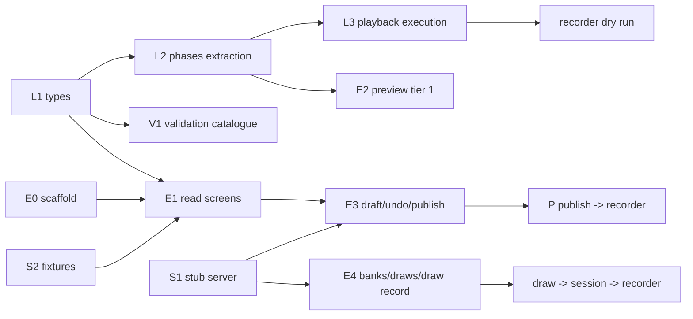

# Implementation plan — script editor (`spr-script-editor`)

Companion to [README.md](README.md) §6: it keeps the milestones and turns them into tasks,
file-level targets, ordering and gates. Grounded against commit `0c1de418` in worktree
`determined-antonelli-b67204`; the design docs are untracked there.

**Gate** = the observable proof that closes a milestone. A milestone is not closed on
code-complete alone. Tasks named `L…` touch the library/recorder, `E…` the editor, `V…`
validation, `S…` local server/fixtures. There are no time estimates here; only order and
dependencies. Bracketed labels (`A1`, `B4`, `C2`, `D3`) index the plan review that drove an
amendment; §9 maps each one to where it lands.

## 1. Ground truth (verified in the repository)

| Fact | Verified in | Consequence for the plan |
|---|---|---|
| Angular 20.3.x, CLI 20.3.36, `@angular/build` builders; Material 20.2, CDK 20.2.14, forms 20.3, TS 5.9.3 | `package.json` | CDK is already a dependency: drag-drop and virtual scroll need no new package. |
| Two projects only: `WebSpeechRecorderNg` (application), `speechrecorderng` (library) | `angular.json` | M2's project block is additive; no restructuring. |
| Library tests: `@angular/build:karma`, `src/test.ts`, `tsconfig.spec.json`, `karma.conf.js` (Chrome, `singleRun:false`) | `angular.json`, `projects/speechrecorderng/*` | Copy the pattern for the editor; CI must pass `--watch=false --browsers=ChromeHeadless`. |
| Demo app imports the library by **relative source path**; root `tsconfig.json` maps `speechrecorderng` → `dist/speechrecorderng` | `src/app/app.module.ts`, `tsconfig.json:...` | `from 'speechrecorderng'` imports in the editor are ambiguous until D-A (§2) is decided. |
| Library is one eager `NgModule` declaring every recorder component and registering `SPR_ROUTES` | `speechrecorderng.module.ts` | D1 confirmed; the editor must not import it and must not rely on its routes. |
| Timing facts: defaults `1000`/`500` ms; `prerecdelay` falls back to `prerecording` (`sessionmanager.ts:1120-1122`), `postrecdelay` to `postrecording` (`:1127`); max timer `pre+recduration+post` (`:1133`); prompt applied at start for `PRERECORDING`/`PRERECORDINGONLY`, at pre-delay end for `RECORDING`, cleared at pre-delay end for `PRERECORDINGONLY` (`:1113-1163`) | `sessionmanager.ts` | L2 can only be correct if these exact behaviours are pinned as characterisation tests first. |
| `RANDOMIZED` is ignored; shuffle runs in the component for `order==='RANDOM'`, writing `_shuffledGroups`/`_shuffledPromptItems`; `applyItem` reads them | `speechrecorderng.component.ts:333-345`, `sessionmanager.ts` `applyItem` | The editor must never persist `_shuffled*`; drafts strip them (D-F). |
| Library types lag the JSON: `Section` has no `name`, `Script` has no `name`/`type`/`minRecorderVersion`, yet fixtures carry `name`, `type`, `scriptId`; `1.json` still uses legacy `promptUnits` | `script.ts:63-81`, `src/test/script/*.json` | Additive type extensions (D-I); the loader must tolerate keys the types do not describe and keep them untouched. |
| `Group._shuffledPromptItems` / `Section._shuffledGroups` are **required, non-optional** fields | `script.ts:67-76` | The editor's loader fills them; the serialiser strips them (never make the recorder null-check). |
| Fixtures: `1.json` 1.8 kB (legacy), `1245.json` 26.6 kB, `3456.json` 6.5 kB, `3171…json` 16.7 kB | `src/test/script/` | Enough for M2; M1/M4 need new fixtures (playback, draw, 500-item perf). |
| No CI configuration in the repo (`.github`, `.gitlab-ci.yml`, … absent); `bin/theme_audit.mjs` drives an already-running Chrome over CDP (port 9333, `--url`, `--viewports`, `--prepare`) | repo root, `bin/theme_audit.mjs` | "Add editor routes to the CI list" means the audit command list, wherever CI lives; define it in `README` §Testing, not `.github`. |
| Design-doc defects: README §4.1 test `tsConfig` is malformed (`"projects/spr-script-editor:tsconfig.spec.json"`); data-model §2.1 has no `Playback.durationMs` although the timeline/W05 need it; README §8.2 script-name question is open while fixtures already carry `name` | this directory | Fix while touching those files (M0/M1). |
| Design tension: README §3 forbids `AudioContext` in the editor; rest-api §5 allows client-side decode of clip duration | README §3, rest-api §5 | Use `HTMLMediaElement` metadata (no Web Audio), server `durationMs` authoritative (D-G). |
| The recorder loads a session's script as `GET script/{sess.script}` — the published, unresolved script | `speechrecorderng.component.ts:164`, rest-api §1 | A1: a published drawn group reaches the recorder empty; a delivery mechanism must be frozen (D-K). |
| Every library component is a `standalone: false` NgModule declaration (`SpeechrecorderngModule` declares and exports them, and registers `SPR_ROUTES`) | `audio_display.ts:53`, `speechrecorderng.module.ts` declarations | A2: the editor cannot use `AudioPlayer`/`AudioDisplay` without importing the module; audition player decided in D-L. |
| Dev config is `apiEndPoint:'test'`, `apiType:'files'`; `src/test` is mapped to `/test` | `src/environments/environment.ts`, `angular.json:35` | A3: the editor needs its own asset mapping plus every list-endpoint fixture; S2 lists them. |
| `promptUnits` occurs in `1.json`/`317118e4…json` but in no library `.ts`; those sections carry no `groups` | `src/test/script/*.json`, grep of `projects/speechrecorderng/src/lib` | A4: the editor must detect the legacy shape and never add `groups: []` implicitly (D-M). |
| `public-api.ts` exports the model types but not `PromptitemUtil`/`MediaitemUtil`/`PromptDocUtil`, `Order`, `VirtualViewBox` | `public-api.ts` | L1 must export them or the editor duplicates item labels and drifts. |
| rest-api has no media list or delete endpoint, only `POST /media` and the in-use refusal rule | rest-api §5, §7 | B1: add `GET`/`DELETE media` before W11 and the delete path are implementable. |
| `VERSION='3.11.26'`; three numeric segments today | `spr.module.version.ts` | The L4 comparator must define missing-segment and pre-release behaviour, not only `3.10` vs `3.9`. |

## 2. Decisions this plan takes (review points, not silently assumed)

| # | Decision | Why / alternative |
|---|---|---|
| D-A | The editor imports the library **from source**: editor `tsconfig.app.json` overrides `baseUrl` to `../..` and `paths: {"speechrecorderng": ["projects/speechrecorderng/src/public-api.ts"]}`. | The dist mapping forces `ng build speechrecorderng` before every `ng serve` and kills HMR in library code. The demo app already consumes source. Alternative (npm semantics) costs only the developer loop; production build is identical. |
| D-B | A **stub write server** in `bin/` (Node builtins only) implements rest-api §2–§6 shapes: ETag/`If-Match`/428/412, publish gate, versions, PATCH, media upload, banks, draws, preview-session. Seeded from `src/test/script`, persists to a temp dir. | M0 can stall on server ownership (open Q1); M3/M4 must not. The app targets the contract, never the stub. |
| D-C | Undo = whole-draft snapshots (`structuredClone`), coalesced per focused field, history capped (~50). The pending edit is also captured as a small **edit intent** (JSON-Patch-style ops per save window); on 412 the intent is re-applied once over the server copy with index guards, then a visible conflict state. | A snapshot stack alone cannot re-apply a structural edit (move/delete/add) — only text. Snapshots serve undo, the intent serves rest-api §2.3's reapply; the intent must cover structure, not only typing. |
| D-D | Validation is pure functions with an injected context (bank `matchCount`, media index, deployment `VERSION`, feature→version map); publishing re-checks server-side. | Editor is catalogue owner (validation.md); the server is the only trusted gate. |
| D-E | JSON path → line mapping via an in-repo tokenizer (`core/validation/json-lines.ts`), no code-editor dependency. | ui-spec §5 says a textarea is enough; a dependency for gutter dots is not. |
| D-F | The draft serialiser strips keys starting `_` and never rewrites unknown keys. | D7 and the byte-comparable promise; `_shuffled*` are runtime artifacts. |
| D-G | Clip duration: server `durationMs` preferred; else measure on upload with an `HTMLMediaElement` (`loadedmetadata`), never `AudioContext`. | Keeps README §3's "no recording code in the editor" true; W05/timeline degrade to "unknown" when neither is available. |
| D-H | Editor state uses Angular signals + `OnPush`; forms stay typed reactive (README §4.3). | Signals fit draft state and selection; no zone-less migration required. |
| D-I | `Script.name?`, `Script.type?`, `Script.minRecorderVersion?`, `Section.name?`, `PromptItem.playback?`, `Group.draw?`, `Playback.durationMs?` become optional typed fields; `Playback`/`Draw`/bank/draw types land with them. | Fixtures already carry them; the editor cannot be typed otherwise. Additive, recorder unaffected. |
| D-J | The draw-rule "example draw" is computed client-side and labelled an example; the server stays the only resolver. The label states that it ignores `fixedBy` and `skipRecordedBySpeaker`, and it samples fairly instead of taking page one. | Two implementations of the draw exist; the example must never be presented as the session's draw (D4). |
| D-K | The server resolves a session's draws into a **materialised script** whose id goes into `Session.script`; `GET script/{id}` then serves it unchanged and the recorder needs no call-site change. Alternative: a session-scoped script endpoint plus one recorder call site. | The recorder today reads `script/{sess.script}` (`speechrecorderng.component.ts:164`) and a published drawn group has `promptItems: []` — A1. Materialisation preserves D2 without a recorder change; it requires the library list and draw queries to exclude internal scripts. |
| D-L | The editor's audition player is **editor-local** (`HTMLMediaElement`), not the library's Web Audio `AudioPlayer`/`AudioDisplay`. README §5 and ui-spec §3.3 are amended to say so. | The library components are `standalone: false` NgModule declarations (A2); importing the module would register `SPR_ROUTES` and bundle the recorder, and `AudioPlayer` uses Web Audio, which README §3 forbids in the editor. |
| D-M | Legacy `promptUnits` scripts are detected (N06) and migrated to `groups` only on request, with a confirmation; the loader never fabricates `groups: []` over one. Until migrated the script opens read-only. | A4: a save that adds `groups: []` silently changes what the recorder runs while the original data survives as an ignored key. |
| D-N | Drafts get server-side revision history (keep the last N saves) plus a local backup of unacked changes in `localStorage`, restored on load. | Published versions are recoverable; drafts are otherwise overwrite-only, so a bad merge/PUT or a crash loses everything since the last publish (D2/D3). |
| D-O | The persisted draw filter gets frozen semantics and a `q` field: tags are AND, `hasAudio:false` means "items without a model recording", category is exact, word bounds are inclusive and case-insensitive, and a `filterVersion` lets those semantics change without silently reinterpreting old rules. The bank page's browse filter is visually distinct from the rule filter. | The filter is persisted and D2 promises reproducibility, yet rest-api/ui-spec and `DrawFilter` disagree about free text and say nothing about the rest (B4). |
| D-P | A preview session (`type: "TEST"`) is what disables uploads: the recorder honours it. If it cannot, tier-2 requires its own recorder deployment with `enableUploadRecordings:false`. | rest-api §6 assumes such a deployment exists but the plan never schedules it; recordings from a preview must be impossible, not merely discarded (B5). |

## 3. Dependency graph and parallel tracks



* **Track L (library/recorder)**: L1 → L2 → L3/L4. `sessionmanager.ts` has exactly one writer at a
  time; the L2 refactor must land before L3 edits the same flow.
* **Track E (editor)**: E0 starts immediately (needs nothing new from L). E1 waits only for L1.
  E3/E4 additionally wait for S1.
* **Track V (validation)**: starts after L1; independent of the editor shell.
* **Track S (stub/fixtures)**: starts immediately; nothing depends on new library code.

E0 and V1 can run in parallel with L1; they share only type definitions, which are additive.

Additions to the tracks: **L5** (resolved-script delivery, D-K) starts once L1 lands and gates the
M1 dry run and M4; **E0** also owns the `src/test` asset mapping (A3); **S1** also owns the frozen
JSON Schemas and the stub conformance tests (M0/M3); **S2** owns the full FILES fixture inventory
(§4 M2).

## 4. Milestones, tasks, gates

### M0 — API agreement (documents, no application code)

- [] Answer open Q1 (server owner). Splits the work: scripts upstream vs banks/draws local.
- [] Freeze **how the recorder obtains a resolved script** (A1, D-K): a materialised script id on
      `Session.script`, or a session-scoped endpoint plus one recorder call site. The stub and the
      M4 gate must exercise this exact path, not a shortcut.
- [] Freeze the draft protocol: **strong** ETag (rest-api's `"w/4-17"` example is weak and
      weak validators are not valid for `If-Match`; use `"4-17"` or specify comparison), 428/412,
      `details.current` **including the current ETag**, `details.checks`, idempotent PUT, whether
      `_restore` consumes `If-Match`, and an `ETag` on the create response (or `If-None-Match: *`
      for the first write).
- [] Freeze what "new script" seeds (a script with no section is unpublishable under E10), and the
      id semantics of import JSON and duplicate.
- [] Freeze publish gate payload, the check ids the server enforces, how E04's `matchCount` is
      computed atomically at publish time, and the rendering of server-returned `details.checks`;
      freeze the feature→recorder-version map ownership (`L1` adds
      `lib/speechrecorder/script/feature-versions.ts`; the server needs the same table — decide
      whether it is exported, duplicated or config).
- [] Freeze bank endpoints and the shipped-bank delivery answer (Q3), **bank/media write
      concurrency** (ETag or an explicit last-write-wins statement) and upload filename collisions.
- [] Add the **media endpoints rest-api is missing** (B1): `GET project/{p}/media` with `usedBy`,
      `DELETE project/{p}/media/{src}`, the draft-vs-published reference rule, and the orphan
      policy for uploads the undo stack cannot remove.
- [] Freeze draw resolution: seeds per `fixedBy`, the refill rule and where it is recorded,
      `ResolvedDraw` storage, `_redraw` status rule, itemcode padding and count cap,
      `order:SEQUENTIAL` meaning, and the PRNG spec the stub and server share.
- [] Freeze the persisted draw-filter semantics (D-O), including a `filterVersion`.
- [] Freeze `/media` upload (`X-Filename`, `durationMs` advisory), media-in-use refusal, and the
      source of truth for W10's "deployment runs {actual}" (B7).
- [] Freeze the auth surface: cookie vs bearer, XSRF strategy, and the 401 → login → return-URL
      contract the shell implements (B8).
- [] Fix the doc defects: the §1 list (README §4.1 test path and its missing `src/test` asset
      mapping, data-model `durationMs`, script `name`), the README §4.4 audit URL
      (`/edit/script/1245` vs ui-spec §1), README §4.3 `express/json-server` vs D-B's Node
      builtins, README §5's `BankService`/`DrawService` placement (kept editor-local; the recorder
      never uses them), and ui-spec §8's M5-vs-per-milestone a11y wording.
- [] Pseudonymity decision (Q4) — it changes the draws view only.
- Gate: endpoint list and JSON shapes frozen in this directory **as JSON Schemas** that `S1` tests
  and the editor specs import; `S1` matches them; the open questions above either answered or
  explicitly deferred with a default marked in this file.

### M1 — Recorder honours playback (library + recorder, no editor)

| Task | Files | Content |
|---|---|---|
| L1 types | `lib/speechrecorder/script/script.ts`, `public-api.ts` | `PlaybackWhen`, `Playback` (+`durationMs?`), `Draw*`, `Bank`, `BankItem`, `ResolvedDraw`; extend `PromptItem`, `Group`, `Script`, `Section` (D-I); export everything, **including the pure utilities the editor reuses** (`PromptitemUtil`, `MediaitemUtil`, `PromptDocUtil`, `Order`, `VirtualViewBox`). No recorder behaviour change. |
| L2 extraction | new `lib/speechrecorder/script/phases.ts`; `sessionmanager.ts` | Characterisation tests first (`phases.spec.ts` or spec beside manager): every default and fallback from §1, the max-timer arithmetic with and without playback (C1), non-recording items (`NON_RECORDING_WAIT`, the `duration` path), and AUTORECORDING auto-advance. Then `promptVisibleAt(promptphase, phase, itemType)`, `effectiveTiming(item)` — returning pre/rec/post **and the playback span with its sequencing** — and the phase-transition table the preview needs (D8). The manager calls them; no behaviour change. |
| L3 playback | `sessionmanager.ts`, `prompting.ts` | All four `when` values with their **end-of-item behaviour pinned**: `BEFORE` plays to the end, then the pre-delay, then recording, and the max timer includes the playback span (C1); `PRERECORDING` starts with the delay and never extends the timer (W05 is a warning, not a runtime fix); `DURING` starts at `RECORDING` and its overrun past the stop is defined; `ONDEMAND` adds a play control. Preload the next clip; route playback so capture cannot double-count it; surface fetch/decode failure in the UI and the session log (never silent); block with a clear message when the service worker has not cached the file offline (C2/C3). Next/Prev/Stop/Pause stop playback and cancel its timers (C4). `playback.alt` joins the item label/description (C5). |
| L3 replay | `sessionmanager.ts`, `item.ts`, session upload | Replay button for `replayable`, cap via `maxReplays`; **replay counts get a defined persistence path** (session PATCH or a log entry) with a test — naming `Item` alone loses them (C4). |
| L3 headphones | prompting UI + `sessionmanager.start()` | If any item in the section has `playback.headphones`, require a confirmation before the section starts. |
| L4 version gate | `feature-versions.ts`, `speechrecorderng.component.ts` (script load) | Recorder refuses a script whose `minRecorderVersion` is above `VERSION` with a clear message. **Write a numeric segment comparator** with tests for `"3.10" > "3.9"`, missing segments and pre-release suffixes. The server applies the same gate at session creation, because a stale cached recorder bundle cannot check anything (C8). |
| L5 resolved script | `speechrecorderng.component.ts` (load path), session API per D-K | Land the mechanism frozen in M0: the recorder reads the materialised id from `Session.script` unchanged, or calls the new session-scoped endpoint. Prove it with a drawn fixture end to end; the stub serves the same shape. |
| Fixture | `src/test/script/playback.json` | Hand-written script exercising all four `when` values, one non-recording item with playback, and a drawn group. |
| Gate | Manual dry run in the recorder with `playback.json`: clip plays at the right moment for each `when`; replay counted **and persisted**; headphone gate appears; navigation during playback is safe; a drawn fixture runs its items through the L5 path. `npm run test_module -- --watch=false --browsers=ChromeHeadless` green, including the extraction tests **and the fake-clock `when` tests** (C7). |

### M2 — Editor skeleton, read-only

| Task | Files | Content |
|---|---|---|
| E0 project block | `angular.json`, `projects/spr-script-editor/**` | Project block per README §4.1 with the test `tsConfig` path fixed **and an asset entry serving `src/test` at `/test`** (A3); `tsconfig.json`/`tsconfig.app.json`/`tsconfig.spec.json` (D-A); `index.html`; `main.ts` (`bootstrapApplication`, providers from README §4.3 + `BankService`/`DrawService`); `main.scss` mirroring `src/main.scss` (palette → `mat.theme` → token + role pins, light and dark); budgets deliberately larger than the recorder's (measure at M2 and set explicit numbers); **no service worker**. The editor imports neither `SpeechrecorderngModule` nor any component it declares (A2). |
| E0 routes/shell | `app/app.routes.ts`, `app/shell/`, `app/editor.config.ts` | Routes of ui-spec §1 with selection in `?sel=`; shell: breadcrumb, save state, warning count link, Preview, Publish, undo/redo. `?sel=` indices are sanitised and fall back to the nearest node after reorder/delete/undo (D9). |
| E1 services | `app/core/script-api.service.ts`, `bank-api.service.ts`, `draw-api.service.ts`, `media.service.ts`, `load.ts` | Read endpoints now, write endpoints in M3. URL building mirrors `ProjectService` (`apiEndPoint` + `project/{p}/…`, `withCredentials`, FILES-mode `.json?requestUUID=`). `load.ts` fills `_shuffled*` **with `groups` verbatim** (never shuffled) and keeps unknown keys; when `groups` is absent it never fabricates an empty array over a legacy `promptUnits` section (A4/D-M). S2 lists every FILES path this needs. |
| E1 library list | `app/library/` | Table, filter row, legend cards, empty/loading/error states (ui-spec §2, §9). |
| E1 editor screens | `app/editor/outline|items-table|inspector` | Outline (flattened tree rows, markers, filter, keyboard, CDK drag-drop, virtual scroll above ~300 rows); centre (script flow cards, section tables, drawn-group card + example draw); inspector (four variants; timeline bar from `effectiveTiming`; playback block with an **editor-local `HTMLMediaElement` audition player** (D-L), not the library's Web Audio components). |
| E2 preview tier 1 | `app/preview/` | Stage mock, step simulation, order list with drawn items folded in, "Nothing is recorded or uploaded" banner. Uses `promptVisibleAt`/`effectiveTiming` **and L2's phase-transition table** — no local copy of the state machine (D8). |
| V1 catalogue | `app/core/validation/**` | E01–E10, W01–W11, N01–N06 as pure functions with context (D-D); `json-lines.ts` (D-E) with specs for escapes, tabs/CRLF, duplicate keys and unicode; fixes and `normalise.ts` (idempotence spec); one spec per id plus the clean case. Fix table: N01, N02, N06 (legacy `promptUnits` → groups, with confirmation), W08, E02 (next free code), E04 (clamp), E05 (free prefix), E08 (keep one side, explicitly chosen). Added checks: `repeats ≥ 1`, `gap ≥ 0`, `maxReplays ≥ 0`, virtual-view-box numbers; `DURING`/`PRERECORDING` on a non-recording item; W03 also scans `draw.playback`; W05 on a drawn group is suspended unless the bank reports clip durations; W11 uses the media index and is suspended, like E04, when it cannot be fetched (D6). |
| S2 fixtures | `src/test/script/`, `projects/spr-script-editor/src/assets/fixtures` | Fixture inventory for FILES mode, one file per path the UI reads: `test/project/<p>.json`, `test/project/<p>/script.json` (library list), `test/script/1245.json` (existing), `playback.json` (copied from M1), a drawn-group script, a **legacy `promptUnits` script** (prove load→save is byte-identical until migrated), bank/draw/media fixtures for §6/§7 and W11, and a generated ~500-item script for perf. |
| Gate | `1245.json` navigable and inspectable in the editor against `ApiType.FILES` **served from `/test` with the list fixtures present**; a legacy script opens read-only and round-trips byte-identically; validation catalogue runs over both; theme audit passes on two editor routes (edit + one interaction state via a new `bin/audit/*.js`); the 500-item script stays responsive in outline and tables; VoiceOver (Safari) pass #1 on the outline and inspector (ui-spec §8). |

### M3 — Write path

| Task | Files | Content |
|---|---|---|
| E3 draft service | `app/core/script-draft.service.ts` | Snapshot undo/redo (D-C) **plus a per-save-window edit intent (JSON-Patch-style ops) used for the 412 reapply**, so structural edits (move/delete/add) survive; history depth capped (~50). 2 s debounce + blur flush, single-flight save, ETag from the last response, 412 → reapply the intent once with index guards → conflict state keeping both texts. `FILES` mode = writes disabled, draft shown as locally modified; `beforeunload` guard while dirty; local backup of unacked changes restored on load (D-N). Invalid JSON text is never PUT: the service serialises the last valid model, the shell shows "unsaved changes", and reload keeps the text from the backup (D2). |
| E3 source view | `app/source/` | Textarea + Format + gutter dots via `json-lines`; parse-and-apply only when parse and invariants hold; structure frozen otherwise; the invalid text lives only in the local backup; import (file), export `script-{id}.json`; publish from the header. |
| E3 checks panel | `app/validation` UI | Severity groups, `line · subject`, consequence sentence, deep link into the editor, one-click fixes; errors block Publish, warnings are listed to the publisher; **server-returned `details.checks` render here too** (B3), so a publish-time race appears as findings, not a bare 409. |
| E3 publish/versions | `script-api.service.ts`, shell | Publish with gate; version list + restore (`draft/_restore`) **with a designed surface — ui-spec has no version-history screen (D5): add a panel to the script inspector and amend ui-spec §3.3**; PATCH name/archive; create/duplicate from the library; `minRecorderVersion` derived from the feature map and shown as N04. |
| E3 media | `script-api.service.ts`, `media.service.ts`, playback block | `POST project/{p}/media`, capture `durationMs` (D-G), attach to `playback.src`; `GET` the media list for the picker and W11; `DELETE` surfaces `MEDIA_IN_USE`; orphan uploads are called out because undo cannot remove them (B1). |
| S1 stub | `bin/script_editor_stub.mjs`, npm script | Complete the write surface + ETag semantics so E3 can be exercised without the real server; add the media list/delete endpoints; add **conformance tests for seed determinism, skip/refill, itemcode generation, ETag/412, the publish gate and multipart**, validated against the schemas frozen in M0. |
| Gate | Create → edit in two browsers without silent loss (412 path exercised with a **structural** edit) → publish blocked by an error, allowed with warnings → the recorder loads the published version. Unit specs: draft undo/redo/conflict, edit-intent reapply, invalid-JSON save rules, normaliser idempotence, fixes, **editor→library round-trip byte-stability over every fixture**, stub conformance, and a smoke run against the real server once it exists. |

### M4 — Banks and draws

| Task | Files | Content |
|---|---|---|
| E4 bank browser | `app/bank/` | Grouped picker (project/builtin), origin chip, read-only state + "Copy to this project", filter builder with live `matchCount`, item table with audition and pagination, project-bank item editing, CSV import result UI. The browse filter and the persisted rule filter are visibly distinct; only the rule filter writes `draw.filter` (D-O). |
| E4 rule builder | `app/bank/` (rule panel) | `count` vs `matchCount` (E04, suspended when the count is unknown per ui-spec §9), `fixedBy`, `skipRecordedBySpeaker`, `itemcodePrefix` preview (padding and cap per M0), `playBankAudio` + settings + `itemDefaults`, example draw (D-J) **labelled as ignoring `fixedBy`/`skipRecordedBySpeaker` and sampled fairly, not from page one** (D4). |
| E4 draws view | `app/draws/` | Table + detail, CSV export (`Accept: text/csv`), re-draw enabled only for `CREATED` with the disabled reason shown; the "draw is fixed at session creation" sentence stays. Preview (`type:"TEST"`) sessions are excluded or badged per M0 (D-P). |
| E4 tier-2 preview | editor config + recorder | `POST …/preview-session`, open `/wsr/ng/spr/session/{id}` in a new tab; editor config needs the recorder base URL. The recorder honours `session.type === 'TEST'` by disabling uploads in that tab, or the deployment running the preview has `enableUploadRecordings:false` (D-P) — state which one the plan relies on. |
| Gate | A drawn group produces a session in the recorder whose items are traceable to bank items **through the mechanism frozen in M0/D-K, not a stub shortcut**; re-opening that session shows identical items (D2); a preview session cannot upload anything; CSV matches the detail view. |

### M5 — Hardening

- Keyboard map and tree semantics from ui-spec §8 done in M2's outline; VoiceOver (Safari) and
  NVDA (Firefox) passes run **per milestone from M2** (ui-spec §8), M5 verifies the whole map.
- Empty/loading/error states of ui-spec §9 revisited as a checklist across all screens.
- Perf: 500-item script, outline, tables, validation on debounce rather than per keystroke.
- Editor routes + interaction state in the theme-audit command list; document the list (there is
  no CI config in-repo — put commands in `README` §7 or `bin/`).
- i18n of editor chrome only if the project needs it; keep strings centralised from M2 so a
  retrofit is mechanical.
- Preview (`type:"TEST"`) sessions: exclusion from draws/reports and cleanup verified (D-P).
- Update README/data-model/rest-api/validation where M0–M4 changed them — including the
  audition-player decision (D-L), the legacy-shape rule (D-M) and the media endpoints (B1); note
  the stub server's status (dev-only) and how to run it.

## 5. Verification commands

```bash
npm run test_module -- --watch=false --browsers=ChromeHeadless   # library, incl. phases specs
ng test spr-script-editor --watch=false --browsers=ChromeHeadless
ng build spr-script-editor --configuration development           # typecheck + template strictness
ng serve spr-script-editor --host=127.0.0.1 --configuration development
node bin/script_editor_stub.mjs --port 4301                      # M3/M4, D-B
node --test bin/script_editor_stub.test.mjs                      # stub conformance + frozen schemas
node bin/theme_audit.mjs --url http://127.0.0.1:4300/project/test/script/1245/edit \
  --viewports 1366x768,1920x1080 --prepare bin/audit/open-draw-inspector.js
```

Manual, per milestone: dry-run a recorded session in the recorder after every model change —
the editor's output is only useful if another application interprets it (README §7).

## 6. PR slicing (suggested order)

1. `feat(lib): script model additions (playback, draw, banks, script metadata, exported utils)` — L1.
2. `test(lib): characterisation tests for timing, prompt visibility and playback sequencing` — L2 part 1.
3. `refactor(lib): extract promptVisibleAt/effectiveTiming/phase transitions` — L2 part 2, no behaviour change.
4. `feat(lib|recorder): resolved-script delivery to the recorder` — L5 per D-K (server side, plus the call site if the endpoint option wins).
5. `feat(recorder): play media to the speaker, replay persistence` — L3, plus fixture.
6. `feat(lib): minRecorderVersion gate, feature map, session-start check` — L4.
7. `chore(editor): project block, `/test` assets, bootstrap, theme, routes` — E0.
8. `feat(editor): read services + media service and model loader (legacy shapes)` — E1 core.
9. `feat(editor): script library list` — E1.
10. `feat(editor): outline, centre, inspector incl. editor-local audition` — E1 (can split outline / inspector).
11. `feat(editor): validation catalogue incl. N06 and the added checks` — V1 (can land with 8).
12. `feat(editor): tier-1 preview on the shared phase table` — E2.
13. `feat(bin): stub server, media endpoints, contract schemas, conformance tests, fixtures` — S1/S2.
14. `feat(editor): draft service, edit intents, local backup, save state` — E3 part 1.
15. `feat(editor): source view, checks panel (incl. server findings), fixes` — E3 part 2.
16. `feat(editor): publish, versions + history surface, media list/upload/delete` — E3 part 3.
17. `feat(editor): banks, draw rule, draw record, tier-2 preview` — E4.
18. `chore(editor): a11y passes, perf, audit list, docs` — M5.

L1 must land first (2–8 depend on it for types). 7–12 can run in parallel with 2–6 once 1 lands.
`sessionmanager.ts` is edited by 3 and 5 only, sequentially; 4 touches the component's load path.

## 7. Risks

| Risk | Mitigation |
|---|---|
| M0 stalls on server ownership (Q1). | Stub server (D-B) + adapter services keep the editor on the frozen contract; no editor code reads the stub directly. |
| Extraction changes recorder behaviour. | Characterisation tests first (L2), refactor second; the recorder's current code is the oracle. |
| ETag conflict handling loses an edit. | Edit intents (D-C) reapply once with index guards, including structural edits, then a visible conflict state that keeps both texts accessible; test with two clients against the stub. |
| Virtual scroll + CDK drag-drop interaction. | Fixed row height; keyboard reorder (`Alt+↑/↓`) is the guaranteed path; if drag proves unstable above N rows, disable drag there and say why in the outline help. |
| Legacy scripts (`1.json`, `317118e4…json`: `promptUnits`, no `groups`) load into a typed model. | Detect the shape (N06), migrate only on request with confirmation, open read-only until then; never fabricate `groups: []` (A4/D-M); a spec proves load→save is byte-identical unless migrated. |
| `minRecorderVersion` comparisons wrong (`"3.10"` vs `"3.9"`, missing segments, pre-release). | Segment comparator with tests (L4); W10/N04 use the same function; the server gates at session creation too (C8). |
| Bundle growth from importing library code (the NgModule pulls every recorder component). | The editor imports no NgModule (A2/D-L) and measures its bundle at M2 with editor-specific budgets. If a library utility drags the audio subtree, fall back to an editor-local copy behind a spec. |
| Accessibility debt discovered late. | Outline tree semantics and keyboard map are M2 acceptance, not M5 cleanup; VoiceOver/NVDA passes run per milestone from M2 (ui-spec §8; D7). |
| i18n retrofit. | Centralise chrome strings from M2. |
| File duration unknown → W05/timeline degrade. | Server `durationMs`, else `HTMLMediaElement` (D-G); when unknown, W05 is suspended with "unknown", never silently passed. |
| **A1** Drawn sessions reach the recorder unresolved. | D-K delivery mechanism, L5, and the M4 gate exercised through the recorder's real load path — never a stub shortcut. |
| **A2** Audition player cannot be the library's (non-standalone, Web Audio). | D-L: editor-local `HTMLMediaElement` player; README §5/ui-spec §3.3 amended. |
| **A3** FILES-mode fixtures/assets absent → M2 gate cannot pass. | E0 asset mapping for `src/test`; S2 inventory of every read path; the M2 gate requires the list fixtures. |
| **C1** Playback breaks the max-timer arithmetic. | L2 characterisation tests include the max timer with and without playback; `effectiveTiming` returns sequencing, not just spans. |
| **C2** Autoplay/preload/offline failures. | Gesture-driven `HTMLMediaElement` playback, preload the next clip, visible failure in UI + session log, offline block when the file is not cached. |
| **C3** Playback routes through capture and double-counts. | Route playback outside the capture path; test `DURING` records exactly the acoustic result. |
| **C4** Replay counts never persisted (no upload path). | L3 replay row: session PATCH or log entry, with a test. |
| **C8** A stale cached recorder bundle skips playback and ignores `minRecorderVersion`. | The server applies the version gate at session creation; deployments keep the bundle current. |
| **D1** 412 reapply cannot cover a structural edit. | Edit intents (D-C) with index guards and a structural-edit test. |
| **D3** A bad draft merge/PUT loses everything since the last publish. | Draft revision history + local backup (D-N). |
| **B1** Media list/delete endpoints missing. | M0 freeze + S1 stub + E3 media task and fixtures. |
| **B3** Publish-time server findings never shown. | E3 checks panel renders `details.checks`. |
| **B4** Persisted filter semantics drift. | D-O freeze + `filterVersion`. |
| **D4** Example draw read as the real draw. | Labelled as ignoring `fixedBy`/`skipRecordedBySpeaker`; fair sample. |

## 8. Open questions and the gate that must close them

| Question (README §8) | Gate | Plan default until answered |
|---|---|---|
| 1. Server ownership (upstream vs local) | M0 | Stub server for development; contract unchanged. |
| 2. Script `name` ownership (entity vs index) | M0/M3 | `Script.name?` on the entity (D-I); fixtures already carry it. |
| 3. Shipped-bank delivery | M0/M4 | Server resolves `audioSrc` for `BUILTIN`; client uses what it is given (rest-api §3.4). |
| 4. Speaker pseudonymity in the draw record | M4 | Show what the API returns; keep speaker rendering isolated so a pseudonym mapping is a one-file change. |
| 5. Multi-project banks | M0/M4 | Project-local per D3; no cross-project bank ids until answered. |
| New: strong ETag semantics | M0 | Plan assumes a strong validator (D-C). |
| New: feature→version map ownership | M0/M1 | Library exports it (`feature-versions.ts`); the server re-checks errors, warnings stay client-side. |
| New: recorder base URL for tier-2 | M4 | Editor config value; no hard-coded deployment path. |
| New: resolved-script delivery (A1) | M0 | Materialised script id on `Session.script` (D-K); alternative is a session-scoped endpoint plus a recorder call site. |
| New: audition player (A2) | M0 | Editor-local `HTMLMediaElement` player (D-L); README §5/ui-spec amended. |
| New: legacy shape policy (A4) | M0 | Detect + migrate on request (D-M); read-only until migrated. |
| New: media endpoints (B1) | M0 | `GET` list with `usedBy`, `DELETE`, orphan policy; rest-api §5/§7 extended. |
| New: draw-filter semantics incl. `q` (B4) | M0 | `q` added to `DrawFilter`, tags AND, inclusive bounds, `filterVersion`. |
| New: auth surface (B8) | M0 | Cookie vs bearer, XSRF, 401 → login → return-URL contract documented. |
| New: W10's "deployment runs {actual}" (B7) | M0 | Co-deployment assumption, else an endpoint reporting the recorder version. |
| New: bank/media write concurrency (B8) | M0 | Last-write-wins stated explicitly, or ETag per bank/resource. |
| New: draft history retention (D3) | M0/M3 | Keep N revisions server-side + local backup of unacked changes (D-N). |
| New: preview session handling (D-P) | M4 | Recorder honours `type:"TEST"`, or a dedicated preview deployment. |

## 9. Review findings index

Labels used throughout: `A…` blocker, `B…` M0 contract hole, `C…` recorder runtime risk, `D…`
editor/validation weak point. Each line names where the amendment lands.

| # | Finding | Addressed by |
|---|---|---|
| A1 | The recorder reads `script/{sess.script}`, so a published drawn group arrives empty; "no recorder change" (D2) is false as specified. | D-K, L5, M4 gate |
| A2 | The library's `AudioPlayer`/`AudioDisplay` are non-standalone NgModule components using Web Audio; the editor cannot import them without the module. | D-L, E0, E1 inspector |
| A3 | FILES mode needs the `src/test` asset mapping and list-endpoint fixtures; the M2 gate cannot pass without them. | E0, S2, M2 gate |
| A4 | Legacy `promptUnits` sections have no library support; a save that adds `groups: []` silently changes what the recorder runs. | D-M, N06, V1, M2 gate |
| B1 | rest-api has no media list/delete endpoint. | M0, E3 media, S1 |
| B2 | Draft create/seed/id semantics undefined. | M0 |
| B3 | Publish-gate ownership and the rendering of server-returned checks. | M0, E3 checks panel |
| B4 | Persisted draw-filter semantics (incl. free text) undefined. | D-O, M0 |
| B5 | Draw materialisation details and preview-session exclusion. | M0, D-P, E4 |
| B6 | ETag details: idempotency, `_restore`, 412 payload, create response. | M0 |
| B7 | W10 compares against an unspecified recorder version. | M0 |
| B8 | Auth/XSRF contract, bank/media write concurrency. | M0 |
| C1 | Playback changes the max-timer arithmetic and sequencing. | L2, L3 |
| C2 | Autoplay, preload, decode failure and offline playback. | L3 |
| C3 | Playback must not double-count through the capture path. | L3 |
| C4 | Replay counts have no persistence path; navigation/pause must stop playback. | L3, L3 replay |
| C5 | `playback.alt` must reach item labels. | L1, L3 |
| C6 | Playback on non-recording items has no defined `when` semantics. | L2, V1 |
| C7 | Proof of the four `when`s must be automated. | M1 gate |
| C8 | A stale cached recorder bundle cannot enforce `minRecorderVersion`. | L4, M0 |
| D1 | Snapshot undo cannot reapply a structural edit after 412. | D-C, E3 draft |
| D2 | Invalid-JSON text must never be PUT and must survive reload. | E3 draft/source |
| D3 | Drafts are overwrite-only; a bad merge loses work since the last publish. | D-N, E3 |
| D4 | The example draw must not be read as the real draw. | D-J, E4 |
| D5 | Version history has no UI surface in ui-spec. | E3 publish/versions |
| D6 | Missing checks and uniform suspension for E04/W05/W11. | V1 |
| D7 | A11y passes are per milestone (ui-spec §8), not M5-only. | M2, M5 |
| D8 | Tier-1 preview needs the phase-transition rules, not a copy. | L2, E2 |
| D9 | `?sel=` indices are unstable under reorder/delete/undo. | E0 routes |
| D10 | `BankService`/`DrawService` placement differs from README §5. | M0 doc fixes, E1 |
